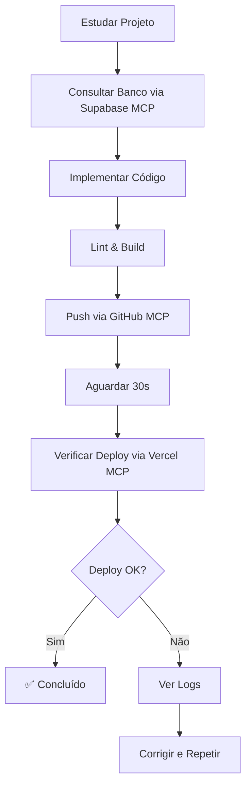

# Cursor Rules - FalaChefe

Este diretório contém as regras do Cursor para o projeto FalaChefe. Essas regras ajudam o AI Assistant a trabalhar de forma mais eficiente e consistente com o projeto.

## Regras Aplicadas Automaticamente (alwaysApply: true)

### 1. [git-workflow.mdc](./git-workflow.mdc)
**Uso**: Sempre usar GitHub MCP para commits e push

- Comandos GitHub MCP para push
- Conventional Commits
- Fluxo de deploy automático

### 2. [vercel-deploy.mdc](./vercel-deploy.mdc)
**Uso**: Acompanhar deploys via Vercel MCP

- IDs do projeto e team
- Verificar status de deploy após push
- Ver logs em caso de erro
- Tempo médio de deploy

### 3. [project-architecture.mdc](./project-architecture.mdc)
**Uso**: Arquitetura completa do projeto

- Infraestrutura (Vercel + Hetzner)
- Fluxo de mensagens WhatsApp
- Arquivos principais
- Tabelas do banco
- Variáveis de ambiente

### 4. [study-before-implement.mdc](./study-before-implement.mdc)
**Uso**: SEMPRE estudar antes de implementar

- Entender contexto atual
- Ler documentação
- Verificar estado via MCPs
- Planejar antes de agir
- Exemplos do que fazer e não fazer

### 5. [mcp-tools.mdc](./mcp-tools.mdc)
**Uso**: Uso correto dos MCPs (GitHub, Vercel, Supabase)

- Quando usar cada MCP
- Exemplos de comandos
- Fluxo completo de desenvolvimento
- IDs de referência rápida

## Regras Aplicadas por Glob

### 6. [typescript-patterns.mdc](./typescript-patterns.mdc)
**Aplica-se a**: `*.ts`, `*.tsx`

- Tipos explícitos
- Evitar `any`
- Template strings SQL (Drizzle)
- Interfaces de resultado
- Error handling
- Logging estruturado
- Padrões de API Routes e Services

## Regras Aplicadas Manualmente

### 7. [database-access.mdc](./database-access.mdc)
**Uso**: Consultas ao banco via Supabase MCP

- Project ID e configurações
- Comandos úteis
- Tabelas principais
- Queries comuns
- Cuidados de segurança

## Como Funcionam as Regras

### alwaysApply: true
Essas regras são **sempre** carregadas em toda interação com o AI Assistant. Use para:
- Práticas essenciais do projeto
- Informações de arquitetura
- Workflows obrigatórios

### globs: "*.ext"
Regras aplicadas apenas quando trabalhando com arquivos específicos:
- `*.ts,*.tsx` → Padrões TypeScript
- `*.py` → Padrões Python
- etc.

### alwaysApply: false
Regras aplicadas manualmente ou quando relevante ao contexto:
- Operações específicas de banco
- Procedimentos esporádicos
- Documentação detalhada

## IDs de Referência Rápida

### GitHub
- **Owner**: `tiagoyoko`
- **Repo**: `falachefe_plataforma`
- **Branch**: `master`

### Vercel
- **Project ID**: `prj_SyUWhD6Qi7lAqJ3SaMxk7JgmhcZl`
- **Team ID**: `team_a1QqoDU5jxv6sUlIZM8b7xII`
- **URL**: https://falachefe.app.br

### Supabase
- **Project ID**: `zpdartuyaergbxmbmtur`
- **Region**: `sa-east-1`
- **Host**: `db.zpdartuyaergbxmbmtur.supabase.co`

### Hetzner
- **IP**: `37.27.248.13`
- **Port**: `8000`
- **URL**: http://37.27.248.13:8000

## Fluxo de Desenvolvimento Padrão



## Atualizando as Regras

Para atualizar uma regra:

1. Editar o arquivo `.mdc` localmente
2. Usar GitHub MCP para push:

```typescript
await mcp_github_create_or_update_file({
  owner: "tiagoyoko",
  repo: "falachefe_plataforma",
  branch: "master",
  path: ".cursor/rules/nome-arquivo.mdc",
  content: "...",
  message: "docs: atualizar regra X"
});
```

## Referências

- [Cursor Rules Documentation](https://docs.cursor.com/context/rules)
- [Project Documentation](../../docs/)
- [Architecture Overview](../../docs/architecture/high-level-architecture.md)
