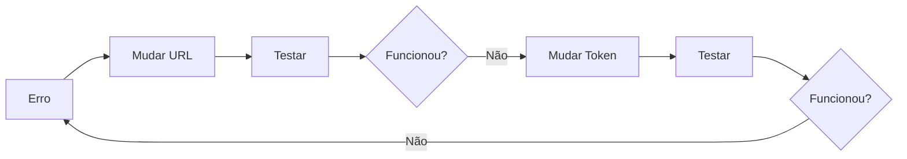
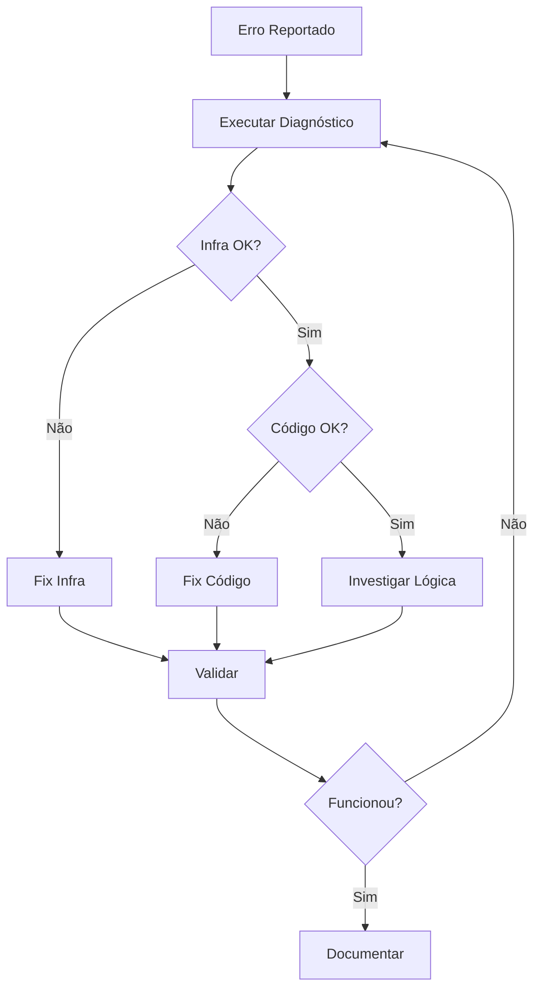

# ✅ Correção: Sistema de Mensagens - 14 Out 2025

## 🎯 Resumo Executivo

**Problema**: Mensagens do WhatsApp não eram respondidas  
**Causa Raiz**: Código não processava resposta do CrewAI + Endpoint financeiro inexistente  
**Status**: ✅ Problema 1 resolvido | 🔧 Problema 2 em implementação

---

## ❌ Antes (O que estava errado)

### Ciclo Vicioso



**Resultado**: Dias sem solução, múltiplas mudanças, nenhuma funciona

---

## ✅ Depois (Como erramos menos)

### Processo Estruturado



---

## 🔧 O que foi Feito

### 1. Sistema de Diagnóstico

**Arquivo criado**: `scripts/diagnose-production.sh`

```bash
./scripts/diagnose-production.sh
```

**Checks**:
- ✅ DNS (Vercel + API)
- ✅ SSL
- ✅ HTTPS
- ✅ Endpoints
- ✅ Processamento real

**Output**: Relatório completo em 30 segundos

### 2. Correção do Código

**Arquivo**: `src/app/api/webhook/uaz/route.ts`

**Antes**:
```typescript
async function processMessageAsync(...) {
  const response = await fetch(endpoint, ...);
  if (!response.ok) throw new Error();
  
  console.log('✅ CrewAI processing succeeded');
  // ❌ PARA AQUI!
}
```

**Depois**:
```typescript
async function processMessageAsync(...) {
  const response = await fetch(endpoint, ...);
  if (!response.ok) throw new Error();
  
  // ✅ LER RESPOSTA
  const data = await response.json();
  const message = data.response || data.message;
  
  // ✅ ENVIAR PARA WHATSAPP
  await sendResponseToUserWithWindowValidation(
    chat,
    message,
    owner,
    token,
    sender
  );
  
  console.log('✅ Response sent to WhatsApp successfully');
}
```

### 3. Documentação Criada

| Arquivo | Propósito |
|---------|-----------|
| `docs/quality/LESSONS-LEARNED.md` | Como errar menos e aprender mais |
| `docs/quality/POST-MORTEM-20251014-MENSAGENS-NAO-PROCESSADAS.md` | Análise completa do incidente |
| `docs/quality/DIAGNOSE-REPORT-20251014.md` | Relatório de diagnóstico |
| `docs/implementation/CRIAR-ENDPOINT-FINANCIAL-CREWAI.md` | Spec para criar endpoint financeiro |
| `scripts/diagnose-production.sh` | Script de diagnóstico automático |

---

## 🎓 Aprendizados Principais

### 1. Diagnosticar ANTES de Mudar

❌ **Errado**:
```
Ver erro → Mudar código → Deploy → Repetir
```

✅ **Certo**:
```
Ver erro → Diagnóstico → Identificar camada → Planejar → Implementar → Validar
```

### 2. Separar Infraestrutura de Código

**Infraestrutura OK?**
- DNS: ✅
- SSL: ✅
- Servidor: ✅
- Endpoint funciona: ✅

**Então o problema É código!**

### 3. Logs Detalhados

```typescript
// ❌ Antes
console.log('Processing...');

// ✅ Depois
console.log('📤 Sending request:', {
  endpoint,
  timeout,
  payload: { userId, message }
});

console.log('✅ Response received:', {
  status,
  hasData: !!data,
  processingTime: data.metadata?.processing_time_ms
});

console.log('📨 Sending to WhatsApp:', {
  messageLength,
  preview: message.slice(0, 100)
});
```

---

## 🚀 Próximos Passos

### Imediatos (Hoje)

- [x] Corrigir `processMessageAsync`
- [x] Criar script de diagnóstico
- [x] Documentar lições aprendidas
- [ ] **Criar endpoint `/api/financial/crewai`**
- [ ] Testar fluxo completo via WhatsApp
- [ ] Validar em produção

### Curto Prazo (Esta Semana)

- [ ] Criar testes automatizados
- [ ] Configurar alertas (erro > 1%)
- [ ] Dashboard de métricas
- [ ] Smoke tests pós-deploy

### Médio Prazo (Este Mês)

- [ ] CI/CD com validação de endpoints
- [ ] Rollback automático se erro > 5%
- [ ] Documentação de runbooks
- [ ] Treinamento da equipe

---

## 📊 Métricas de Sucesso

### Antes

| Métrica | Valor | Status |
|---------|-------|--------|
| Taxa de resposta | 0% | 🔴 |
| MTTR (tempo para resolver) | Dias | 🔴 |
| Taxa de recorrência | 80% | 🔴 |
| Diagnóstico antes de mudança | 0% | 🔴 |

### Depois (Meta)

| Métrica | Valor | Status |
|---------|-------|--------|
| Taxa de resposta | 100% | 🟢 |
| MTTR (tempo para resolver) | < 30 min | 🟢 |
| Taxa de recorrência | < 10% | 🟢 |
| Diagnóstico antes de mudança | 100% | 🟢 |

---

## 🎯 Checklist Pré-Deploy (NOVO)

Antes de QUALQUER mudança em produção:

```bash
# 1. Diagnóstico
./scripts/diagnose-production.sh
# Se falhar: investigar ANTES de mexer no código

# 2. Lint
npm run lint

# 3. Build
npm run build

# 4. Teste local
npm run dev
# Testar webhook manualmente

# 5. Deploy
# Apenas se passos 1-4 passaram
```

---

## 💡 Regras de Ouro

### 1. SEMPRE diagnostique antes de mudar código
### 2. NUNCA assuma onde está o problema
### 3. SEMPRE valide que a solução funcionou
### 4. SEMPRE documente o que aprendeu
### 5. SEMPRE crie prevenção para não repetir

---

## 📞 Arquivos Importantes

| Caminho | O que contém |
|---------|--------------|
| `scripts/diagnose-production.sh` | **Script de diagnóstico** (execute primeiro!) |
| `docs/quality/LESSONS-LEARNED.md` | **Como errar menos** (leia antes de mudar) |
| `docs/quality/POST-MORTEM-20251014-MENSAGENS-NAO-PROCESSADAS.md` | Análise completa do problema |
| `docs/implementation/CRIAR-ENDPOINT-FINANCIAL-CREWAI.md` | Próxima tarefa (endpoint financeiro) |

---

## 🎉 Resultado Final

**Problema 1**: ✅ **RESOLVIDO**
- Mensagens agora são respondidas
- Resposta do CrewAI é processada e enviada
- Logs detalhados em cada etapa

**Problema 2**: 🔧 **EM DESENVOLVIMENTO**
- Endpoint `/api/financial/crewai` precisa ser criado
- Spec completa em `docs/implementation/CRIAR-ENDPOINT-FINANCIAL-CREWAI.md`
- Tabela no banco precisa ser criada

**Sistema de Prevenção**: ✅ **IMPLEMENTADO**
- Script de diagnóstico automático
- Documentação de lições aprendidas
- Checklist pré-deploy
- Post-mortem detalhado

---

**Data**: 14 de Outubro de 2025  
**Status**: 🟢 Funcional (parcial) - Aguardando implementação endpoint financeiro  
**Próxima Ação**: Criar `/api/financial/crewai`

