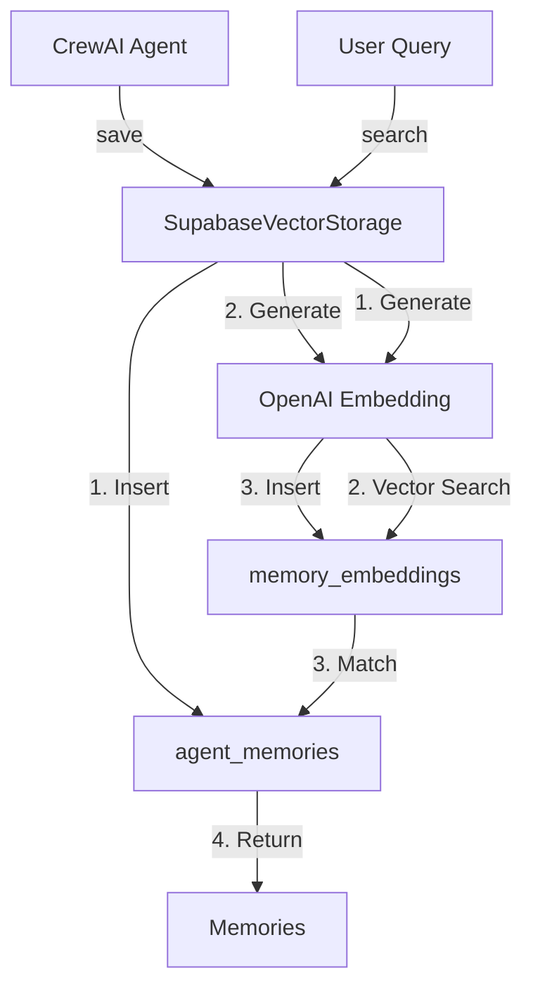

# 🎯 Resumo: Supabase Vector Storage para CrewAI

## ❌ Problema: Por que NÃO usar SQLite?

```
CrewAI padrão:
  └── storage/memory.db (SQLite local)
      ❌ Arquivo local no servidor
      ❌ Sem backup automático
      ❌ Não integrado com sistema
      ❌ Dados isolados
      ❌ Sem busca vetorial otimizada
```

## ✅ Solução: Supabase + pgvector

```
FalaChefe:
  └── Supabase PostgreSQL
      ├── pgvector extension ✅
      ├── Backup automático ✅
      ├── Integrado com sistema ✅
      ├── Busca semântica ✅
      └── Compartilhado entre instâncias ✅
```

---

## 📊 Arquitetura das Tabelas

### Fluxo de Dados



### Relacionamento

```
agent_memories (tabela principal)
├── id (uuid)
├── agent_id (varchar) ← Leo, Max, Lia, Orchestrator
├── user_id (varchar) ← +5511999999999
├── company_id (varchar)
├── memory_type (varchar) ← conversation, learning, preferences
├── content (jsonb) ← { dados flexíveis }
└── metadata (jsonb)

memory_embeddings (busca vetorial)
├── id (uuid)
├── memory_id (uuid) → agent_memories.id
├── embedding (vector[1536]) ← OpenAI embedding
└── content_text (text) ← Texto indexado
```

---

## 🔧 Implementação

### 1. Storage Customizado

```python
# crewai-projects/falachefe_crew/src/falachefe_crew/storage/supabase_storage.py

class SupabaseVectorStorage(Storage):
    def __init__(self):
        self.client = create_client(SUPABASE_URL, SUPABASE_KEY)
        openai.api_key = OPENAI_API_KEY
    
    def save(self, value, metadata, agent):
        # 1. Salvar memória
        memory = self.client.table('agent_memories').insert({
            'agent_id': agent,
            'content': {'text': value, 'metadata': metadata},
            ...
        }).execute()
        
        # 2. Gerar embedding
        embedding = openai.embeddings.create(
            model="text-embedding-3-small",
            input=value
        )
        
        # 3. Salvar vetor
        self.client.table('memory_embeddings').insert({
            'memory_id': memory.id,
            'embedding': embedding,
            ...
        }).execute()
    
    def search(self, query, limit=10):
        # 1. Gerar embedding da query
        query_embedding = openai.embeddings.create(...)
        
        # 2. Busca vetorial (pgvector)
        results = self.client.rpc('match_memories', {
            'query_embedding': query_embedding,
            'match_threshold': 0.5,
            'match_count': limit
        }).execute()
        
        return results
```

### 2. Integração com CrewAI

```python
# crewai-projects/falachefe_crew/src/falachefe_crew/crew.py

from crewai.memory import LongTermMemory
from .storage.supabase_storage import SupabaseVectorStorage

class FalachefeCrew:
    def orchestrated_crew(self):
        # Usar Supabase ao invés de SQLite
        supabase_storage = SupabaseVectorStorage()
        
        return Crew(
            agents=[...],
            tasks=[...],
            memory=True,
            long_term_memory=LongTermMemory(
                storage=supabase_storage  # ← Storage customizado
            )
        )
```

### 3. Funções SQL (Supabase)

```sql
-- crewai-projects/falachefe_crew/supabase_functions.sql

-- Busca vetorial com pgvector
CREATE FUNCTION match_memories(
  query_embedding vector(1536),
  match_threshold float,
  match_count int
)
RETURNS TABLE (...)
AS $$
  SELECT
    am.*,
    1 - (me.embedding <=> query_embedding) AS similarity
  FROM agent_memories am
  JOIN memory_embeddings me ON me.memory_id = am.id
  WHERE 1 - (me.embedding <=> query_embedding) > match_threshold
  ORDER BY me.embedding <=> query_embedding
  LIMIT match_count;
$$;

-- Índice HNSW para busca rápida
CREATE INDEX idx_memory_embeddings_vector 
  ON memory_embeddings 
  USING hnsw (embedding vector_cosine_ops);
```

---

## 🚀 Próximos Passos

### 1. Executar SQL no Supabase

```bash
# 1. Acessar Supabase SQL Editor
# 2. Copiar conteúdo de supabase_functions.sql
# 3. Executar
```

### 2. Adicionar Variáveis de Ambiente

```bash
# crewai-projects/falachefe_crew/.env

# Supabase (já existem)
SUPABASE_URL="https://zpdartuyaergbxmbmtur.supabase.co"
SUPABASE_SERVICE_ROLE_KEY="eyJhbGciOiJIUzI1NiIsInR5cCI6IkpXVCJ9..."

# OpenAI (já existe)
OPENAI_API_KEY="sk-proj-..."
```

### 3. Instalar Dependências

```bash
cd crewai-projects/falachefe_crew

# Adicionar ao requirements.txt
echo "supabase==2.9.1" >> requirements.txt
echo "openai>=1.0.0" >> requirements.txt

# Instalar
pip install -r requirements.txt
```

### 4. Deploy no Hetzner

```bash
# 1. SSH no servidor
ssh root@37.27.248.13

# 2. Ir para diretório
cd /opt/falachefe-crewai

# 3. Atualizar código
git pull origin master

# 4. Rebuild
docker compose down
docker compose build
docker compose up -d

# 5. Verificar logs
docker logs -f falachefe-crewai-api --tail 100
```

---

## 🧪 Testes

### Teste 1: Salvar Memória
```bash
curl -X POST http://37.27.248.13:8000/process \
  -H "Content-Type: application/json" \
  -d '{
    "user_message": "Meu nome é João, Padaria do João, faturamento R$ 50k/mês",
    "user_id": "test_vector_001",
    "phone_number": "+5511999999999"
  }'
```

### Teste 2: Busca Semântica
```bash
curl -X POST http://37.27.248.13:8000/process \
  -H "Content-Type: application/json" \
  -d '{
    "user_message": "Quanto minha empresa fatura?",
    "user_id": "test_vector_001",
    "phone_number": "+5511999999999"
  }'
```

**Resposta esperada:**
> "João, sua Padaria do João fatura R$ 50k/mês"

✅ **Se lembrar = Supabase Vector funcionando!**

### Teste 3: Verificar no Supabase

```sql
-- Ver memórias salvas
SELECT * FROM agent_memories 
WHERE user_id = 'test_vector_001';

-- Ver embeddings
SELECT 
  am.content,
  me.content_text,
  length(me.embedding::text) as embedding_size
FROM agent_memories am
JOIN memory_embeddings me ON me.memory_id = am.id
WHERE am.user_id = 'test_vector_001';

-- Estatísticas
SELECT * FROM get_memory_stats();
```

---

## 📊 Vantagens vs SQLite

| Aspecto | SQLite Local | Supabase Vector |
|---------|--------------|-----------------|
| **Armazenamento** | Arquivo local | Cloud PostgreSQL |
| **Backup** | Manual | Automático |
| **Busca Vetorial** | Básica | pgvector otimizado |
| **Compartilhamento** | ❌ | ✅ Multi-instância |
| **Integração** | ❌ | ✅ Com todo sistema |
| **Escalabilidade** | Limitada | Horizontal |
| **Monitoring** | ❌ | ✅ Dashboard Supabase |
| **Custo** | Grátis | $0 (free tier) |

---

## 🎯 Resultado Final

### Antes (SQLite)
```
Usuário: "Meu nome é João"
→ Salvo em ./storage/memory.db
→ Reinicia container = Perde memória
→ Sem busca semântica avançada
```

### Depois (Supabase Vector)
```
Usuário: "Meu nome é João, Padaria do João"
→ Salvo em Supabase
→ Embedding gerado e indexado
→ Busca semântica otimizada
→ Compartilhado entre instâncias
→ Backup automático
→ Visível no dashboard

Próxima interação:
Usuário: "Quanto minha padaria fatura?"
→ Busca vetorial encontra contexto
→ "João, sua Padaria do João fatura R$ 50k/mês"
```

---

## 📁 Arquivos Criados

1. ✅ `crewai-projects/falachefe_crew/src/falachefe_crew/storage/supabase_storage.py`
   - Storage customizado com pgvector

2. ✅ `crewai-projects/falachefe_crew/supabase_functions.sql`
   - Funções SQL para busca vetorial

3. ✅ `crewai-projects/falachefe_crew/src/falachefe_crew/crew.py` (atualizado)
   - Integração com Supabase Storage

4. ✅ `MEMORIA-AGENTES-CONFIG.md`
   - Documentação completa sobre memória

5. ✅ `TABELAS-MEMORIA-EXPLICACAO.md`
   - Explicação de todas as tabelas

6. ✅ `RESUMO-SUPABASE-VECTOR-STORAGE.md` (este arquivo)
   - Resumo executivo da implementação

---

**Status:** ✅ Código pronto | ⏳ Aguardando deploy


