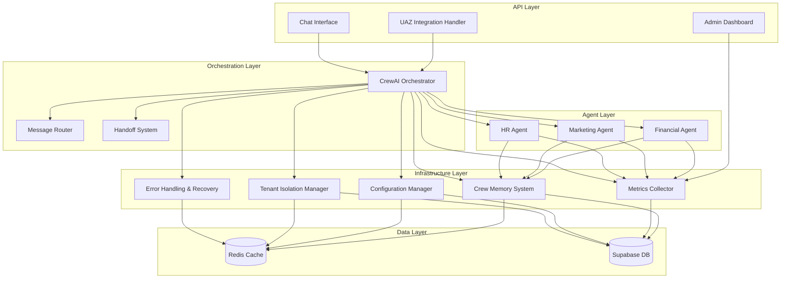

# Components

## CrewAI Orchestrator
**Responsibility:** Coordena a execução de agentes IA, gerencia handoff entre agentes e mantém contexto de conversação.

**Key Interfaces:**
- `processMessage(message: string, context: ConversationContext): Promise<CrewResponse>`
- `selectAgent(messageAnalysis: MessageAnalysis): Promise<CrewAgent>`
- `executeHandoff(fromAgent: CrewAgent, toAgent: CrewAgent, context: ConversationContext): Promise<HandoffResult>`
- `getCrewMetrics(crewId: string, timeRange: DateRange): Promise<CrewMetrics>`

**Dependencies:** Redis (coordenação), Supabase (persistência), OpenAI (LLM), CrewMemorySystem (contexto)

**Technology Stack:** CrewAI 0.80+, TypeScript, Redis, LangChain

## Message Router
**Responsibility:** Analisa mensagens recebidas, extrai intenções e determina complexidade para roteamento apropriado.

**Key Interfaces:**
- `analyzeMessage(message: string): Promise<MessageAnalysis>`
- `extractIntent(message: string): Promise<IntentResult>`
- `determineComplexity(analysis: MessageAnalysis): Promise<ComplexityLevel>`
- `requiresHumanApproval(analysis: MessageAnalysis): Promise<boolean>`

**Dependencies:** OpenAI (análise de linguagem natural), CrewMemorySystem (contexto histórico)

**Technology Stack:** LangChain, OpenAI GPT-4, TypeScript

## Financial Agent
**Responsibility:** Especializado em operações financeiras, gestão de despesas, análise de fluxo de caixa e planejamento orçamentário.

**Key Interfaces:**
- `processFinancialRequest(request: FinancialRequest): Promise<FinancialResponse>`
- `addExpense(expenseData: ExpenseData): Promise<ExpenseResult>`
- `generateCashFlowReport(period: DateRange): Promise<CashFlowReport>`
- `createBudgetPlan(budgetData: BudgetData): Promise<BudgetPlan>`
- `analyzeFinancialTrends(data: FinancialData): Promise<TrendAnalysis>`

**Dependencies:** Supabase (dados financeiros), CrewMemorySystem (histórico), OpenAI (análise)

**Technology Stack:** CrewAI Agent, Financial Tools, Drizzle ORM, TypeScript

## Handoff System
**Responsibility:** Gerencia transferência de contexto entre agentes, preserva estado da conversa e coordena handoffs assíncronos.

**Key Interfaces:**
- `transferContext(fromAgent: string, toAgent: string, context: ConversationContext): Promise<TransferResult>`
- `preserveConversationState(conversationId: string, state: ConversationState): Promise<void>`
- `notifyUserOfHandoff(handoff: HandoffEvent): Promise<void>`
- `validateHandoffFeasibility(fromAgent: CrewAgent, toAgent: CrewAgent): Promise<boolean>`

**Dependencies:** Redis (estado temporário), Supabase (persistência), CrewMemorySystem (contexto)

**Technology Stack:** Redis, TypeScript, Event-driven architecture

## Crew Memory System
**Responsibility:** Gerencia memória contextual do CrewAI, armazena e recupera informações relevantes por tenant.

**Key Interfaces:**
- `storeMemory(memory: MemoryData): Promise<void>`
- `retrieveRelevantMemories(query: string, context: MemoryContext): Promise<Memory[]>`
- `updateMemoryImportance(memoryId: string, importance: number): Promise<void>`
- `cleanupExpiredMemories(companyId: string): Promise<void>`

**Dependencies:** Supabase (armazenamento persistente), Redis (cache), OpenAI (indexação semântica)

**Technology Stack:** CrewAI Memory, Supabase, Redis, LangChain embeddings

## Metrics Collector
**Responsibility:** Coleta métricas de performance, custos e qualidade dos agentes e crews para monitoramento e otimização.

**Key Interfaces:**
- `recordMetric(metric: MetricData): Promise<void>`
- `getAgentPerformance(agentId: string, period: DateRange): Promise<PerformanceMetrics>`
- `getCrewCostAnalysis(crewId: string, period: DateRange): Promise<CostAnalysis>`
- `generatePerformanceReport(crewId: string): Promise<PerformanceReport>`

**Dependencies:** Supabase (armazenamento de métricas), Redis (métricas em tempo real)

**Technology Stack:** TypeScript, Drizzle ORM, Prometheus (futuro)

## UAZ Integration Handler
**Responsibility:** Gerencia integração com UAZ API para WhatsApp, processa webhooks e coordena comunicação bidirecional.

**Key Interfaces:**
- `processWebhook(webhookData: UAZWebhookData): Promise<void>`
- `sendMessage(message: WhatsAppMessage): Promise<MessageResult>`
- `handleDeliveryStatus(status: DeliveryStatus): Promise<void>`
- `validateWebhookSignature(payload: string, signature: string): Promise<boolean>`

**Dependencies:** UAZ API (WhatsApp), CrewAI Orchestrator (processamento), Redis (rate limiting)

**Technology Stack:** Next.js API Routes, TypeScript, UAZ SDK

## Tenant Isolation Manager
**Responsibility:** Garante isolamento rigoroso entre empresas, gerencia contextos separados e previne vazamento de dados.

**Key Interfaces:**
- `createTenantContext(companyId: string): Promise<TenantContext>`
- `validateTenantAccess(userId: string, companyId: string): Promise<boolean>`
- `isolateCrewData(crewId: string, companyId: string): Promise<void>`
- `auditTenantAccess(companyId: string): Promise<AccessAudit>`

**Dependencies:** Better Auth (autenticação), Supabase (isolamento de dados), Redis (contexto isolado)

**Technology Stack:** Better Auth, TypeScript, Row Level Security (Supabase)

## Configuration Manager
**Responsibility:** Gerencia configurações dinâmicas de crews e agentes, permite customização por empresa sem deploy.

**Key Interfaces:**
- `getCrewConfig(crewId: string): Promise<CrewConfig>`
- `updateAgentConfig(agentId: string, config: AgentConfig): Promise<void>`
- `validateConfiguration(config: any): Promise<ValidationResult>`
- `applyConfigurationChanges(crewId: string): Promise<void>`

**Dependencies:** Supabase (configurações), Redis (cache de config), CrewAI Orchestrator (aplicação)

**Technology Stack:** TypeScript, JSON Schema validation, Redis

## Error Handling & Recovery
**Responsibility:** Gerencia erros, implementa circuit breakers e coordena recuperação automática de falhas.

**Key Interfaces:**
- `handleAgentError(error: AgentError, context: ErrorContext): Promise<RecoveryAction>`
- `executeCircuitBreaker(service: string, operation: () => Promise<any>): Promise<any>`
- `fallbackToLegacySystem(context: FallbackContext): Promise<LegacyResponse>`
- `notifyErrorToAdmins(error: SystemError): Promise<void>`

**Dependencies:** Sentry (error tracking), Redis (circuit breaker state), Legacy System (fallback)

**Technology Stack:** Sentry, TypeScript, Circuit Breaker pattern

## Component Diagrams

## Technology Trend Analysis Summary

**Tendências Emergentes 2025:**
- **Consolidação do Ecossistema:** CrewAI integrando com IBM watsonx.ai, Amazon Bedrock, Microsoft Azure
- **Enterprise-Ready Platforms:** Frameworks evoluindo para suportar necessidades empresariais com segurança e compliance
- **Real-time Collaboration:** Agentes trabalhando em tempo real com sincronização via WebSockets

**Análise Competitiva:**
- **CrewAI:** Líder emergente (38k+ stars, 2M+ downloads/mês, partnerships IBM/Amazon/Microsoft)
- **AutoGen:** Competidor direto com backing Microsoft, foco em conversational AI
- **LangGraph:** Crescimento rápido no ecossistema LangChain, foco em workflow orchestration

**Recomendações Estratégicas:**
- **Curto Prazo:** Implementar CrewAI 0.80+ com version pinning e monitoring
- **Médio Prazo:** Avaliar integrações com IBM watsonx.ai e Amazon Bedrock
- **Longo Prazo:** Monitorar evolução de competidores e preparar para migração se necessário

---

## **Rationale Detalhada:**

**Decisões de Componentização:**
1. **Separação de Responsabilidades:** Cada componente tem uma responsabilidade única e bem definida
2. **Interface-Based Design:** Componentes comunicam via interfaces bem definidas
3. **Dependency Injection:** Dependências são injetadas para facilitar testes e manutenção
4. **Event-Driven Architecture:** Componentes se comunicam via eventos para desacoplamento

**Considerações de Escalabilidade:**
- Componentes podem ser escalados independentemente
- Redis permite coordenação distribuída
- Circuit breakers protegem contra falhas em cascata
- Preparação para edge deployment e real-time collaboration

**Considerações de Manutenibilidade:**
- Interfaces claras facilitam mudanças internas
- Componentes isolados reduzem impacto de mudanças
- Error handling centralizado simplifica debugging
- Abstrações facilitam migração futura para frameworks alternativos
