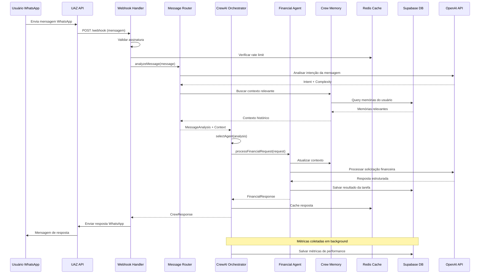
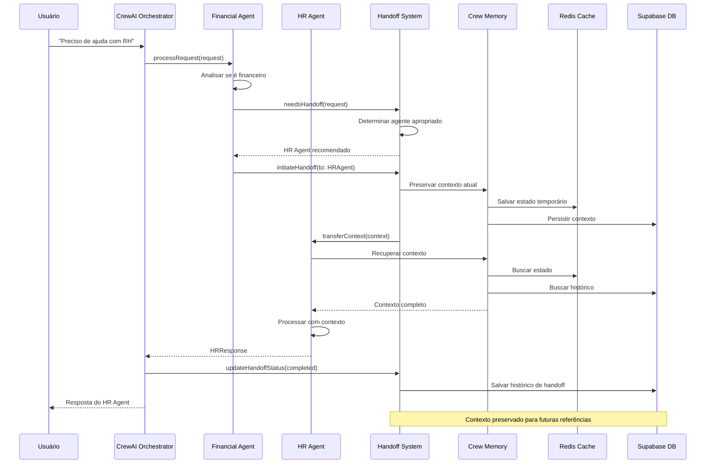
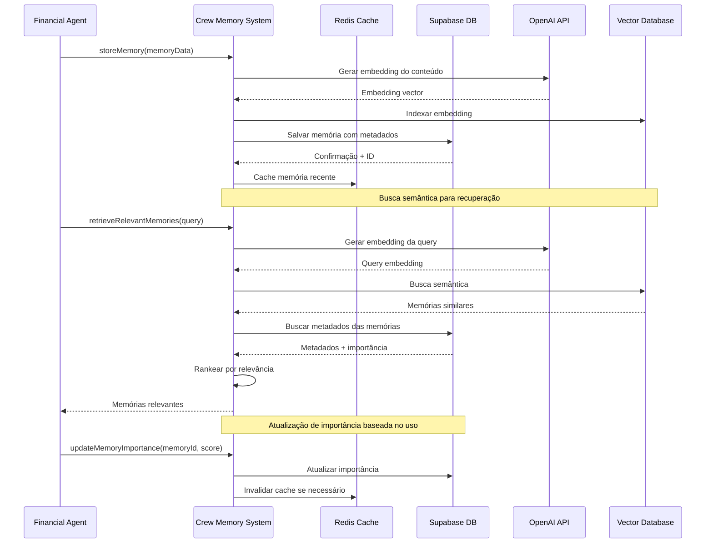

# Core Workflows

## Workflow 1: Processamento de Mensagem WhatsApp

```mermaid
sequenceDiagram
    participant User as Usuário WhatsApp
    participant UAZ as UAZ API
    participant Webhook as Webhook Handler
    participant Router as Message Router
    participant Orchestrator as CrewAI Orchestrator
    participant Agent as Financial Agent
    participant Memory as Crew Memory
    participant Redis as Redis Cache
    participant DB as Supabase DB
    participant OpenAI as OpenAI API

    User->>UAZ: Envia mensagem WhatsApp
    UAZ->>Webhook: POST /webhook (mensagem)
    Webhook->>Webhook: Validar assinatura
    Webhook->>Redis: Verificar rate limit
    Webhook->>Router: analyzeMessage(message)
    
    Router->>OpenAI: Analisar intenção da mensagem
    OpenAI-->>Router: Intent + Complexity
    Router->>Memory: Buscar contexto relevante
    Memory->>DB: Query memórias do usuário
    DB-->>Memory: Memórias relevantes
    Memory-->>Router: Contexto histórico
    
    Router-->>Orchestrator: MessageAnalysis + Context
    Orchestrator->>Orchestrator: selectAgent(analysis)
    Orchestrator->>Agent: processFinancialRequest(request)
    
    Agent->>Memory: Atualizar contexto
    Agent->>OpenAI: Processar solicitação financeira
    OpenAI-->>Agent: Resposta estruturada
    Agent->>DB: Salvar resultado da tarefa
    Agent-->>Orchestrator: FinancialResponse
    
    Orchestrator->>Redis: Cache resposta
    Orchestrator-->>Webhook: CrewResponse
    Webhook->>UAZ: Enviar resposta WhatsApp
    UAZ->>User: Mensagem de resposta
    
    Note over Orchestrator,DB: Métricas coletadas em background
    Orchestrator->>DB: Salvar métricas de performance
```

## Workflow 2: Handoff entre Agentes

```mermaid
sequenceDiagram
    participant User as Usuário
    participant Orchestrator as CrewAI Orchestrator
    participant FinAgent as Financial Agent
    participant HRAgent as HR Agent
    participant Handoff as Handoff System
    participant Memory as Crew Memory
    participant Redis as Redis Cache
    participant DB as Supabase DB

    User->>Orchestrator: "Preciso de ajuda com RH"
    Orchestrator->>FinAgent: processRequest(request)
    FinAgent->>FinAgent: Analisar se é financeiro
    
    FinAgent->>Handoff: needsHandoff(request)
    Handoff->>Handoff: Determinar agente apropriado
    Handoff-->>FinAgent: HR Agent recomendado
    
    FinAgent->>Handoff: initiateHandoff(to: HRAgent)
    Handoff->>Memory: Preservar contexto atual
    Memory->>Redis: Salvar estado temporário
    Memory->>DB: Persistir contexto
    
    Handoff->>HRAgent: transferContext(context)
    HRAgent->>Memory: Recuperar contexto
    Memory->>Redis: Buscar estado
    Memory->>DB: Buscar histórico
    Memory-->>HRAgent: Contexto completo
    
    HRAgent->>HRAgent: Processar com contexto
    HRAgent-->>Orchestrator: HRResponse
    Orchestrator->>Handoff: updateHandoffStatus(completed)
    Handoff->>DB: Salvar histórico de handoff
    
    Orchestrator-->>User: Resposta do HR Agent
    
    Note over Handoff,DB: Contexto preservado para futuras referências
```

## Workflow 3: Sistema de Memória e Aprendizado

```mermaid
sequenceDiagram
    participant Agent as Financial Agent
    participant Memory as Crew Memory System
    participant Redis as Redis Cache
    participant DB as Supabase DB
    participant OpenAI as OpenAI API
    participant VectorDB as Vector Database

    Agent->>Memory: storeMemory(memoryData)
    Memory->>OpenAI: Gerar embedding do conteúdo
    OpenAI-->>Memory: Embedding vector
    Memory->>VectorDB: Indexar embedding
    
    Memory->>DB: Salvar memória com metadados
    DB-->>Memory: Confirmação + ID
    Memory->>Redis: Cache memória recente
    
    Note over Memory,VectorDB: Busca semântica para recuperação
    
    Agent->>Memory: retrieveRelevantMemories(query)
    Memory->>OpenAI: Gerar embedding da query
    OpenAI-->>Memory: Query embedding
    Memory->>VectorDB: Busca semântica
    VectorDB-->>Memory: Memórias similares
    
    Memory->>DB: Buscar metadados das memórias
    DB-->>Memory: Metadados + importância
    Memory->>Memory: Rankear por relevância
    Memory-->>Agent: Memórias relevantes
    
    Note over Memory,DB: Atualização de importância baseada no uso
    Agent->>Memory: updateMemoryImportance(memoryId, score)
    Memory->>DB: Atualizar importância
    Memory->>Redis: Invalidar cache se necessário
```
