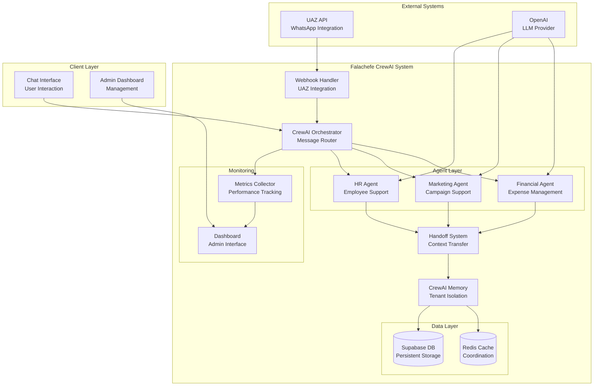

# High Level Architecture

## Technical Summary

O sistema Falachefe CrewAI implementa uma arquitetura de **multi-agent orchestration** baseada no framework CrewAI, integrada ao sistema existente Next.js/Supabase. A arquitetura utiliza **Redis para coordenação distribuída**, **OpenAI como LLM principal** e mantém **isolamento rigoroso por tenant** para suportar 20 empresas simultâneas. O sistema segue um **padrão de microservices** com **event-driven communication** para handoff entre agentes, garantindo escalabilidade e resiliência.

## High Level Overview

1. **Estilo Arquitetural:** Microservices com orquestração de agentes IA
2. **Estrutura de Repositório:** Monorepo (baseado na estrutura atual)
3. **Arquitetura de Serviços:** CrewAI Orquestrador + Agentes Especializados + Sistema de Memória
4. **Fluxo Principal:** UAZ Webhook → CrewAI Router → Agent Selection → Task Execution → Response via UAZ
5. **Decisões Arquiteturais:** CrewAI para orquestração, Redis para coordenação, Supabase para persistência

## High Level Project Diagram

## Architectural and Design Patterns

**1. Multi-Agent Orchestration Pattern:**
- **Descrição:** CrewAI gerencia múltiplos agentes especializados com coordenação centralizada
- **Rationale:** Permite especialização por domínio (financeiro, marketing, HR) mantendo coordenação eficiente

**2. Event-Driven Communication:**
- **Descrição:** Handoff entre agentes via eventos assíncronos com preservação de contexto
- **Rationale:** Desacopla agentes e permite escalabilidade horizontal com resiliência

**3. Repository Pattern com Tenant Isolation:**
- **Descrição:** Abstração de acesso a dados com isolamento rigoroso por empresa
- **Rationale:** Garante segurança multi-tenant e facilita testes e manutenção

**4. Circuit Breaker Pattern:**
- **Descrição:** Proteção contra falhas em cascata em integrações externas (UAZ API, OpenAI)
- **Rationale:** Mantém sistema resiliente durante picos de tráfego ou falhas externas

**5. CQRS (Command Query Responsibility Segregation):**
- **Descrição:** Separação de operações de leitura (queries) e escrita (commands) para métricas e auditoria
- **Rationale:** Otimiza performance e permite escalabilidade independente de leitura/escrita

## Constraint Analysis Summary

**Limitações Críticas Identificadas:**
- **Arquitetura Monolítica Atual:** Sistema de agentes atual é acoplado e dificulta migração gradual
- **Dependências de Sistema Legado:** Incompatibilidade potencial com CrewAI e dependências modernas
- **Estrutura de Banco Rígida:** Schema atual não suporta conceitos CrewAI (crews, tasks, memories)

**Estratégias de Mitigação:**
- Refatoração incremental com interfaces de abstração
- Criação de adaptadores e wrappers de compatibilidade
- Extensão de schema com backward compatibility
- Migração gradual com coexistência de sistemas
- Sistema legado como fallback automático durante transição
