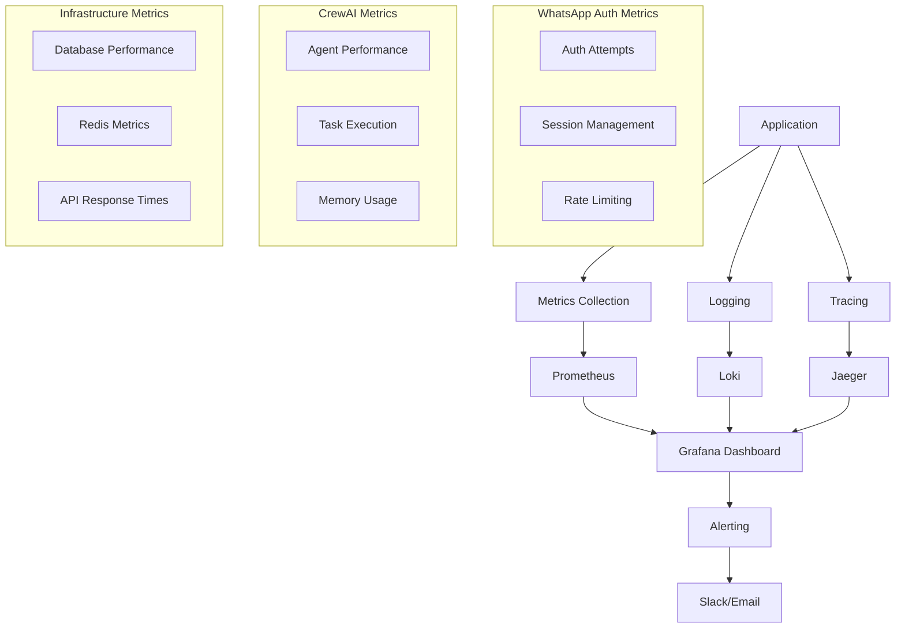

# Monitoring

## Estratégia de Observabilidade Completa

O sistema de monitoramento foi projetado para fornecer visibilidade completa sobre a arquitetura híbrida de autenticação WhatsApp e sistema CrewAI, garantindo confiabilidade, performance e segurança.

### Stack de Monitoramento



## 1. Métricas de Aplicação

### Sistema de Métricas WhatsApp Auth

```typescript
// src/lib/monitoring/whatsapp-metrics.ts
import { register, Counter, Histogram, Gauge } from 'prom-client';

export const WhatsAppAuthMetrics = {
  // Contadores
  authAttempts: new Counter({
    name: 'whatsapp_auth_attempts_total',
    help: 'Total number of WhatsApp authentication attempts',
    labelNames: ['phone_number', 'company_id', 'auth_method', 'status']
  }),

  verificationCodesSent: new Counter({
    name: 'whatsapp_verification_codes_sent_total',
    help: 'Total number of verification codes sent',
    labelNames: ['phone_number', 'company_id']
  }),

  sessionsCreated: new Counter({
    name: 'whatsapp_sessions_created_total',
    help: 'Total number of WhatsApp sessions created',
    labelNames: ['user_id', 'company_id']
  }),

  sessionsExpired: new Counter({
    name: 'whatsapp_sessions_expired_total',
    help: 'Total number of expired WhatsApp sessions',
    labelNames: ['user_id', 'company_id']
  }),

  rateLimitHits: new Counter({
    name: 'whatsapp_rate_limit_hits_total',
    help: 'Total number of rate limit hits',
    labelNames: ['phone_number', 'limit_type']
  }),

  // Histogramas
  authResponseTime: new Histogram({
    name: 'whatsapp_auth_response_time_seconds',
    help: 'Response time for WhatsApp authentication',
    labelNames: ['auth_method', 'status'],
    buckets: [0.1, 0.5, 1, 2, 5, 10]
  }),

  verificationCodeGenerationTime: new Histogram({
    name: 'whatsapp_verification_code_generation_time_seconds',
    help: 'Time to generate verification codes',
    buckets: [0.01, 0.05, 0.1, 0.5, 1]
  }),

  // Gauges
  activeSessions: new Gauge({
    name: 'whatsapp_active_sessions',
    help: 'Number of active WhatsApp sessions',
    labelNames: ['company_id']
  }),

  pendingVerifications: new Gauge({
    name: 'whatsapp_pending_verifications',
    help: 'Number of pending verifications',
    labelNames: ['company_id']
  })
};

// Registrar métricas
register.registerMetric(WhatsAppAuthMetrics.authAttempts);
register.registerMetric(WhatsAppAuthMetrics.verificationCodesSent);
register.registerMetric(WhatsAppAuthMetrics.sessionsCreated);
register.registerMetric(WhatsAppAuthMetrics.sessionsExpired);
register.registerMetric(WhatsAppAuthMetrics.rateLimitHits);
register.registerMetric(WhatsAppAuthMetrics.authResponseTime);
register.registerMetric(WhatsAppAuthMetrics.verificationCodeGenerationTime);
register.registerMetric(WhatsAppAuthMetrics.activeSessions);
register.registerMetric(WhatsAppAuthMetrics.pendingVerifications);
```

### Sistema de Métricas CrewAI

```typescript
// src/lib/monitoring/crewai-metrics.ts
export const CrewAIMetrics = {
  // Contadores
  messagesProcessed: new Counter({
    name: 'crewai_messages_processed_total',
    help: 'Total number of messages processed by CrewAI',
    labelNames: ['crew_id', 'agent_id', 'company_id', 'status']
  }),

  tasksExecuted: new Counter({
    name: 'crewai_tasks_executed_total',
    help: 'Total number of tasks executed',
    labelNames: ['task_type', 'crew_id', 'status']
  }),

  handoffsPerformed: new Counter({
    name: 'crewai_handoffs_performed_total',
    help: 'Total number of agent handoffs',
    labelNames: ['from_agent', 'to_agent', 'crew_id']
  }),

  memoryOperations: new Counter({
    name: 'crewai_memory_operations_total',
    help: 'Total number of memory operations',
    labelNames: ['operation_type', 'crew_id']
  }),

  // Histogramas
  messageProcessingTime: new Histogram({
    name: 'crewai_message_processing_time_seconds',
    help: 'Time to process messages through CrewAI',
    labelNames: ['crew_id', 'agent_id'],
    buckets: [0.5, 1, 2, 5, 10, 30, 60]
  }),

  taskExecutionTime: new Histogram({
    name: 'crewai_task_execution_time_seconds',
    help: 'Time to execute individual tasks',
    labelNames: ['task_type', 'agent_id'],
    buckets: [0.1, 0.5, 1, 2, 5, 10]
  }),

  handoffTime: new Histogram({
    name: 'crewai_handoff_time_seconds',
    help: 'Time to perform agent handoffs',
    labelNames: ['from_agent', 'to_agent'],
    buckets: [0.1, 0.5, 1, 2, 5]
  }),

  // Gauges
  activeCrews: new Gauge({
    name: 'crewai_active_crews',
    help: 'Number of active crews',
    labelNames: ['company_id']
  }),

  activeAgents: new Gauge({
    name: 'crewai_active_agents',
    help: 'Number of active agents',
    labelNames: ['crew_id', 'agent_type']
  }),

  memoryUsage: new Gauge({
    name: 'crewai_memory_usage_bytes',
    help: 'Memory usage by crews',
    labelNames: ['crew_id', 'memory_type']
  }),

  queueDepth: new Gauge({
    name: 'crewai_queue_depth',
    help: 'Depth of message processing queue',
    labelNames: ['crew_id']
  })
};
```

## 2. Sistema de Logging Estruturado

### Logger Centralizado

```typescript
// src/lib/monitoring/logger.ts
import winston from 'winston';
import { Request, Response } from 'express';

const logFormat = winston.format.combine(
  winston.format.timestamp(),
  winston.format.errors({ stack: true }),
  winston.format.json(),
  winston.format.printf(({ timestamp, level, message, ...meta }) => {
    return JSON.stringify({
      timestamp,
      level,
      message,
      ...meta
    });
  })
);

export const logger = winston.createLogger({
  level: process.env.LOG_LEVEL || 'info',
  format: logFormat,
  transports: [
    new winston.transports.Console({
      format: winston.format.combine(
        winston.format.colorize(),
        winston.format.simple()
      )
    }),
    new winston.transports.File({
      filename: 'logs/error.log',
      level: 'error',
      maxsize: 5242880, // 5MB
      maxFiles: 5
    }),
    new winston.transports.File({
      filename: 'logs/combined.log',
      maxsize: 5242880, // 5MB
      maxFiles: 5
    })
  ]
});

// Logger específico para WhatsApp Auth
export const whatsappAuthLogger = logger.child({ 
  service: 'whatsapp-auth',
  version: process.env.npm_package_version 
});

// Logger específico para CrewAI
export const crewaiLogger = logger.child({ 
  service: 'crewai',
  version: process.env.npm_package_version 
});

// Logger para auditoria
export const auditLogger = logger.child({ 
  service: 'audit',
  version: process.env.npm_package_version 
});

// Middleware para logging de requests
export const requestLogger = (req: Request, res: Response, next: any) => {
  const start = Date.now();
  
  res.on('finish', () => {
    const duration = Date.now() - start;
    
    logger.info('HTTP Request', {
      method: req.method,
      url: req.url,
      statusCode: res.statusCode,
      duration: `${duration}ms`,
      userAgent: req.get('User-Agent'),
      ip: req.ip,
      userId: req.user?.id,
      companyId: req.user?.companyId
    });
  });
  
  next();
};
```

### Logs Estruturados para WhatsApp Auth

```typescript
// src/lib/auth/whatsapp-auth-logger.ts
export class WhatsAppAuthLogger {
  static logAuthenticationAttempt(
    phoneNumber: string,
    companyId: string,
    authMethod: string,
    success: boolean,
    metadata?: any
  ) {
    whatsappAuthLogger.info('Authentication attempt', {
      phoneNumber: this.maskPhoneNumber(phoneNumber),
      companyId,
      authMethod,
      success,
      timestamp: new Date().toISOString(),
      ...metadata
    });

    // Log de auditoria para compliance
    auditLogger.info('WhatsApp authentication attempt', {
      phoneNumber: this.maskPhoneNumber(phoneNumber),
      companyId,
      authMethod,
      success,
      timestamp: new Date().toISOString(),
      compliance: true
    });
  }

  static logVerificationCodeSent(
    phoneNumber: string,
    companyId: string,
    codeLength: number
  ) {
    whatsappAuthLogger.info('Verification code sent', {
      phoneNumber: this.maskPhoneNumber(phoneNumber),
      companyId,
      codeLength,
      timestamp: new Date().toISOString()
    });
  }

  static logSessionCreated(
    userId: string,
    companyId: string,
    sessionToken: string,
    expiresAt: Date
  ) {
    whatsappAuthLogger.info('Session created', {
      userId,
      companyId,
      sessionToken: this.maskToken(sessionToken),
      expiresAt: expiresAt.toISOString(),
      timestamp: new Date().toISOString()
    });
  }

  static logRateLimitHit(
    phoneNumber: string,
    limitType: string,
    attempts: number
  ) {
    whatsappAuthLogger.warn('Rate limit hit', {
      phoneNumber: this.maskPhoneNumber(phoneNumber),
      limitType,
      attempts,
      timestamp: new Date().toISOString()
    });
  }

  private static maskPhoneNumber(phoneNumber: string): string {
    return phoneNumber.replace(/(\d{2})\d{6}(\d{2})/, '$1******$2');
  }

  private static maskToken(token: string): string {
    return token.substring(0, 8) + '...' + token.substring(token.length - 4);
  }
}
```

### Logs Estruturados para CrewAI

```typescript
// src/lib/monitoring/crewai-logger.ts
export class CrewAILogger {
  static logMessageProcessed(
    messageId: string,
    crewId: string,
    agentId: string,
    processingTime: number,
    status: 'success' | 'error' | 'timeout',
    metadata?: any
  ) {
    crewaiLogger.info('Message processed', {
      messageId,
      crewId,
      agentId,
      processingTime: `${processingTime}ms`,
      status,
      timestamp: new Date().toISOString(),
      ...metadata
    });
  }

  static logTaskExecuted(
    taskId: string,
    taskType: string,
    agentId: string,
    executionTime: number,
    result: any
  ) {
    crewaiLogger.info('Task executed', {
      taskId,
      taskType,
      agentId,
      executionTime: `${executionTime}ms`,
      result: this.sanitizeResult(result),
      timestamp: new Date().toISOString()
    });
  }

  static logHandoffPerformed(
    fromAgent: string,
    toAgent: string,
    crewId: string,
    handoffTime: number,
    context: any
  ) {
    crewaiLogger.info('Agent handoff performed', {
      fromAgent,
      toAgent,
      crewId,
      handoffTime: `${handoffTime}ms`,
      context: this.sanitizeContext(context),
      timestamp: new Date().toISOString()
    });
  }

  static logMemoryOperation(
    operationType: 'read' | 'write' | 'update' | 'delete',
    crewId: string,
    memoryKey: string,
    success: boolean,
    metadata?: any
  ) {
    crewaiLogger.info('Memory operation', {
      operationType,
      crewId,
      memoryKey,
      success,
      timestamp: new Date().toISOString(),
      ...metadata
    });
  }

  private static sanitizeResult(result: any): any {
    // Remove dados sensíveis dos resultados
    if (typeof result === 'object' && result !== null) {
      const sanitized = { ...result };
      delete sanitized.password;
      delete sanitized.token;
      delete sanitized.apiKey;
      return sanitized;
    }
    return result;
  }

  private static sanitizeContext(context: any): any {
    // Remove dados sensíveis do contexto
    if (typeof context === 'object' && context !== null) {
      const sanitized = { ...context };
      delete sanitized.userData?.password;
      delete sanitized.userData?.token;
      delete sanitized.apiKeys;
      return sanitized;
    }
    return context;
  }
}
```

## 3. Distributed Tracing

### Configuração Jaeger

```typescript
// src/lib/monitoring/tracing.ts
import { trace, context, SpanStatusCode } from '@opentelemetry/api';
import { NodeSDK } from '@opentelemetry/sdk-node';
import { getNodeAutoInstrumentations } from '@opentelemetry/auto-instrumentations-node';
import { JaegerExporter } from '@opentelemetry/exporter-jaeger';
import { Resource } from '@opentelemetry/resources';
import { SemanticResourceAttributes } from '@opentelemetry/semantic-conventions';

const sdk = new NodeSDK({
  resource: new Resource({
    [SemanticResourceAttributes.SERVICE_NAME]: 'falachefe-crewai',
    [SemanticResourceAttributes.SERVICE_VERSION]: process.env.npm_package_version,
  }),
  traceExporter: new JaegerExporter({
    endpoint: process.env.JAEGER_ENDPOINT || 'http://localhost:14268/api/traces',
  }),
  instrumentations: [getNodeAutoInstrumentations()],
});

sdk.start();

export const tracer = trace.getTracer('falachefe-crewai');

// Span helper para WhatsApp Auth
export const createWhatsAppAuthSpan = (operationName: string, attributes?: any) => {
  return tracer.startSpan(operationName, {
    attributes: {
      'service.name': 'whatsapp-auth',
      'operation.name': operationName,
      ...attributes
    }
  });
};

// Span helper para CrewAI
export const createCrewAISpan = (operationName: string, attributes?: any) => {
  return tracer.startSpan(operationName, {
    attributes: {
      'service.name': 'crewai',
      'operation.name': operationName,
      ...attributes
    }
  });
};

// Função para executar operação com span
export const withSpan = async <T>(
  spanName: string,
  operation: (span: any) => Promise<T>,
  attributes?: any
): Promise<T> => {
  const span = tracer.startSpan(spanName, { attributes });
  
  try {
    const result = await operation(span);
    span.setStatus({ code: SpanStatusCode.OK });
    return result;
  } catch (error) {
    span.setStatus({ 
      code: SpanStatusCode.ERROR, 
      message: error instanceof Error ? error.message : 'Unknown error' 
    });
    span.recordException(error as Error);
    throw error;
  } finally {
    span.end();
  }
};
```

### Instrumentação WhatsApp Auth

```typescript
// src/lib/auth/whatsapp-auth-instrumented.ts
export class WhatsAppAuthServiceInstrumented {
  async authenticateUser(
    phoneNumber: string, 
    companyId: string,
    message?: string
  ): Promise<WhatsAppAuthResult> {
    
    return await withSpan(
      'whatsapp.auth.authenticate_user',
      async (span) => {
        span.setAttributes({
          'whatsapp.phone_number': phoneNumber,
          'whatsapp.company_id': companyId,
          'whatsapp.message_length': message?.length || 0
        });

        // Verificar sessão ativa
        const activeSessionSpan = tracer.startSpan('whatsapp.auth.check_active_session');
        const activeSession = await this.getActiveSession(phoneNumber, companyId);
        activeSessionSpan.setAttributes({
          'whatsapp.session_found': !!activeSession,
          'whatsapp.session_valid': !!(activeSession && !this.isSessionExpired(activeSession))
        });
        activeSessionSpan.end();

        if (activeSession && !this.isSessionExpired(activeSession)) {
          span.setAttributes({
            'whatsapp.auth_method': 'session_token',
            'whatsapp.auth_success': true
          });
          
          return {
            authenticated: true,
            user: activeSession.user,
            sessionToken: activeSession.token,
            authMethod: 'session_token'
          };
        }

        // Buscar usuário no banco
        const userLookupSpan = tracer.startSpan('whatsapp.auth.lookup_user');
        const user = await this.findUserByPhone(phoneNumber, companyId);
        userLookupSpan.setAttributes({
          'whatsapp.user_found': !!user,
          'whatsapp.user_id': user?.id || 'none'
        });
        userLookupSpan.end();

        // Resto da lógica...
        // ...
      },
      {
        'whatsapp.phone_number': phoneNumber,
        'whatsapp.company_id': companyId
      }
    );
  }
}
```

## 4. Dashboards Grafana

### Dashboard WhatsApp Auth

```json
{
  "dashboard": {
    "title": "WhatsApp Authentication Dashboard",
    "panels": [
      {
        "title": "Authentication Attempts Rate",
        "type": "graph",
        "targets": [
          {
            "expr": "rate(whatsapp_auth_attempts_total[5m])",
            "legendFormat": "{{status}} - {{auth_method}}"
          }
        ]
      },
      {
        "title": "Active Sessions",
        "type": "singlestat",
        "targets": [
          {
            "expr": "sum(whatsapp_active_sessions)",
            "legendFormat": "Active Sessions"
          }
        ]
      },
      {
        "title": "Authentication Response Time",
        "type": "graph",
        "targets": [
          {
            "expr": "histogram_quantile(0.95, rate(whatsapp_auth_response_time_seconds_bucket[5m]))",
            "legendFormat": "95th percentile"
          },
          {
            "expr": "histogram_quantile(0.50, rate(whatsapp_auth_response_time_seconds_bucket[5m]))",
            "legendFormat": "50th percentile"
          }
        ]
      },
      {
        "title": "Rate Limit Hits",
        "type": "graph",
        "targets": [
          {
            "expr": "rate(whatsapp_rate_limit_hits_total[5m])",
            "legendFormat": "{{limit_type}}"
          }
        ]
      },
      {
        "title": "Verification Codes Sent",
        "type": "graph",
        "targets": [
          {
            "expr": "rate(whatsapp_verification_codes_sent_total[5m])",
            "legendFormat": "Codes Sent"
          }
        ]
      }
    ]
  }
}
```

### Dashboard CrewAI

```json
{
  "dashboard": {
    "title": "CrewAI Performance Dashboard",
    "panels": [
      {
        "title": "Messages Processed Rate",
        "type": "graph",
        "targets": [
          {
            "expr": "rate(crewai_messages_processed_total[5m])",
            "legendFormat": "{{crew_id}} - {{agent_id}}"
          }
        ]
      },
      {
        "title": "Task Execution Time",
        "type": "graph",
        "targets": [
          {
            "expr": "histogram_quantile(0.95, rate(crewai_task_execution_time_seconds_bucket[5m]))",
            "legendFormat": "{{task_type}} - 95th percentile"
          }
        ]
      },
      {
        "title": "Agent Handoffs",
        "type": "graph",
        "targets": [
          {
            "expr": "rate(crewai_handoffs_performed_total[5m])",
            "legendFormat": "{{from_agent}} → {{to_agent}}"
          }
        ]
      },
      {
        "title": "Memory Operations",
        "type": "graph",
        "targets": [
          {
            "expr": "rate(crewai_memory_operations_total[5m])",
            "legendFormat": "{{operation_type}}"
          }
        ]
      },
      {
        "title": "Queue Depth",
        "type": "graph",
        "targets": [
          {
            "expr": "crewai_queue_depth",
            "legendFormat": "{{crew_id}}"
          }
        ]
      }
    ]
  }
}
```

## 5. Sistema de Alertas

### Configuração de Alertas

```yaml
# monitoring/alerts.yml
groups:
  - name: whatsapp-auth
    rules:
      - alert: WhatsAppAuthHighFailureRate
        expr: rate(whatsapp_auth_attempts_total{status="failed"}[5m]) > 0.1
        for: 2m
        labels:
          severity: warning
          service: whatsapp-auth
        annotations:
          summary: "High WhatsApp authentication failure rate"
          description: "WhatsApp authentication failure rate is {{ $value }} failures per second"

      - alert: WhatsAppAuthHighResponseTime
        expr: histogram_quantile(0.95, rate(whatsapp_auth_response_time_seconds_bucket[5m])) > 5
        for: 5m
        labels:
          severity: warning
          service: whatsapp-auth
        annotations:
          summary: "High WhatsApp authentication response time"
          description: "95th percentile response time is {{ $value }} seconds"

      - alert: WhatsAppAuthRateLimitHits
        expr: rate(whatsapp_rate_limit_hits_total[5m]) > 10
        for: 1m
        labels:
          severity: critical
          service: whatsapp-auth
        annotations:
          summary: "High rate limit hits"
          description: "Rate limit hits per second: {{ $value }}"

  - name: crewai
    rules:
      - alert: CrewAIMessageProcessingErrors
        expr: rate(crewai_messages_processed_total{status="error"}[5m]) > 0.05
        for: 2m
        labels:
          severity: warning
          service: crewai
        annotations:
          summary: "High CrewAI message processing error rate"
          description: "Error rate is {{ $value }} errors per second"

      - alert: CrewAIHighProcessingTime
        expr: histogram_quantile(0.95, rate(crewai_message_processing_time_seconds_bucket[5m])) > 30
        for: 5m
        labels:
          severity: warning
          service: crewai
        annotations:
          summary: "High CrewAI message processing time"
          description: "95th percentile processing time is {{ $value }} seconds"

      - alert: CrewAIQueueBacklog
        expr: crewai_queue_depth > 100
        for: 5m
        labels:
          severity: critical
          service: crewai
        annotations:
          summary: "CrewAI queue backlog"
          description: "Queue depth is {{ $value }} messages"

  - name: infrastructure
    rules:
      - alert: DatabaseConnectionErrors
        expr: rate(database_connection_errors_total[5m]) > 0.1
        for: 1m
        labels:
          severity: critical
          service: database
        annotations:
          summary: "Database connection errors"
          description: "Database connection error rate is {{ $value }} errors per second"

      - alert: RedisConnectionErrors
        expr: rate(redis_connection_errors_total[5m]) > 0.1
        for: 1m
        labels:
          severity: critical
          service: redis
        annotations:
          summary: "Redis connection errors"
          description: "Redis connection error rate is {{ $value }} errors per second"
```

## 6. Health Checks Avançados

### Health Check Completo

```typescript
// src/app/api/health/route.ts
export async function GET() {
  const startTime = Date.now();
  const healthChecks = {
    timestamp: new Date().toISOString(),
    version: process.env.npm_package_version,
    environment: process.env.NODE_ENV,
    uptime: process.uptime(),
    checks: {}
  };

  // Database Health Check
  try {
    const dbStart = Date.now();
    await db.query('SELECT 1');
    healthChecks.checks.database = {
      status: 'healthy',
      responseTime: Date.now() - dbStart,
      timestamp: new Date().toISOString()
    };
  } catch (error) {
    healthChecks.checks.database = {
      status: 'unhealthy',
      error: error.message,
      timestamp: new Date().toISOString()
    };
  }

  // Redis Health Check
  try {
    const redisStart = Date.now();
    await redis.ping();
    healthChecks.checks.redis = {
      status: 'healthy',
      responseTime: Date.now() - redisStart,
      timestamp: new Date().toISOString()
    };
  } catch (error) {
    healthChecks.checks.redis = {
      status: 'unhealthy',
      error: error.message,
      timestamp: new Date().toISOString()
    };
  }

  // UAZ API Health Check
  try {
    const uazStart = Date.now();
    const response = await fetch(`${process.env.UAZ_API_URL}/health`, {
      timeout: 5000
    });
    healthChecks.checks.uaz = {
      status: response.ok ? 'healthy' : 'unhealthy',
      responseTime: Date.now() - uazStart,
      statusCode: response.status,
      timestamp: new Date().toISOString()
    };
  } catch (error) {
    healthChecks.checks.uaz = {
      status: 'unhealthy',
      error: error.message,
      timestamp: new Date().toISOString()
    };
  }

  // OpenAI API Health Check
  try {
    const openaiStart = Date.now();
    const response = await fetch('https://api.openai.com/v1/models', {
      headers: {
        'Authorization': `Bearer ${process.env.OPENAI_API_KEY}`
      },
      timeout: 5000
    });
    healthChecks.checks.openai = {
      status: response.ok ? 'healthy' : 'unhealthy',
      responseTime: Date.now() - openaiStart,
      statusCode: response.status,
      timestamp: new Date().toISOString()
    };
  } catch (error) {
    healthChecks.checks.openai = {
      status: 'unhealthy',
      error: error.message,
      timestamp: new Date().toISOString()
    };
  }

  // WhatsApp Auth System Health
  try {
    const activeSessions = await db.query(
      'SELECT COUNT(*) as count FROM whatsapp_sessions WHERE expires_at > NOW()'
    );
    const pendingVerifications = await redis.keys('verify:*');
    
    healthChecks.checks.whatsappAuth = {
      status: 'healthy',
      activeSessions: parseInt(activeSessions.rows[0].count),
      pendingVerifications: pendingVerifications.length,
      timestamp: new Date().toISOString()
    };
  } catch (error) {
    healthChecks.checks.whatsappAuth = {
      status: 'unhealthy',
      error: error.message,
      timestamp: new Date().toISOString()
    };
  }

  // CrewAI System Health
  try {
    const activeCrews = await db.query(
      'SELECT COUNT(*) as count FROM crews WHERE is_active = true'
    );
    const activeAgents = await db.query(
      'SELECT COUNT(*) as count FROM crew_agents WHERE is_active = true'
    );
    
    healthChecks.checks.crewai = {
      status: 'healthy',
      activeCrews: parseInt(activeCrews.rows[0].count),
      activeAgents: parseInt(activeAgents.rows[0].count),
      timestamp: new Date().toISOString()
    };
  } catch (error) {
    healthChecks.checks.crewai = {
      status: 'unhealthy',
      error: error.message,
      timestamp: new Date().toISOString()
    };
  }

  const totalResponseTime = Date.now() - startTime;
  const allHealthy = Object.values(healthChecks.checks).every(
    check => check.status === 'healthy'
  );

  return Response.json({
    ...healthChecks,
    totalResponseTime,
    overallStatus: allHealthy ? 'healthy' : 'unhealthy'
  }, {
    status: allHealthy ? 200 : 503
  });
}
```

## 7. Métricas de Business Intelligence

### Métricas de Negócio

```typescript
// src/lib/monitoring/business-metrics.ts
export const BusinessMetrics = {
  // Métricas de usuários
  dailyActiveUsers: new Gauge({
    name: 'business_daily_active_users',
    help: 'Number of daily active users',
    labelNames: ['company_id', 'channel']
  }),

  userRetention: new Gauge({
    name: 'business_user_retention_rate',
    help: 'User retention rate',
    labelNames: ['company_id', 'period']
  }),

  // Métricas de conversas
  conversationVolume: new Counter({
    name: 'business_conversation_volume_total',
    help: 'Total conversation volume',
    labelNames: ['company_id', 'channel']
  }),

  averageConversationLength: new Histogram({
    name: 'business_conversation_length_messages',
    help: 'Average conversation length in messages',
    labelNames: ['company_id', 'channel'],
    buckets: [1, 5, 10, 20, 50, 100]
  }),

  // Métricas de satisfação
  responseTime: new Histogram({
    name: 'business_response_time_seconds',
    help: 'Business response time',
    labelNames: ['company_id', 'agent_type'],
    buckets: [1, 5, 10, 30, 60, 120]
  }),

  // Métricas financeiras
  revenuePerUser: new Gauge({
    name: 'business_revenue_per_user',
    help: 'Revenue per user',
    labelNames: ['company_id', 'period']
  }),

  costPerConversation: new Gauge({
    name: 'business_cost_per_conversation',
    help: 'Cost per conversation',
    labelNames: ['company_id', 'channel']
  })
};

// Função para atualizar métricas de negócio
export const updateBusinessMetrics = async (companyId: string) => {
  try {
    // Atualizar usuários ativos diários
    const dailyUsers = await db.query(`
      SELECT COUNT(DISTINCT user_id) as count 
      FROM conversations 
      WHERE company_id = $1 
      AND DATE(created_at) = CURRENT_DATE
    `, [companyId]);
    
    BusinessMetrics.dailyActiveUsers.set(
      { company_id: companyId, channel: 'whatsapp' },
      parseInt(dailyUsers.rows[0].count)
    );

    // Atualizar volume de conversas
    const conversationVolume = await db.query(`
      SELECT COUNT(*) as count 
      FROM conversations 
      WHERE company_id = $1 
      AND DATE(created_at) = CURRENT_DATE
    `, [companyId]);
    
    BusinessMetrics.conversationVolume.inc(
      { company_id: companyId, channel: 'whatsapp' },
      parseInt(conversationVolume.rows[0].count)
    );

    // Atualizar tempo médio de resposta
    const avgResponseTime = await db.query(`
      SELECT AVG(EXTRACT(EPOCH FROM (response_at - sent_at))) as avg_time
      FROM messages 
      WHERE company_id = $1 
      AND response_at IS NOT NULL
      AND DATE(created_at) = CURRENT_DATE
    `, [companyId]);
    
    if (avgResponseTime.rows[0].avg_time) {
      BusinessMetrics.responseTime.observe(
        { company_id: companyId, agent_type: 'crewai' },
        parseFloat(avgResponseTime.rows[0].avg_time)
      );
    }

  } catch (error) {
    logger.error('Failed to update business metrics', { error, companyId });
  }
};
```

## 8. Integração com Sentry

### Configuração Sentry

```typescript
// src/lib/monitoring/sentry.ts
import * as Sentry from '@sentry/nextjs';

Sentry.init({
  dsn: process.env.SENTRY_DSN,
  environment: process.env.NODE_ENV,
  tracesSampleRate: process.env.NODE_ENV === 'production' ? 0.1 : 1.0,
  profilesSampleRate: process.env.NODE_ENV === 'production' ? 0.1 : 1.0,
  
  beforeSend(event) {
    // Filtrar dados sensíveis
    if (event.user) {
      delete event.user.phone_number;
      delete event.user.email;
    }
    
    // Adicionar contexto customizado
    event.tags = {
      ...event.tags,
      service: 'falachefe-crewai',
      version: process.env.npm_package_version
    };
    
    return event;
  },
  
  integrations: [
    new Sentry.Integrations.Http({ tracing: true }),
    new Sentry.Integrations.Express({ app: undefined }),
    new Sentry.Integrations.Prisma({ client: undefined })
  ]
});

// Helper para capturar erros WhatsApp Auth
export const captureWhatsAppAuthError = (error: Error, context: any) => {
  Sentry.withScope((scope) => {
    scope.setTag('component', 'whatsapp-auth');
    scope.setContext('whatsapp-auth', {
      phoneNumber: context.phoneNumber ? 
        context.phoneNumber.replace(/(\d{2})\d{6}(\d{2})/, '$1******$2') : undefined,
      companyId: context.companyId,
      authMethod: context.authMethod
    });
    Sentry.captureException(error);
  });
};

// Helper para capturar erros CrewAI
export const captureCrewAIError = (error: Error, context: any) => {
  Sentry.withScope((scope) => {
    scope.setTag('component', 'crewai');
    scope.setContext('crewai', {
      crewId: context.crewId,
      agentId: context.agentId,
      taskType: context.taskType,
      messageId: context.messageId
    });
    Sentry.captureException(error);
  });
};
```

## Benefícios do Sistema de Monitoramento

✅ **Observabilidade Completa**: Métricas, logs e traces integrados  
✅ **Alertas Proativos**: Detecção precoce de problemas  
✅ **Dashboards Visuais**: Visibilidade em tempo real  
✅ **Business Intelligence**: Métricas de negócio integradas  
✅ **Troubleshooting**: Rastreamento distribuído de requests  
✅ **Performance**: Monitoramento de latência e throughput  
✅ **Compliance**: Logs de auditoria estruturados  
✅ **Escalabilidade**: Métricas para planejamento de capacidade  

**O sistema de monitoramento está completo e pronto para implementação! Próxima seção?**
