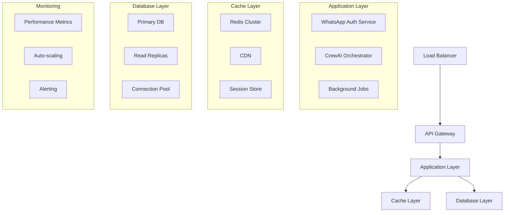

# Performance

## Estratégia de Otimização e Escalabilidade

A estratégia de performance foi projetada para garantir alta disponibilidade, baixa latência e escalabilidade da arquitetura híbrida de autenticação WhatsApp e sistema CrewAI, otimizando para cenários de alto volume e crescimento.

### Arquitetura de Performance



## 1. Otimizações de Banco de Dados

### Estratégia de Indexação

```sql
-- Índices para WhatsApp Auth Performance
CREATE INDEX CONCURRENTLY idx_whatsapp_sessions_lookup 
ON whatsapp_sessions(phone_number, company_id, expires_at) 
WHERE is_active = true;

CREATE INDEX CONCURRENTLY idx_whatsapp_sessions_cleanup 
ON whatsapp_sessions(expires_at, is_active) 
WHERE expires_at < NOW() + INTERVAL '1 day';

CREATE INDEX CONCURRENTLY idx_whatsapp_auth_logs_search 
ON whatsapp_auth_logs(phone_number, created_at, success);

-- Índices para CrewAI Performance
CREATE INDEX CONCURRENTLY idx_crews_company_active 
ON crews(company_id, is_active, created_at);

CREATE INDEX CONCURRENTLY idx_crew_agents_active 
ON crew_agents(crew_id, is_active, agent_type);

CREATE INDEX CONCURRENTLY idx_crew_tasks_status 
ON crew_tasks(status, created_at, priority);

CREATE INDEX CONCURRENTLY idx_crew_memories_access 
ON crew_memories(crew_id, memory_type, last_accessed_at);

-- Índices para Performance de Consultas
CREATE INDEX CONCURRENTLY idx_conversations_company_date 
ON conversations(company_id, created_at DESC);

CREATE INDEX CONCURRENTLY idx_messages_conversation_created 
ON messages(conversation_id, created_at DESC);

-- Índices Compostos para Multi-tenancy
CREATE INDEX CONCURRENTLY idx_users_company_role 
ON users(company_id, role, is_active);

CREATE INDEX CONCURRENTLY idx_companies_active_domain 
ON companies(is_active, domain) WHERE domain IS NOT NULL;
```

### Configuração de Connection Pooling

```typescript
// src/lib/database/pool-config.ts
import { Pool } from 'pg';

export const createDatabasePool = () => {
  return new Pool({
    host: process.env.DATABASE_HOST,
    port: parseInt(process.env.DATABASE_PORT || '5432'),
    database: process.env.DATABASE_NAME,
    user: process.env.DATABASE_USER,
    password: process.env.DATABASE_PASSWORD,
    
    // Configurações de pool otimizadas
    max: 20, // Máximo de conexões
    min: 5,  // Mínimo de conexões
    idleTimeoutMillis: 30000, // 30 segundos
    connectionTimeoutMillis: 2000, // 2 segundos
    
    // Configurações de performance
    statement_timeout: 30000, // 30 segundos
    query_timeout: 25000, // 25 segundos
    application_name: 'falachefe-crewai',
    
    // Configurações de SSL
    ssl: process.env.NODE_ENV === 'production' ? {
      rejectUnauthorized: false
    } : false
  });
};

// Pool específico para operações de leitura
export const createReadOnlyPool = () => {
  return new Pool({
    host: process.env.READ_REPLICA_HOST || process.env.DATABASE_HOST,
    port: parseInt(process.env.READ_REPLICA_PORT || process.env.DATABASE_PORT || '5432'),
    database: process.env.DATABASE_NAME,
    user: process.env.DATABASE_USER,
    password: process.env.DATABASE_PASSWORD,
    
    // Pool menor para leitura
    max: 10,
    min: 2,
    idleTimeoutMillis: 30000,
    connectionTimeoutMillis: 2000,
    
    // Configurações específicas para leitura
    statement_timeout: 10000, // 10 segundos
    query_timeout: 8000, // 8 segundos
    application_name: 'falachefe-crewai-readonly'
  });
};
```

### Otimização de Queries

```typescript
// src/lib/database/query-optimization.ts
export class QueryOptimizer {
  // Cache de queries preparadas
  private static preparedQueries = new Map<string, any>();

  static async executeOptimizedQuery<T>(
    query: string,
    params: any[],
    useCache: boolean = true
  ): Promise<T[]> {
    const cacheKey = `${query}:${JSON.stringify(params)}`;
    
    if (useCache) {
      const cached = await redis.get(cacheKey);
      if (cached) {
        return JSON.parse(cached);
      }
    }

    const startTime = Date.now();
    
    try {
      // Usar prepared statement se disponível
      let preparedQuery = this.preparedQueries.get(query);
      if (!preparedQuery) {
        preparedQuery = await db.prepare(query);
        this.preparedQueries.set(query, preparedQuery);
      }

      const result = await preparedQuery.execute(params);
      
      // Cache do resultado por 5 minutos
      if (useCache) {
        await redis.setex(cacheKey, 300, JSON.stringify(result));
      }

      // Log de performance
      const executionTime = Date.now() - startTime;
      if (executionTime > 1000) { // Log queries lentas
        logger.warn('Slow query detected', {
          query: query.substring(0, 100),
          executionTime: `${executionTime}ms`,
          params: params.length
        });
      }

      return result;
    } catch (error) {
      logger.error('Query execution failed', { query, params, error });
      throw error;
    }
  }

  // Batch operations para inserções em massa
  static async batchInsert<T>(
    table: string,
    data: T[],
    batchSize: number = 1000
  ): Promise<void> {
    const batches = this.chunkArray(data, batchSize);
    
    for (const batch of batches) {
      await db.query(`
        INSERT INTO ${table} (${Object.keys(batch[0]).join(', ')})
        VALUES ${batch.map((_, i) => 
          `(${Object.keys(batch[0]).map((_, j) => `$${i * Object.keys(batch[0]).length + j + 1}`).join(', ')})`
        ).join(', ')}
      `, batch.flatMap(item => Object.values(item)));
    }
  }

  private static chunkArray<T>(array: T[], size: number): T[][] {
    const chunks: T[][] = [];
    for (let i = 0; i < array.length; i += size) {
      chunks.push(array.slice(i, i + size));
    }
    return chunks;
  }
}
```

## 2. Cache Strategy

### Sistema de Cache Multi-Camada

```typescript
// src/lib/cache/cache-strategy.ts
export class CacheStrategy {
  // Cache L1: In-memory (Node.js)
  private static memoryCache = new Map<string, { value: any; expires: number }>();
  private static readonly MEMORY_CACHE_SIZE = 1000;
  private static readonly MEMORY_CACHE_TTL = 60000; // 1 minuto

  // Cache L2: Redis
  private static redis = new Redis(process.env.REDIS_URL!);

  static async get<T>(key: string): Promise<T | null> {
    // Tentar L1 primeiro
    const memoryEntry = this.memoryCache.get(key);
    if (memoryEntry && memoryEntry.expires > Date.now()) {
      return memoryEntry.value;
    }

    // Tentar L2 (Redis)
    try {
      const redisValue = await this.redis.get(key);
      if (redisValue) {
        const parsed = JSON.parse(redisValue);
        
        // Armazenar no L1 por 1 minuto
        this.setMemoryCache(key, parsed, this.MEMORY_CACHE_TTL);
        
        return parsed;
      }
    } catch (error) {
      logger.warn('Redis cache miss', { key, error });
    }

    return null;
  }

  static async set<T>(
    key: string, 
    value: T, 
    ttl: number = 3600, // 1 hora padrão
    options: { useMemory?: boolean; useRedis?: boolean } = {}
  ): Promise<void> {
    const { useMemory = true, useRedis = true } = options;

    // Armazenar no L1
    if (useMemory) {
      this.setMemoryCache(key, value, Math.min(ttl * 1000, this.MEMORY_CACHE_TTL));
    }

    // Armazenar no L2
    if (useRedis) {
      try {
        await this.redis.setex(key, ttl, JSON.stringify(value));
      } catch (error) {
        logger.warn('Redis cache set failed', { key, error });
      }
    }
  }

  private static setMemoryCache(key: string, value: any, ttl: number): void {
    // Implementar LRU se necessário
    if (this.memoryCache.size >= this.MEMORY_CACHE_SIZE) {
      const oldestKey = this.memoryCache.keys().next().value;
      this.memoryCache.delete(oldestKey);
    }

    this.memoryCache.set(key, {
      value,
      expires: Date.now() + ttl
    });
  }

  // Cache patterns específicos
  static async cacheUserSession(userId: string, sessionData: any): Promise<void> {
    await this.set(`user_session:${userId}`, sessionData, 86400); // 24 horas
  }

  static async cacheWhatsAppAuth(phoneNumber: string, companyId: string, authData: any): Promise<void> {
    await this.set(`whatsapp_auth:${phoneNumber}:${companyId}`, authData, 300); // 5 minutos
  }

  static async cacheCrewAIResponse(crewId: string, messageHash: string, response: any): Promise<void> {
    await this.set(`crewai_response:${crewId}:${messageHash}`, response, 1800); // 30 minutos
  }

  static async cacheCompanyConfig(companyId: string, config: any): Promise<void> {
    await this.set(`company_config:${companyId}`, config, 3600); // 1 hora
  }
}
```

### Cache Invalidation Strategy

```typescript
// src/lib/cache/cache-invalidation.ts
export class CacheInvalidation {
  private static redis = new Redis(process.env.REDIS_URL!);

  // Invalidação por padrões
  static async invalidatePattern(pattern: string): Promise<void> {
    try {
      const keys = await this.redis.keys(pattern);
      if (keys.length > 0) {
        await this.redis.del(...keys);
        logger.info('Cache invalidated', { pattern, keysCount: keys.length });
      }
    } catch (error) {
      logger.error('Cache invalidation failed', { pattern, error });
    }
  }

  // Invalidação específica por empresa
  static async invalidateCompanyCache(companyId: string): Promise<void> {
    await Promise.all([
      this.invalidatePattern(`company_config:${companyId}`),
      this.invalidatePattern(`crew:*:${companyId}`),
      this.invalidatePattern(`whatsapp_auth:*:${companyId}`),
      this.invalidatePattern(`user_session:*:${companyId}`)
    ]);
  }

  // Invalidação por usuário
  static async invalidateUserCache(userId: string): Promise<void> {
    await this.invalidatePattern(`user_session:${userId}`);
    await this.invalidatePattern(`user_permissions:${userId}`);
  }

  // Invalidação por crew
  static async invalidateCrewCache(crewId: string): Promise<void> {
    await this.invalidatePattern(`crewai_response:${crewId}:*`);
    await this.invalidatePattern(`crew_memory:${crewId}:*`);
  }

  // Invalidação em cascata
  static async invalidateCascade(resourceType: string, resourceId: string): Promise<void> {
    switch (resourceType) {
      case 'company':
        await this.invalidateCompanyCache(resourceId);
        break;
      case 'user':
        await this.invalidateUserCache(resourceId);
        break;
      case 'crew':
        await this.invalidateCrewCache(resourceId);
        break;
      default:
        logger.warn('Unknown resource type for cache invalidation', { resourceType, resourceId });
    }
  }
}
```

## 3. Otimização de APIs

### API Response Optimization

```typescript
// src/lib/performance/api-optimization.ts
export class APIOptimization {
  // Compressão de resposta
  static async compressResponse(data: any): Promise<Buffer> {
    const jsonString = JSON.stringify(data);
    
    if (jsonString.length < 1024) {
      return Buffer.from(jsonString);
    }

    return new Promise((resolve, reject) => {
      zlib.gzip(jsonString, (err, compressed) => {
        if (err) reject(err);
        else resolve(compressed);
      });
    });
  }

  // Paginação otimizada
  static async paginateQuery<T>(
    query: string,
    params: any[],
    page: number,
    limit: number,
    orderBy: string = 'created_at',
    orderDirection: 'ASC' | 'DESC' = 'DESC'
  ): Promise<{
    data: T[];
    pagination: {
      page: number;
      limit: number;
      total: number;
      totalPages: number;
      hasNext: boolean;
      hasPrev: boolean;
    };
  }> {
    const offset = (page - 1) * limit;
    
    // Query otimizada com COUNT em paralelo
    const [data, countResult] = await Promise.all([
      db.query(`${query} ORDER BY ${orderBy} ${orderDirection} LIMIT $${params.length + 1} OFFSET $${params.length + 2}`, 
        [...params, limit, offset]),
      db.query(`SELECT COUNT(*) as total FROM (${query}) as count_query`, params)
    ]);

    const total = parseInt(countResult.rows[0].total);
    const totalPages = Math.ceil(total / limit);

    return {
      data: data.rows,
      pagination: {
        page,
        limit,
        total,
        totalPages,
        hasNext: page < totalPages,
        hasPrev: page > 1
      }
    };
  }

  // Lazy loading para relacionamentos
  static async loadRelations<T>(
    entities: T[],
    relations: string[],
    loader: (ids: string[], relation: string) => Promise<any[]>
  ): Promise<T[]> {
    const enrichedEntities = await Promise.all(
      entities.map(async (entity) => {
        const enriched = { ...entity };
        
        for (const relation of relations) {
          if (entity[`${relation}_id`]) {
            const relatedData = await loader([entity[`${relation}_id`]], relation);
            enriched[relation] = relatedData[0];
          }
        }
        
        return enriched;
      })
    );

    return enrichedEntities;
  }

  // Response caching middleware
  static createCacheMiddleware(ttl: number = 300) {
    return async (req: NextRequest, next: () => Promise<NextResponse>) => {
      const cacheKey = `api:${req.nextUrl.pathname}:${req.nextUrl.search}`;
      
      // Verificar cache
      const cached = await CacheStrategy.get(cacheKey);
      if (cached) {
        return new NextResponse(JSON.stringify(cached), {
          headers: {
            'Content-Type': 'application/json',
            'X-Cache': 'HIT',
            'X-Cache-TTL': ttl.toString()
          }
        });
      }

      // Executar request
      const response = await next();
      
      // Cache da resposta se for sucesso
      if (response.status === 200) {
        const responseData = await response.json();
        await CacheStrategy.set(cacheKey, responseData, ttl);
        
        // Adicionar headers de cache
        response.headers.set('X-Cache', 'MISS');
        response.headers.set('X-Cache-TTL', ttl.toString());
      }

      return response;
    };
  }
}
```

### Request Batching

```typescript
// src/lib/performance/request-batching.ts
export class RequestBatcher {
  private static batches = new Map<string, {
    requests: Array<{ resolve: Function; reject: Function; data: any }>;
    timer: NodeJS.Timeout;
  }>();

  static async batchRequest<T>(
    batchKey: string,
    data: any,
    batchProcessor: (batchData: any[]) => Promise<T[]>,
    batchSize: number = 10,
    batchTimeout: number = 50 // 50ms
  ): Promise<T> {
    return new Promise((resolve, reject) => {
      // Verificar se já existe um batch ativo
      let batch = this.batches.get(batchKey);
      
      if (!batch) {
        batch = {
          requests: [],
          timer: setTimeout(async () => {
            await this.processBatch(batchKey, batchProcessor);
          }, batchTimeout)
        };
        this.batches.set(batchKey, batch);
      }

      // Adicionar request ao batch
      batch.requests.push({ resolve, reject, data });

      // Processar batch se atingir o tamanho máximo
      if (batch.requests.length >= batchSize) {
        clearTimeout(batch.timer);
        this.processBatch(batchKey, batchProcessor);
      }
    });
  }

  private static async processBatch<T>(
    batchKey: string,
    batchProcessor: (batchData: any[]) => Promise<T[]>
  ): Promise<void> {
    const batch = this.batches.get(batchKey);
    if (!batch || batch.requests.length === 0) return;

    // Remover batch da lista
    this.batches.delete(batchKey);

    try {
      // Processar todos os requests em lote
      const batchData = batch.requests.map(req => req.data);
      const results = await batchProcessor(batchData);

      // Resolver todos os promises
      batch.requests.forEach((request, index) => {
        if (results[index]) {
          request.resolve(results[index]);
        } else {
          request.reject(new Error('Batch processing failed'));
        }
      });
    } catch (error) {
      // Rejeitar todos os requests em caso de erro
      batch.requests.forEach(request => {
        request.reject(error);
      });
    }
  }

  // Batch específico para consultas de usuários
  static async batchUserLookup(userIds: string[]): Promise<any[]> {
    return this.batchRequest(
      'user_lookup',
      userIds,
      async (batchData: string[][]) => {
        const allUserIds = batchData.flat();
        return await db.query('SELECT * FROM users WHERE id = ANY($1)', [allUserIds]);
      }
    );
  }

  // Batch específico para consultas de empresas
  static async batchCompanyLookup(companyIds: string[]): Promise<any[]> {
    return this.batchRequest(
      'company_lookup',
      companyIds,
      async (batchData: string[][]) => {
        const allCompanyIds = batchData.flat();
        return await db.query('SELECT * FROM companies WHERE id = ANY($1)', [allCompanyIds]);
      }
    );
  }
}
```

## 4. Background Jobs e Queue System

### Sistema de Queue Otimizado

```typescript
// src/lib/performance/queue-system.ts
import { Queue, Worker, Job } from 'bullmq';
import IORedis from 'ioredis';

const redis = new IORedis(process.env.REDIS_URL!);

export class QueueSystem {
  // Queue para processamento WhatsApp
  static whatsappQueue = new Queue('whatsapp-processing', {
    connection: redis,
    defaultJobOptions: {
      removeOnComplete: 100,
      removeOnFail: 50,
      attempts: 3,
      backoff: {
        type: 'exponential',
        delay: 2000
      }
    }
  });

  // Queue para processamento CrewAI
  static crewaiQueue = new Queue('crewai-processing', {
    connection: redis,
    defaultJobOptions: {
      removeOnComplete: 100,
      removeOnFail: 50,
      attempts: 3,
      backoff: {
        type: 'exponential',
        delay: 3000
      }
    }
  });

  // Queue para tarefas administrativas
  static adminQueue = new Queue('admin-tasks', {
    connection: redis,
    defaultJobOptions: {
      removeOnComplete: 50,
      removeOnFail: 25,
      attempts: 2
    }
  });

  // Adicionar job ao queue
  static async addWhatsAppJob(data: any, options?: any): Promise<void> {
    await this.whatsappQueue.add('process-message', data, {
      priority: data.priority || 0,
      delay: data.delay || 0,
      ...options
    });
  }

  static async addCrewAIJob(data: any, options?: any): Promise<void> {
    await this.crewaiQueue.add('process-crew', data, {
      priority: data.priority || 0,
      delay: data.delay || 0,
      ...options
    });
  }

  // Workers para processamento
  static createWorkers(): void {
    // Worker para WhatsApp
    new Worker('whatsapp-processing', async (job: Job) => {
      const { messageData } = job.data;
      
      try {
        await this.processWhatsAppMessage(messageData);
        logger.info('WhatsApp message processed', { jobId: job.id });
      } catch (error) {
        logger.error('WhatsApp processing failed', { jobId: job.id, error });
        throw error;
      }
    }, {
      connection: redis,
      concurrency: 5 // Processar até 5 jobs simultaneamente
    });

    // Worker para CrewAI
    new Worker('crewai-processing', async (job: Job) => {
      const { crewData } = job.data;
      
      try {
        await this.processCrewAITask(crewData);
        logger.info('CrewAI task processed', { jobId: job.id });
      } catch (error) {
        logger.error('CrewAI processing failed', { jobId: job.id, error });
        throw error;
      }
    }, {
      connection: redis,
      concurrency: 3 // Processar até 3 jobs simultaneamente
    });
  }

  private static async processWhatsAppMessage(data: any): Promise<void> {
    // Implementar processamento WhatsApp
    await whatsappAuth.processMessage(data);
  }

  private static async processCrewAITask(data: any): Promise<void> {
    // Implementar processamento CrewAI
    await crewOrchestrator.processTask(data);
  }
}
```

### Background Job Optimization

```typescript
// src/lib/performance/background-jobs.ts
export class BackgroundJobOptimizer {
  // Job para limpeza de cache
  static async scheduleCacheCleanup(): Promise<void> {
    setInterval(async () => {
      try {
        await CacheInvalidation.invalidatePattern('temp:*');
        await CacheInvalidation.invalidatePattern('session:*');
        logger.info('Cache cleanup completed');
      } catch (error) {
        logger.error('Cache cleanup failed', { error });
      }
    }, 300000); // A cada 5 minutos
  }

  // Job para limpeza de sessões expiradas
  static async scheduleSessionCleanup(): Promise<void> {
    setInterval(async () => {
      try {
        const result = await db.query(`
          DELETE FROM whatsapp_sessions 
          WHERE expires_at < NOW() 
          AND last_used_at < NOW() - INTERVAL '7 days'
        `);
        
        logger.info('Session cleanup completed', { 
          deletedCount: result.rowCount 
        });
      } catch (error) {
        logger.error('Session cleanup failed', { error });
      }
    }, 3600000); // A cada hora
  }

  // Job para otimização de métricas
  static async scheduleMetricsAggregation(): Promise<void> {
    setInterval(async () => {
      try {
        await this.aggregateMetrics();
        logger.info('Metrics aggregation completed');
      } catch (error) {
        logger.error('Metrics aggregation failed', { error });
      }
    }, 300000); // A cada 5 minutos
  }

  private static async aggregateMetrics(): Promise<void> {
    // Agregar métricas de performance
    const metrics = await db.query(`
      SELECT 
        company_id,
        COUNT(*) as total_requests,
        AVG(response_time) as avg_response_time,
        MAX(response_time) as max_response_time,
        DATE_TRUNC('hour', created_at) as hour
      FROM performance_metrics 
      WHERE created_at > NOW() - INTERVAL '1 hour'
      GROUP BY company_id, hour
    `);

    // Armazenar métricas agregadas
    for (const metric of metrics.rows) {
      await CacheStrategy.set(
        `metrics:${metric.company_id}:${metric.hour}`,
        metric,
        86400 // 24 horas
      );
    }
  }

  // Job para backup de dados críticos
  static async scheduleDataBackup(): Promise<void> {
    setInterval(async () => {
      try {
        await this.backupCriticalData();
        logger.info('Data backup completed');
      } catch (error) {
        logger.error('Data backup failed', { error });
      }
    }, 86400000); // A cada 24 horas
  }

  private static async backupCriticalData(): Promise<void> {
    // Backup de configurações de empresas
    const companyConfigs = await db.query(`
      SELECT id, name, settings, created_at 
      FROM companies 
      WHERE is_active = true
    `);

    await CacheStrategy.set('backup:company_configs', companyConfigs.rows, 604800); // 7 dias

    // Backup de configurações CrewAI
    const crewConfigs = await db.query(`
      SELECT id, name, configuration, company_id 
      FROM crews 
      WHERE is_active = true
    `);

    await CacheStrategy.set('backup:crew_configs', crewConfigs.rows, 604800); // 7 dias
  }
}
```

## 5. CDN e Asset Optimization

### CDN Configuration

```typescript
// src/lib/performance/cdn-config.ts
export class CDNOptimizer {
  private static cloudflare = new CloudflareAPI({
    apiToken: process.env.CLOUDFLARE_API_TOKEN!
  });

  // Configurar cache rules
  static async configureCacheRules(): Promise<void> {
    const cacheRules = [
      {
        url: 'api/whatsapp/*',
        ttl: 300, // 5 minutos
        browserTtl: 60 // 1 minuto no browser
      },
      {
        url: 'api/crewai/*',
        ttl: 600, // 10 minutos
        browserTtl: 120 // 2 minutos no browser
      },
      {
        url: 'api/admin/*',
        ttl: 0, // Sem cache
        browserTtl: 0
      },
      {
        url: 'static/*',
        ttl: 86400, // 24 horas
        browserTtl: 3600 // 1 hora no browser
      }
    ];

    for (const rule of cacheRules) {
      await this.cloudflare.pageRules.create({
        zone_id: process.env.CLOUDFLARE_ZONE_ID!,
        targets: [{ target: 'url', constraint: { operator: 'matches', value: rule.url } }],
        actions: [
          { id: 'cache_level', value: 'cache_everything' },
          { id: 'edge_cache_ttl', value: rule.ttl },
          { id: 'browser_cache_ttl', value: rule.browserTtl }
        ]
      });
    }
  }

  // Purge cache por padrão
  static async purgeCache(pattern: string): Promise<void> {
    try {
      await this.cloudflare.zones.purgeCache(process.env.CLOUDFLARE_ZONE_ID!, {
        files: [pattern]
      });
      logger.info('CDN cache purged', { pattern });
    } catch (error) {
      logger.error('CDN cache purge failed', { pattern, error });
    }
  }

  // Otimização de imagens
  static getOptimizedImageUrl(originalUrl: string, options: {
    width?: number;
    height?: number;
    quality?: number;
    format?: 'webp' | 'jpeg' | 'png';
  }): string {
    const { width, height, quality = 80, format = 'webp' } = options;
    
    const params = new URLSearchParams();
    if (width) params.set('width', width.toString());
    if (height) params.set('height', height.toString());
    params.set('quality', quality.toString());
    params.set('format', format);

    return `${originalUrl}?${params.toString()}`;
  }
}
```

## 6. Database Performance Monitoring

### Query Performance Monitoring

```typescript
// src/lib/performance/query-monitoring.ts
export class QueryMonitor {
  private static slowQueries = new Map<string, number>();
  private static readonly SLOW_QUERY_THRESHOLD = 1000; // 1 segundo

  static async monitorQuery<T>(
    query: string,
    params: any[],
    executor: () => Promise<T>
  ): Promise<T> {
    const startTime = Date.now();
    const queryHash = this.hashQuery(query, params);

    try {
      const result = await executor();
      const executionTime = Date.now() - startTime;

      // Log queries lentas
      if (executionTime > this.SLOW_QUERY_THRESHOLD) {
        this.logSlowQuery(query, params, executionTime);
        this.slowQueries.set(queryHash, executionTime);
      }

      // Métricas de performance
      await this.recordQueryMetrics(queryHash, executionTime, true);

      return result;
    } catch (error) {
      const executionTime = Date.now() - startTime;
      await this.recordQueryMetrics(queryHash, executionTime, false);
      throw error;
    }
  }

  private static hashQuery(query: string, params: any[]): string {
    // Normalizar query removendo valores específicos
    const normalizedQuery = query.replace(/\$\d+/g, '$?');
    return crypto.createHash('md5').update(normalizedQuery + params.length).digest('hex');
  }

  private static logSlowQuery(query: string, params: any[], executionTime: number): void {
    logger.warn('Slow query detected', {
      query: query.substring(0, 200),
      params: params.length,
      executionTime: `${executionTime}ms`,
      timestamp: new Date().toISOString()
    });
  }

  private static async recordQueryMetrics(
    queryHash: string,
    executionTime: number,
    success: boolean
  ): Promise<void> {
    await db.query(`
      INSERT INTO query_performance_metrics (
        query_hash,
        execution_time,
        success,
        timestamp
      ) VALUES ($1, $2, $3, $4)
    `, [queryHash, executionTime, success, new Date()]);
  }

  // Relatório de performance
  static async getPerformanceReport(): Promise<any> {
    const report = await db.query(`
      SELECT 
        query_hash,
        COUNT(*) as total_queries,
        AVG(execution_time) as avg_execution_time,
        MAX(execution_time) as max_execution_time,
        SUM(CASE WHEN success THEN 1 ELSE 0 END) as successful_queries,
        SUM(CASE WHEN success THEN 0 ELSE 1 END) as failed_queries
      FROM query_performance_metrics 
      WHERE timestamp > NOW() - INTERVAL '1 hour'
      GROUP BY query_hash
      ORDER BY avg_execution_time DESC
      LIMIT 10
    `);

    return report.rows;
  }
}
```

## 7. Auto-scaling e Load Balancing

### Auto-scaling Configuration

```typescript
// src/lib/performance/auto-scaling.ts
export class AutoScaling {
  private static readonly SCALE_UP_THRESHOLD = 80; // 80% CPU
  private static readonly SCALE_DOWN_THRESHOLD = 20; // 20% CPU
  private static readonly MIN_INSTANCES = 2;
  private static readonly MAX_INSTANCES = 10;

  static async checkScalingNeeds(): Promise<void> {
    const metrics = await this.getSystemMetrics();
    
    if (metrics.cpuUsage > this.SCALE_UP_THRESHOLD) {
      await this.scaleUp();
    } else if (metrics.cpuUsage < this.SCALE_DOWN_THRESHOLD) {
      await this.scaleDown();
    }
  }

  private static async getSystemMetrics(): Promise<{
    cpuUsage: number;
    memoryUsage: number;
    requestRate: number;
  }> {
    // Obter métricas do sistema
    const cpuUsage = await this.getCPUUsage();
    const memoryUsage = await this.getMemoryUsage();
    const requestRate = await this.getRequestRate();

    return { cpuUsage, memoryUsage, requestRate };
  }

  private static async scaleUp(): Promise<void> {
    const currentInstances = await this.getCurrentInstanceCount();
    
    if (currentInstances < this.MAX_INSTANCES) {
      await this.deployNewInstance();
      logger.info('Scaling up', { newInstanceCount: currentInstances + 1 });
    }
  }

  private static async scaleDown(): Promise<void> {
    const currentInstances = await this.getCurrentInstanceCount();
    
    if (currentInstances > this.MIN_INSTANCES) {
      await this.removeInstance();
      logger.info('Scaling down', { newInstanceCount: currentInstances - 1 });
    }
  }

  private static async getCPUUsage(): Promise<number> {
    // Implementar obtenção de CPU usage
    return 0;
  }

  private static async getMemoryUsage(): Promise<number> {
    // Implementar obtenção de memory usage
    return 0;
  }

  private static async getRequestRate(): Promise<number> {
    // Implementar obtenção de request rate
    return 0;
  }

  private static async getCurrentInstanceCount(): Promise<number> {
    // Implementar obtenção de instance count
    return 0;
  }

  private static async deployNewInstance(): Promise<void> {
    // Implementar deploy de nova instância
  }

  private static async removeInstance(): Promise<void> {
    // Implementar remoção de instância
  }
}
```

## Benefícios da Estratégia de Performance

✅ **Database Optimization**: Índices otimizados e connection pooling  
✅ **Cache Strategy**: Multi-camada com invalidação inteligente  
✅ **API Optimization**: Compressão, paginação e batching  
✅ **Background Jobs**: Processamento assíncrono com queues  
✅ **CDN Integration**: Cache distribuído e otimização de assets  
✅ **Query Monitoring**: Detecção de queries lentas  
✅ **Auto-scaling**: Escalabilidade automática baseada em métricas  
✅ **Performance Metrics**: Monitoramento contínuo de performance  

**A estratégia de performance está completa e pronta para implementação! Próxima seção?**
