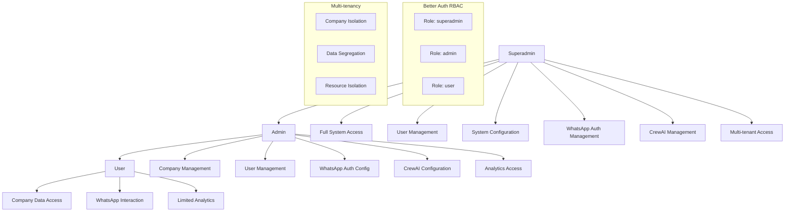

# Security

## Estratégia de Segurança Baseada em Better Auth + RBAC

A estratégia de segurança foi projetada para proteger a arquitetura híbrida de autenticação WhatsApp e sistema CrewAI, utilizando Better Auth com controle de acesso baseado em roles (RBAC) e multi-tenancy rigoroso.

### Hierarquia de Roles e Permissões



## 1. Configuração Better Auth com RBAC

### Configuração Principal do Better Auth

```typescript
// src/lib/auth/config.ts
import { betterAuth } from "better-auth";
import { admin } from "better-auth/plugins/admin";
import { organization } from "better-auth/plugins/organization";
import { emailAndPassword } from "better-auth/plugins/email-and-password";
import { drizzleAdapter } from "better-auth/adapters/drizzle";
import { db } from "@/lib/database";

export const auth = betterAuth({
  database: drizzleAdapter(db, {
    provider: "pg"
  }),
  
  emailAndPassword: {
    enabled: true,
    requireEmailVerification: false, // Para desenvolvimento
    minPasswordLength: 8,
    maxPasswordLength: 128,
    passwordHashing: {
      algorithm: "scrypt",
      keyLength: 64,
      saltLength: 32
    }
  },

  socialProviders: {
    google: {
      clientId: process.env.GOOGLE_CLIENT_ID!,
      clientSecret: process.env.GOOGLE_CLIENT_SECRET!,
    },
    github: {
      clientId: process.env.GITHUB_CLIENT_ID!,
      clientSecret: process.env.GITHUB_CLIENT_SECRET!,
    }
  },

  plugins: [
    admin({
      // Configurações específicas do admin
      impersonationSessionDuration: 3600, // 1 hora
    }),
    
    organization({
      // Configurações de organização para multi-tenancy
      allowUserToCreateOrganization: false, // Apenas admins podem criar
      organizationLimit: {
        free: 1,
        pro: 5,
        enterprise: -1 // Ilimitado
      }
    })
  ],

  // Configurações de sessão
  session: {
    expiresIn: 60 * 60 * 24 * 7, // 7 dias
    updateAge: 60 * 60 * 24, // 1 dia
    cookieCache: {
      enabled: true,
      maxAge: 60 * 5 // 5 minutos
    }
  },

  // Configurações de segurança
  advanced: {
    generateId: () => crypto.randomUUID(),
    crossSubDomainCookies: {
      enabled: false,
      domain: process.env.NODE_ENV === 'production' ? '.falachefe.com' : 'localhost'
    },
    useSecureCookies: process.env.NODE_ENV === 'production',
    trustedOrigins: [
      'http://localhost:3000',
      'https://falachefe.com',
      'https://*.falachefe.com'
    ]
  },

  // Configurações de rate limiting
  rateLimit: {
    window: 60, // 1 minuto
    max: 100, // 100 requests por minuto
    skipSuccessfulRequests: false,
    skipFailedRequests: false
  },

  // Callbacks para controle de acesso
  callbacks: {
    async session({ session, user }) {
      // Adicionar informações de role e company ao session
      if (session?.user) {
        session.user.role = user.role;
        session.user.companyId = user.companyId;
        session.user.permissions = await getUserPermissions(user.id);
      }
      return session;
    },

    async jwt({ token, user, account }) {
      // Adicionar informações de role ao JWT
      if (user) {
        token.role = user.role;
        token.companyId = user.companyId;
      }
      return token;
    }
  }
});
```

### Sistema de Roles e Permissões

```typescript
// src/lib/auth/rbac.ts
export const ROLES = {
  SUPERADMIN: 'superadmin',
  ADMIN: 'admin', 
  USER: 'user'
} as const;

export const PERMISSIONS = {
  // Superadmin permissions
  SYSTEM_MANAGEMENT: 'system:manage',
  USER_MANAGEMENT: 'user:manage',
  ORGANIZATION_MANAGEMENT: 'organization:manage',
  
  // Admin permissions
  COMPANY_MANAGEMENT: 'company:manage',
  COMPANY_USER_MANAGEMENT: 'company:user:manage',
  WHATSAPP_CONFIG: 'whatsapp:config',
  CREWAI_CONFIG: 'crewai:config',
  ANALYTICS_FULL: 'analytics:full',
  
  // User permissions
  WHATSAPP_INTERACT: 'whatsapp:interact',
  ANALYTICS_READ: 'analytics:read',
  PROFILE_MANAGE: 'profile:manage'
} as const;

export const ROLE_PERMISSIONS = {
  [ROLES.SUPERADMIN]: [
    PERMISSIONS.SYSTEM_MANAGEMENT,
    PERMISSIONS.USER_MANAGEMENT,
    PERMISSIONS.ORGANIZATION_MANAGEMENT,
    PERMISSIONS.COMPANY_MANAGEMENT,
    PERMISSIONS.COMPANY_USER_MANAGEMENT,
    PERMISSIONS.WHATSAPP_CONFIG,
    PERMISSIONS.CREWAI_CONFIG,
    PERMISSIONS.ANALYTICS_FULL,
    PERMISSIONS.WHATSAPP_INTERACT,
    PERMISSIONS.ANALYTICS_READ,
    PERMISSIONS.PROFILE_MANAGE
  ],
  
  [ROLES.ADMIN]: [
    PERMISSIONS.COMPANY_MANAGEMENT,
    PERMISSIONS.COMPANY_USER_MANAGEMENT,
    PERMISSIONS.WHATSAPP_CONFIG,
    PERMISSIONS.CREWAI_CONFIG,
    PERMISSIONS.ANALYTICS_FULL,
    PERMISSIONS.WHATSAPP_INTERACT,
    PERMISSIONS.ANALYTICS_READ,
    PERMISSIONS.PROFILE_MANAGE
  ],
  
  [ROLES.USER]: [
    PERMISSIONS.WHATSAPP_INTERACT,
    PERMISSIONS.ANALYTICS_READ,
    PERMISSIONS.PROFILE_MANAGE
  ]
} as const;

// Função para verificar permissões
export const hasPermission = (userRole: string, permission: string): boolean => {
  const rolePermissions = ROLE_PERMISSIONS[userRole as keyof typeof ROLE_PERMISSIONS];
  return rolePermissions?.includes(permission) || false;
};

// Função para verificar múltiplas permissões
export const hasAllPermissions = (userRole: string, permissions: string[]): boolean => {
  return permissions.every(permission => hasPermission(userRole, permission));
};

// Função para verificar se é superadmin
export const isSuperadmin = (userRole: string): boolean => {
  return userRole === ROLES.SUPERADMIN;
};

// Função para verificar se é admin
export const isAdmin = (userRole: string): boolean => {
  return userRole === ROLES.ADMIN || userRole === ROLES.SUPERADMIN;
};
```

### Middleware de Autenticação e Autorização

```typescript
// src/lib/auth/middleware.ts
import { NextRequest, NextResponse } from 'next/server';
import { auth } from './config';
import { hasPermission, isSuperadmin, isAdmin } from './rbac';

export async function authenticateRequest(request: NextRequest) {
  try {
    const session = await auth.api.getSession({
      headers: request.headers
    });

    if (!session?.user) {
      return NextResponse.json(
        { error: 'Unauthorized' }, 
        { status: 401 }
      );
    }

    return session;
  } catch (error) {
    return NextResponse.json(
      { error: 'Authentication failed' }, 
      { status: 401 }
    );
  }
}

export async function authorizeRequest(
  request: NextRequest, 
  requiredPermission: string
) {
  const session = await authenticateRequest(request);
  
  if (session instanceof NextResponse) {
    return session; // Erro de autenticação
  }

  if (!hasPermission(session.user.role, requiredPermission)) {
    return NextResponse.json(
      { error: 'Insufficient permissions' }, 
      { status: 403 }
    );
  }

  return session;
}

export async function authorizeAdminRequest(request: NextRequest) {
  const session = await authenticateRequest(request);
  
  if (session instanceof NextResponse) {
    return session;
  }

  if (!isAdmin(session.user.role)) {
    return NextResponse.json(
      { error: 'Admin access required' }, 
      { status: 403 }
    );
  }

  return session;
}

export async function authorizeSuperadminRequest(request: NextRequest) {
  const session = await authenticateRequest(request);
  
  if (session instanceof NextResponse) {
    return session;
  }

  if (!isSuperadmin(session.user.role)) {
    return NextResponse.json(
      { error: 'Superadmin access required' }, 
      { status: 403 }
    );
  }

  return session;
}
```

## 2. Proteção Multi-Tenant

### Middleware de Isolamento por Empresa

```typescript
// src/lib/auth/tenant-middleware.ts
export async function validateTenantAccess(
  request: NextRequest,
  companyId: string,
  session: any
): Promise<boolean> {
  // Superadmin tem acesso a todas as empresas
  if (isSuperadmin(session.user.role)) {
    return true;
  }

  // Admin tem acesso apenas à sua empresa
  if (isAdmin(session.user.role)) {
    return session.user.companyId === companyId;
  }

  // User tem acesso apenas à sua empresa
  return session.user.companyId === companyId;
}

export async function authorizeTenantRequest(
  request: NextRequest,
  companyId: string
) {
  const session = await authenticateRequest(request);
  
  if (session instanceof NextResponse) {
    return session;
  }

  const hasAccess = await validateTenantAccess(request, companyId, session);
  
  if (!hasAccess) {
    return NextResponse.json(
      { error: 'Access denied to this company' }, 
      { status: 403 }
    );
  }

  return session;
}

// Helper para extrair companyId do request
export function extractCompanyId(request: NextRequest): string | null {
  // Tentar extrair do path
  const pathMatch = request.nextUrl.pathname.match(/\/company\/([^\/]+)/);
  if (pathMatch) {
    return pathMatch[1];
  }

  // Tentar extrair do query params
  const queryCompanyId = request.nextUrl.searchParams.get('companyId');
  if (queryCompanyId) {
    return queryCompanyId;
  }

  // Tentar extrair do body (para POST/PUT)
  return null;
}
```

## 3. Proteção de APIs

### Proteção de Endpoints WhatsApp Auth

```typescript
// src/app/api/auth/whatsapp/verify/route.ts
import { authorizeRequest } from '@/lib/auth/middleware';
import { PERMISSIONS } from '@/lib/auth/rbac';

export async function POST(request: NextRequest) {
  // Verificar se usuário tem permissão para interagir com WhatsApp
  const session = await authorizeRequest(request, PERMISSIONS.WHATSAPP_INTERACT);
  
  if (session instanceof NextResponse) {
    return session; // Erro de autorização
  }

  try {
    const { phoneNumber, companyId, code } = await request.json();

    // Validar acesso à empresa
    const tenantSession = await authorizeTenantRequest(request, companyId);
    if (tenantSession instanceof NextResponse) {
      return tenantSession;
    }

    // Verificar código
    const authResult = await whatsappAuth.verifyCode(phoneNumber, companyId, code);

    return Response.json({
      status: 'success',
      authenticated: true,
      sessionToken: authResult.sessionToken,
      user: {
        id: authResult.user.id,
        name: authResult.user.name,
        phoneNumber: authResult.user.phoneNumber
      }
    });

  } catch (error) {
    if (error instanceof WhatsAppAuthError) {
      return Response.json({ 
        error: error.message,
        code: error.code 
      }, { status: 400 });
    }
    
    return Response.json({ error: 'Internal server error' }, { status: 500 });
  }
}
```

### Proteção de Endpoints CrewAI

```typescript
// src/app/api/crewai/process/route.ts
import { authorizeRequest } from '@/lib/auth/middleware';
import { PERMISSIONS } from '@/lib/auth/rbac';

export async function POST(request: NextRequest) {
  // Verificar se usuário tem permissão para configurar CrewAI
  const session = await authorizeRequest(request, PERMISSIONS.CREWAI_CONFIG);
  
  if (session instanceof NextResponse) {
    return session;
  }

  try {
    const { message, companyId, conversationId } = await request.json();

    // Validar acesso à empresa
    const tenantSession = await authorizeTenantRequest(request, companyId);
    if (tenantSession instanceof NextResponse) {
      return tenantSession;
    }

    // Processar mensagem com CrewAI
    const crewResponse = await crewOrchestrator.processMessage({
      message,
      userId: session.user.id,
      companyId,
      conversationId,
      authContext: {
        type: 'api',
        userId: session.user.id,
        role: session.user.role,
        permissions: session.user.permissions
      }
    });

    return Response.json(crewResponse);

  } catch (error) {
    logger.error('CrewAI processing error:', error);
    return Response.json({ error: 'Internal server error' }, { status: 500 });
  }
}
```

### Proteção de Endpoints Admin

```typescript
// src/app/api/admin/users/route.ts
import { authorizeAdminRequest } from '@/lib/auth/middleware';

export async function GET(request: NextRequest) {
  // Verificar se usuário é admin
  const session = await authorizeAdminRequest(request);
  
  if (session instanceof NextResponse) {
    return session;
  }

  try {
    const { searchParams } = new URL(request.url);
    const companyId = searchParams.get('companyId');
    const page = parseInt(searchParams.get('page') || '1');
    const limit = parseInt(searchParams.get('limit') || '10');

    // Validar acesso à empresa (se especificada)
    if (companyId) {
      const tenantSession = await authorizeTenantRequest(request, companyId);
      if (tenantSession instanceof NextResponse) {
        return tenantSession;
      }
    }

    // Buscar usuários
    const users = await getUsers({
      companyId: companyId || session.user.companyId,
      page,
      limit,
      role: session.user.role === 'superadmin' ? undefined : 'user' // Admin só vê users
    });

    return Response.json(users);

  } catch (error) {
    logger.error('Admin users fetch error:', error);
    return Response.json({ error: 'Internal server error' }, { status: 500 });
  }
}

export async function POST(request: NextRequest) {
  // Verificar se usuário é admin
  const session = await authorizeAdminRequest(request);
  
  if (session instanceof NextResponse) {
    return session;
  }

  try {
    const { email, name, role, companyId } = await request.json();

    // Validar acesso à empresa
    const targetCompanyId = companyId || session.user.companyId;
    const tenantSession = await authorizeTenantRequest(request, targetCompanyId);
    if (tenantSession instanceof NextResponse) {
      return tenantSession;
    }

    // Validar role (admin não pode criar superadmin)
    if (role === 'superadmin' && session.user.role !== 'superadmin') {
      return Response.json(
        { error: 'Cannot create superadmin user' }, 
        { status: 403 }
      );
    }

    // Criar usuário
    const newUser = await createUser({
      email,
      name,
      role: role || 'user',
      companyId: targetCompanyId
    });

    return Response.json(newUser, { status: 201 });

  } catch (error) {
    logger.error('Admin user creation error:', error);
    return Response.json({ error: 'Internal server error' }, { status: 500 });
  }
}
```

## 4. Proteção de Dados Sensíveis

### Sanitização de Dados

```typescript
// src/lib/security/data-sanitization.ts
export class DataSanitizer {
  static sanitizeUser(user: any): any {
    const sanitized = { ...user };
    
    // Remover campos sensíveis
    delete sanitized.password;
    delete sanitized.passwordHash;
    delete sanitized.twoFactorSecret;
    delete sanitized.recoveryCodes;
    
    // Mascarar dados sensíveis
    if (sanitized.phoneNumber) {
      sanitized.phoneNumber = this.maskPhoneNumber(sanitized.phoneNumber);
    }
    
    if (sanitized.email && !this.isAdminEmail(sanitized.email)) {
      sanitized.email = this.maskEmail(sanitized.email);
    }
    
    return sanitized;
  }

  static sanitizeSession(session: any): any {
    const sanitized = { ...session };
    
    // Mascarar token de sessão
    if (sanitized.sessionToken) {
      sanitized.sessionToken = this.maskToken(sanitized.sessionToken);
    }
    
    return sanitized;
  }

  static sanitizeWhatsAppAuth(authData: any): any {
    const sanitized = { ...authData };
    
    // Mascarar número de telefone
    if (sanitized.phoneNumber) {
      sanitized.phoneNumber = this.maskPhoneNumber(sanitized.phoneNumber);
    }
    
    // Remover códigos de verificação
    delete sanitized.verificationCode;
    delete sanitized.verificationAttempts;
    
    return sanitized;
  }

  private static maskPhoneNumber(phoneNumber: string): string {
    return phoneNumber.replace(/(\d{2})\d{6}(\d{2})/, '$1******$2');
  }

  private static maskEmail(email: string): string {
    const [local, domain] = email.split('@');
    const maskedLocal = local.substring(0, 2) + '***' + local.substring(local.length - 2);
    return `${maskedLocal}@${domain}`;
  }

  private static maskToken(token: string): string {
    return token.substring(0, 8) + '...' + token.substring(token.length - 4);
  }

  private static isAdminEmail(email: string): boolean {
    const adminEmails = [
      'tiago@agenciavibecode.com',
      'fabricio@fabricioleonard.com'
    ];
    return adminEmails.includes(email);
  }
}
```

### Validação de Input

```typescript
// src/lib/security/input-validation.ts
import { z } from 'zod';

export const ValidationSchemas = {
  // Validação de usuário
  createUser: z.object({
    email: z.string().email().max(255),
    name: z.string().min(2).max(100),
    role: z.enum(['user', 'admin', 'superadmin']),
    companyId: z.string().uuid()
  }),

  // Validação de WhatsApp Auth
  whatsappVerify: z.object({
    phoneNumber: z.string().regex(/^\+?[1-9]\d{1,14}$/),
    companyId: z.string().uuid(),
    code: z.string().length(6).regex(/^\d+$/)
  }),

  // Validação de CrewAI
  crewaiProcess: z.object({
    message: z.string().min(1).max(10000),
    companyId: z.string().uuid(),
    conversationId: z.string().uuid().optional()
  }),

  // Validação de empresa
  createCompany: z.object({
    name: z.string().min(2).max(100),
    domain: z.string().domain().optional(),
    settings: z.record(z.any()).optional()
  })
};

export function validateInput<T>(schema: z.ZodSchema<T>, data: unknown): T {
  try {
    return schema.parse(data);
  } catch (error) {
    if (error instanceof z.ZodError) {
      throw new ValidationError(
        'Invalid input data',
        error.errors.map(e => ({
          field: e.path.join('.'),
          message: e.message
        }))
      );
    }
    throw error;
  }
}

export class ValidationError extends Error {
  constructor(
    message: string,
    public errors: Array<{ field: string; message: string }>
  ) {
    super(message);
    this.name = 'ValidationError';
  }
}
```

## 5. Proteção de Rate Limiting

### Rate Limiting por Role e Endpoint

```typescript
// src/lib/security/rate-limiting.ts
import { Redis } from 'ioredis';
import { auth } from './auth/config';

const redis = new Redis(process.env.REDIS_URL!);

export const RateLimits = {
  // Por role
  [ROLES.SUPERADMIN]: {
    requests: 1000,
    window: 60 // 1 minuto
  },
  [ROLES.ADMIN]: {
    requests: 500,
    window: 60
  },
  [ROLES.USER]: {
    requests: 100,
    window: 60
  },
  
  // Por endpoint específico
  'whatsapp-verify': {
    requests: 3,
    window: 300 // 5 minutos
  },
  'crewai-process': {
    requests: 50,
    window: 60
  },
  'admin-users': {
    requests: 20,
    window: 60
  }
};

export async function checkRateLimit(
  key: string,
  limit: number,
  window: number
): Promise<{ allowed: boolean; remaining: number; resetTime: number }> {
  const current = await redis.incr(key);
  
  if (current === 1) {
    await redis.expire(key, window);
  }
  
  const ttl = await redis.ttl(key);
  const resetTime = Date.now() + (ttl * 1000);
  
  return {
    allowed: current <= limit,
    remaining: Math.max(0, limit - current),
    resetTime
  };
}

export async function checkUserRateLimit(
  userId: string,
  endpoint: string,
  role: string
): Promise<{ allowed: boolean; remaining: number; resetTime: number }> {
  const roleLimit = RateLimits[role as keyof typeof RateLimits];
  const endpointLimit = RateLimits[endpoint as keyof typeof RateLimits];
  
  // Usar o limite mais restritivo
  const limit = endpointLimit ? endpointLimit.requests : roleLimit.requests;
  const window = endpointLimit ? endpointLimit.window : roleLimit.window;
  
  const key = `rate_limit:${userId}:${endpoint}`;
  return await checkRateLimit(key, limit, window);
}
```

## 6. Auditoria e Compliance

### Sistema de Auditoria

```typescript
// src/lib/security/audit.ts
export class AuditLogger {
  static async logUserAction(
    userId: string,
    action: string,
    resource: string,
    details: any,
    ipAddress: string,
    userAgent: string
  ) {
    await db.insert('audit_logs').values({
      userId,
      action,
      resource,
      details: JSON.stringify(details),
      ipAddress,
      userAgent,
      timestamp: new Date()
    });
  }

  static async logAdminAction(
    adminId: string,
    targetUserId: string,
    action: string,
    details: any,
    ipAddress: string
  ) {
    await this.logUserAction(
      adminId,
      `admin:${action}`,
      `user:${targetUserId}`,
      details,
      ipAddress,
      'Admin Panel'
    );
  }

  static async logWhatsAppAuthAction(
    phoneNumber: string,
    action: string,
    success: boolean,
    ipAddress: string
  ) {
    await db.insert('whatsapp_auth_logs').values({
      phoneNumber: this.maskPhoneNumber(phoneNumber),
      action,
      success,
      ipAddress,
      timestamp: new Date()
    });
  }

  private static maskPhoneNumber(phoneNumber: string): string {
    return phoneNumber.replace(/(\d{2})\d{6}(\d{2})/, '$1******$2');
  }
}
```

## 7. Configuração de Segurança do Next.js

### Middleware de Segurança

```typescript
// middleware.ts
import { NextRequest, NextResponse } from 'next/server';
import { auth } from '@/lib/auth/config';

export async function middleware(request: NextRequest) {
  // Headers de segurança
  const response = NextResponse.next();
  
  response.headers.set('X-Frame-Options', 'DENY');
  response.headers.set('X-Content-Type-Options', 'nosniff');
  response.headers.set('X-XSS-Protection', '1; mode=block');
  response.headers.set('Referrer-Policy', 'strict-origin-when-cross-origin');
  response.headers.set('Permissions-Policy', 'camera=(), microphone=(), geolocation=()');
  
  if (process.env.NODE_ENV === 'production') {
    response.headers.set('Strict-Transport-Security', 'max-age=31536000; includeSubDomains');
  }

  // Verificar autenticação para rotas protegidas
  const protectedPaths = ['/dashboard', '/admin', '/api/admin'];
  const isProtectedPath = protectedPaths.some(path => 
    request.nextUrl.pathname.startsWith(path)
  );

  if (isProtectedPath) {
    try {
      const session = await auth.api.getSession({
        headers: request.headers
      });

      if (!session?.user) {
        return NextResponse.redirect(new URL('/login', request.url));
      }

      // Adicionar informações do usuário aos headers
      response.headers.set('X-User-ID', session.user.id);
      response.headers.set('X-User-Role', session.user.role);
      response.headers.set('X-User-Company', session.user.companyId || '');

    } catch (error) {
      return NextResponse.redirect(new URL('/login', request.url));
    }
  }

  return response;
}

export const config = {
  matcher: [
    '/((?!_next/static|_next/image|favicon.ico|public).*)',
  ],
};
```

## 8. Configuração de Usuários Específicos

### Script de Inicialização de Usuários

```typescript
// scripts/auth/init-users.ts
import { auth } from '@/lib/auth/config';

export async function initializeUsers() {
  // Criar superadmin
  const superadmin = await auth.api.signUpEmail({
    body: {
      email: 'tiago@agenciavibecode.com',
      password: process.env.SUPERADMIN_PASSWORD!,
      name: 'Tiago Yokoyama'
    }
  });

  if (superadmin.user) {
    // Definir role como superadmin
    await db.update('user')
      .set({ role: 'superadmin' })
      .where(eq('user.id', superadmin.user.id));
    
    console.log('✅ Superadmin created:', superadmin.user.email);
  }

  // Criar admin
  const admin = await auth.api.signUpEmail({
    body: {
      email: 'fabricio@fabricioleonard.com',
      password: process.env.ADMIN_PASSWORD!,
      name: 'Fabricio Leonard'
    }
  });

  if (admin.user) {
    // Definir role como admin
    await db.update('user')
      .set({ role: 'admin' })
      .where(eq('user.id', admin.user.id));
    
    console.log('✅ Admin created:', admin.user.email);
  }

  console.log('🎉 Initial users created successfully!');
}
```

## Benefícios da Estratégia de Segurança

✅ **RBAC Completo**: Controle granular baseado em roles  
✅ **Multi-tenancy**: Isolamento rigoroso por empresa  
✅ **Better Auth**: Sistema de autenticação robusto e moderno  
✅ **Rate Limiting**: Proteção contra abuso por role  
✅ **Auditoria**: Logs completos para compliance  
✅ **Validação**: Sanitização e validação de dados  
✅ **Headers de Segurança**: Proteção contra ataques comuns  
✅ **Usuários Específicos**: Superadmin e admin configurados  

**A estratégia de segurança está completa e pronta para implementação! Próxima seção?**
