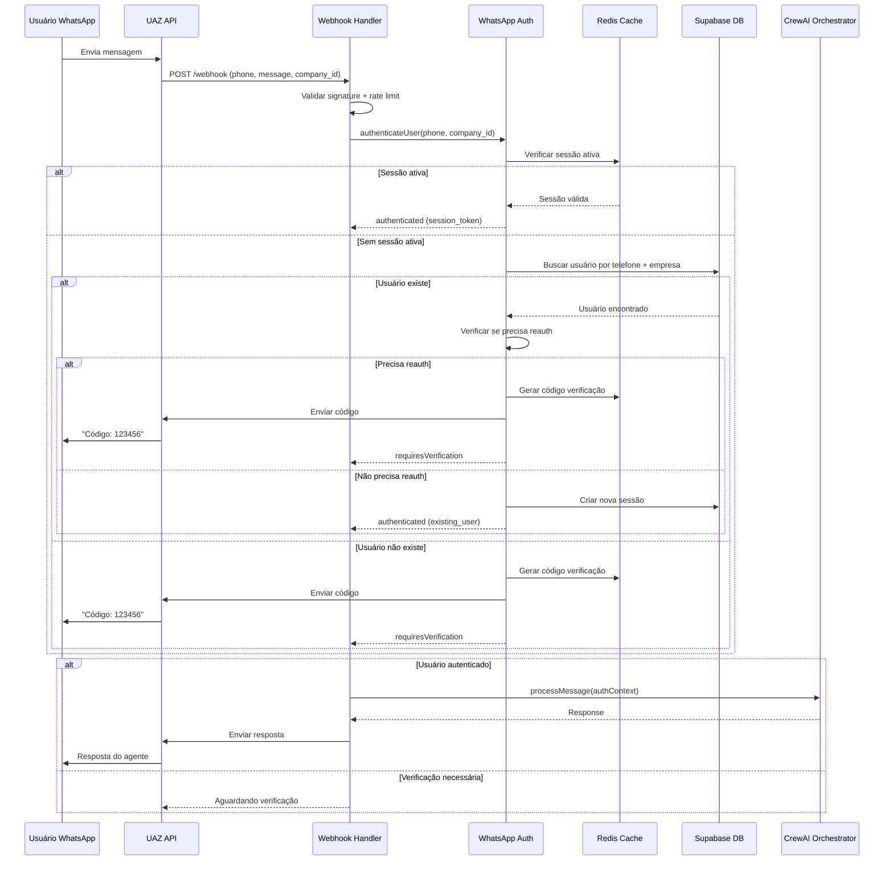

# WhatsApp Authentication Strategy

## Solução Híbrida Implementada

A solução híbrida combina múltiplas estratégias de autenticação para WhatsApp:

1. **Primeira Interação:** Código de verificação obrigatório
2. **Sessões Subsequentes:** Token de sessão com TTL
3. **Reautenticação:** A cada 24 horas ou a pedido
4. **Fallback:** Para sistema legado se autenticação falhar

## Componentes da Solução

### 1. WhatsApp Authentication Service

```typescript
// src/lib/auth/whatsapp-auth.ts
export class WhatsAppAuthService {
  constructor(
    private redis: RedisClient,
    private db: DatabaseClient,
    private uazClient: UAZClient,
    private logger: Logger
  ) {}

  async authenticateUser(
    phoneNumber: string, 
    companyId: string,
    message?: string
  ): Promise<WhatsAppAuthResult> {
    
    // 1. Verificar se usuário já tem sessão ativa
    const activeSession = await this.getActiveSession(phoneNumber, companyId);
    if (activeSession && !this.isSessionExpired(activeSession)) {
      return {
        authenticated: true,
        user: activeSession.user,
        sessionToken: activeSession.token,
        authMethod: 'session_token'
      };
    }

    // 2. Buscar usuário no banco
    const user = await this.findUserByPhone(phoneNumber, companyId);
    
    if (!user) {
      // 3. Usuário não existe - iniciar processo de registro/verificação
      return await this.handleUnknownUser(phoneNumber, companyId);
    }

    // 4. Usuário existe - verificar se precisa reautenticação
    if (this.requiresReauthentication(user)) {
      return await this.initiateVerification(user, phoneNumber, companyId);
    }

    // 5. Gerar nova sessão
    const sessionToken = await this.createSession(user, companyId);
    
    return {
      authenticated: true,
      user,
      sessionToken,
      authMethod: 'existing_user'
    };
  }

  async verifyCode(
    phoneNumber: string, 
    companyId: string, 
    code: string
  ): Promise<WhatsAppAuthResult> {
    
    const verificationKey = `verify:${phoneNumber}:${companyId}`;
    const storedData = await this.redis.get(verificationKey);
    
    if (!storedData) {
      throw new WhatsAppAuthError('Código expirado ou inválido');
    }

    const { code: storedCode, attempts } = JSON.parse(storedData);
    
    if (attempts >= 3) {
      throw new WhatsAppAuthError('Muitas tentativas. Tente novamente em 15 minutos.');
    }

    if (storedCode !== code) {
      await this.redis.setex(verificationKey, 300, JSON.stringify({
        code: storedCode,
        attempts: attempts + 1
      }));
      throw new WhatsAppAuthError('Código incorreto');
    }

    // Código válido - buscar ou criar usuário
    let user = await this.findUserByPhone(phoneNumber, companyId);
    
    if (!user) {
      user = await this.createWhatsAppUser(phoneNumber, companyId);
    }

    // Criar sessão
    const sessionToken = await this.createSession(user, companyId);
    
    // Limpar dados de verificação
    await this.redis.del(verificationKey);
    
    return {
      authenticated: true,
      user,
      sessionToken,
      authMethod: 'verification_code'
    };
  }

  private async initiateVerification(
    user: User, 
    phoneNumber: string, 
    companyId: string
  ): Promise<WhatsAppAuthResult> {
    
    const code = this.generateVerificationCode();
    const verificationData = {
      code,
      attempts: 0,
      userId: user.id,
      timestamp: Date.now()
    };

    // Salvar código no Redis (TTL 5 minutos)
    await this.redis.setex(
      `verify:${phoneNumber}:${companyId}`, 
      300, 
      JSON.stringify(verificationData)
    );

    // Enviar código via WhatsApp
    await this.sendVerificationCode(phoneNumber, code);

    return {
      authenticated: false,
      requiresVerification: true,
      message: 'Código de verificação enviado'
    };
  }

  private async createSession(user: User, companyId: string): Promise<string> {
    const sessionToken = this.generateSessionToken();
    const expiresAt = new Date(Date.now() + 24 * 60 * 60 * 1000); // 24 horas

    await this.db.insert('whatsapp_sessions').values({
      userId: user.id,
      companyId,
      phoneNumber: user.phoneNumber,
      sessionToken,
      expiresAt
    });

    // Cache da sessão no Redis
    await this.redis.setex(
      `session:${sessionToken}`, 
      86400, 
      JSON.stringify({
        userId: user.id,
        companyId,
        phoneNumber: user.phoneNumber,
        expiresAt: expiresAt.toISOString()
      })
    );

    return sessionToken;
  }
}
```

### 2. Webhook Handler com Autenticação

```typescript
// src/app/api/webhook/uaz/route.ts
export async function POST(request: NextRequest) {
  try {
    const webhookData = await request.json();
    const { from, message, company_id } = webhookData;

    // Validar webhook signature
    const signature = request.headers.get('x-uaz-signature');
    if (!await validateWebhookSignature(webhookData, signature)) {
      return Response.json({ error: 'Invalid signature' }, { status: 401 });
    }

    // Rate limiting por telefone
    const rateLimitKey = `rate_limit:${from}`;
    const isRateLimited = await checkRateLimit(rateLimitKey, 10, 60); // 10 msg/min
    if (isRateLimited) {
      return Response.json({ error: 'Rate limited' }, { status: 429 });
    }

    // Autenticar usuário WhatsApp
    const authResult = await whatsappAuth.authenticateUser(from, company_id, message);
    
    if (!authResult.authenticated) {
      if (authResult.requiresVerification) {
        return Response.json({ 
          status: 'verification_required',
          message: 'Código de verificação enviado para seu WhatsApp'
        });
      }
      
      return Response.json({ 
        status: 'authentication_failed',
        message: 'Não foi possível autenticar o usuário'
      });
    }

    // Processar mensagem com usuário autenticado
    const crewResponse = await crewOrchestrator.processMessage({
      message,
      userId: authResult.user.id,
      companyId: company_id,
      conversationId: await getOrCreateConversation(authResult.user.id, company_id),
      authContext: {
        type: 'whatsapp',
        phoneNumber: from,
        sessionToken: authResult.sessionToken,
        authMethod: authResult.authMethod
      }
    });

    // Enviar resposta via UAZ
    await uazClient.sendMessage({
      to: from,
      message: crewResponse.response,
      companyId: company_id
    });

    // Log da interação
    await logWhatsAppInteraction({
      phoneNumber: from,
      companyId: company_id,
      message,
      response: crewResponse.response,
      authMethod: authResult.authMethod,
      processingTime: crewResponse.processingTime
    });

    return Response.json({ 
      status: 'success',
      messageId: crewResponse.messageId 
    });

  } catch (error) {
    logger.error('WhatsApp webhook error:', error);
    
    // Enviar mensagem de erro para usuário se possível
    if (error instanceof WhatsAppAuthError && error.sendToUser) {
      await uazClient.sendMessage({
        to: webhookData.from,
        message: error.userMessage
      });
    }
    
    return Response.json({ error: 'Internal server error' }, { status: 500 });
  }
}
```

### 3. Endpoints de Autenticação WhatsApp

```typescript
// src/app/api/auth/whatsapp/verify/route.ts
export async function POST(request: NextRequest) {
  try {
    const { phoneNumber, companyId, code } = await request.json();

    // Validar entrada
    if (!phoneNumber || !companyId || !code) {
      return Response.json({ error: 'Missing required fields' }, { status: 400 });
    }

    // Verificar código
    const authResult = await whatsappAuth.verifyCode(phoneNumber, companyId, code);

    return Response.json({
      status: 'success',
      authenticated: true,
      sessionToken: authResult.sessionToken,
      user: {
        id: authResult.user.id,
        name: authResult.user.name,
        phoneNumber: authResult.user.phoneNumber
      }
    });

  } catch (error) {
    if (error instanceof WhatsAppAuthError) {
      return Response.json({ 
        error: error.message,
        code: error.code 
      }, { status: 400 });
    }
    
    return Response.json({ error: 'Internal server error' }, { status: 500 });
  }
}

// src/app/api/auth/whatsapp/resend/route.ts
export async function POST(request: NextRequest) {
  try {
    const { phoneNumber, companyId } = await request.json();

    // Verificar rate limit para reenvio
    const rateLimitKey = `resend:${phoneNumber}:${companyId}`;
    const canResend = await checkRateLimit(rateLimitKey, 3, 300); // 3 reenvios/5min
    
    if (!canResend) {
      return Response.json({ 
        error: 'Muitas tentativas de reenvio. Tente novamente em 5 minutos.' 
      }, { status: 429 });
    }

    await whatsappAuth.resendVerificationCode(phoneNumber, companyId);

    return Response.json({
      status: 'success',
      message: 'Código reenviado'
    });

  } catch (error) {
    return Response.json({ error: 'Internal server error' }, { status: 500 });
  }
}
```

### 4. Database Schema para WhatsApp Auth

```sql
-- Adicionar campos para autenticação WhatsApp
ALTER TABLE users 
ADD COLUMN phone_number VARCHAR(20),
ADD COLUMN whatsapp_verified BOOLEAN DEFAULT FALSE,
ADD COLUMN whatsapp_verified_at TIMESTAMP WITH TIME ZONE,
ADD COLUMN whatsapp_last_login TIMESTAMP WITH TIME ZONE,
ADD COLUMN verification_attempts INTEGER DEFAULT 0,
ADD COLUMN last_verification_attempt TIMESTAMP WITH TIME ZONE;

-- Índice para busca por telefone + empresa
CREATE INDEX idx_users_phone_company ON users(phone_number, company_id) 
WHERE phone_number IS NOT NULL;

-- Tabela para sessões WhatsApp
CREATE TABLE whatsapp_sessions (
  id UUID PRIMARY KEY DEFAULT gen_random_uuid(),
  user_id UUID NOT NULL REFERENCES users(id) ON DELETE CASCADE,
  company_id UUID NOT NULL REFERENCES companies(id) ON DELETE CASCADE,
  phone_number VARCHAR(20) NOT NULL,
  session_token VARCHAR(255) NOT NULL UNIQUE,
  expires_at TIMESTAMP WITH TIME ZONE NOT NULL,
  created_at TIMESTAMP WITH TIME ZONE DEFAULT NOW(),
  last_used_at TIMESTAMP WITH TIME ZONE DEFAULT NOW(),
  is_active BOOLEAN DEFAULT TRUE,
  
  CONSTRAINT chk_whatsapp_sessions_token_unique UNIQUE (session_token)
);

-- Índices para sessões
CREATE INDEX idx_whatsapp_sessions_token ON whatsapp_sessions(session_token);
CREATE INDEX idx_whatsapp_sessions_phone ON whatsapp_sessions(phone_number, company_id);
CREATE INDEX idx_whatsapp_sessions_user ON whatsapp_sessions(user_id);
CREATE INDEX idx_whatsapp_sessions_expires ON whatsapp_sessions(expires_at);

-- Tabela para logs de autenticação WhatsApp
CREATE TABLE whatsapp_auth_logs (
  id UUID PRIMARY KEY DEFAULT gen_random_uuid(),
  phone_number VARCHAR(20) NOT NULL,
  company_id UUID NOT NULL REFERENCES companies(id),
  user_id UUID REFERENCES users(id),
  auth_method VARCHAR(50) NOT NULL, -- 'verification_code', 'session_token', 'new_user'
  success BOOLEAN NOT NULL,
  error_message TEXT,
  ip_address INET,
  user_agent TEXT,
  created_at TIMESTAMP WITH TIME ZONE DEFAULT NOW()
);

-- Índices para logs
CREATE INDEX idx_whatsapp_auth_logs_phone ON whatsapp_auth_logs(phone_number);
CREATE INDEX idx_whatsapp_auth_logs_company ON whatsapp_auth_logs(company_id);
CREATE INDEX idx_whatsapp_auth_logs_created ON whatsapp_auth_logs(created_at);

-- Trigger para limpeza automática de sessões expiradas
CREATE OR REPLACE FUNCTION cleanup_expired_whatsapp_sessions()
RETURNS void AS $$
BEGIN
  DELETE FROM whatsapp_sessions 
  WHERE expires_at < NOW() OR (last_used_at < NOW() - INTERVAL '7 days');
END;
$$ LANGUAGE plpgsql;

-- Job para limpeza (executar a cada hora)
-- SELECT cron.schedule('cleanup-whatsapp-sessions', '0 * * * *', 'SELECT cleanup_expired_whatsapp_sessions();');
```

### 5. Fluxo de Autenticação Completo



## Segurança e Monitoramento

### Rate Limiting e Proteção

```typescript
// src/lib/auth/rate-limiter.ts
export class WhatsAppRateLimiter {
  async checkRateLimit(
    key: string, 
    maxRequests: number, 
    windowSeconds: number
  ): Promise<boolean> {
    const current = await this.redis.incr(key);
    
    if (current === 1) {
      await this.redis.expire(key, windowSeconds);
    }
    
    return current > maxRequests;
  }

  async checkVerificationRateLimit(phoneNumber: string): Promise<boolean> {
    return await this.checkRateLimit(`verify_limit:${phoneNumber}`, 3, 300); // 3 tentativas/5min
  }

  async checkMessageRateLimit(phoneNumber: string): Promise<boolean> {
    return await this.checkRateLimit(`msg_limit:${phoneNumber}`, 10, 60); // 10 msg/min
  }
}
```

### Logging e Auditoria

```typescript
// src/lib/auth/audit-logger.ts
export class WhatsAppAuditLogger {
  async logAuthenticationAttempt(
    phoneNumber: string,
    companyId: string,
    authMethod: string,
    success: boolean,
    errorMessage?: string,
    metadata?: any
  ): Promise<void> {
    await this.db.insert('whatsapp_auth_logs').values({
      phoneNumber,
      companyId,
      authMethod,
      success,
      errorMessage,
      metadata: JSON.stringify(metadata),
      ipAddress: this.getClientIP(),
      userAgent: this.getUserAgent(),
      createdAt: new Date()
    });
  }
}
```

## Configurações e Environment

```typescript
// src/lib/config/whatsapp-auth-config.ts
export const WhatsAppAuthConfig = {
  verificationCode: {
    length: 6,
    expirationMinutes: 5,
    maxAttempts: 3,
    resendCooldownMinutes: 1
  },
  session: {
    expirationHours: 24,
    maxSessionsPerUser: 3,
    cleanupIntervalHours: 1
  },
  rateLimiting: {
    verificationAttempts: { max: 3, windowMinutes: 5 },
    messages: { max: 10, windowMinutes: 1 },
    resendCodes: { max: 3, windowMinutes: 5 }
  },
  security: {
    requireReauthAfterHours: 24,
    maxFailedAttempts: 5,
    lockoutDurationMinutes: 15
  }
};
```

Esta implementação híbrida garante:

✅ **Segurança:** Múltiplas camadas de autenticação  
✅ **Usabilidade:** Experiência fluida para usuários recorrentes  
✅ **Auditoria:** Logs completos de todas as interações  
✅ **Escalabilidade:** Rate limiting e cache eficiente  
✅ **Confiabilidade:** Fallback para sistema legado  

**A solução está pronta para implementação! Precisa de algum ajuste específico?**
