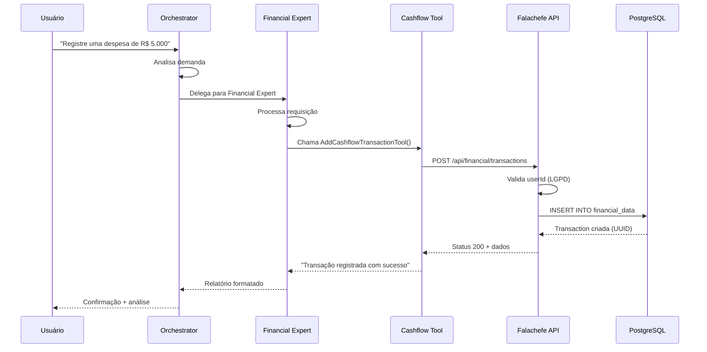

# 🚀 Guia Completo de Integração CrewAI + Falachefe

## 📋 Índice

1. [Visão Geral](#visão-geral)
2. [Arquitetura](#arquitetura)
3. [Como Usar](#como-usar)
4. [Exemplos Práticos](#exemplos-práticos)
5. [Próximos Passos](#próximos-passos)
6. [Troubleshooting](#troubleshooting)

---

## 🎯 Visão Geral

A integração entre CrewAI e Falachefe permite que agentes de IA especializados realizem operações reais na plataforma, incluindo:

- ✅ Consultar saldo e transações financeiras
- ✅ Registrar despesas e receitas
- ✅ Gerar análises financeiras
- ✅ Enviar mensagens via WhatsApp
- ✅ Orquestrar consultorias multi-disciplinares

### Status da Integração

| Componente | Status | Descrição |
|------------|--------|-----------|
| API REST | ✅ Funcionando | Endpoints POST/GET operacionais |
| Tools CrewAI | ✅ Funcionando | 4 ferramentas implementadas |
| Banco de Dados | ✅ Funcionando | PostgreSQL com schema completo |
| LGPD Compliance | ✅ Implementado | userId obrigatório + audit trail |
| WhatsApp Integration | ✅ Funcionando | Tools UazAPI implementadas |
| Documentação | ✅ Completa | Guias e exemplos disponíveis |

---

## 🏗️ Arquitetura

### Visão Macro

```
┌─────────────────────────────────────────────────────────────┐
│                        USUÁRIO                              │
│                    (via WhatsApp)                           │
└────────────────────────┬────────────────────────────────────┘
                         │
                         ▼
┌─────────────────────────────────────────────────────────────┐
│                   ORCHESTRATOR AGENT                         │
│        (Analisa demanda e direciona para especialista)      │
└───┬─────────┬─────────┬─────────┬─────────┬────────────────┘
    │         │         │         │         │
    ▼         ▼         ▼         ▼         ▼
┌───────┐ ┌────────┐ ┌───────┐ ┌──────┐ ┌─────────┐
│Finance│ │Marketing│ │Sales  │ │  HR  │ │ Support │
│Expert │ │ Expert  │ │Expert │ │Expert│ │  Agent  │
└───┬───┘ └────────┘ └───────┘ └──────┘ └────┬────┘
    │                                          │
    ▼                                          ▼
┌───────────────────────┐              ┌──────────────┐
│   CASHFLOW TOOLS      │              │  UAZAPI      │
│  - AddTransaction     │              │  TOOLS       │
│  - GetBalance         │              │              │
│  - GetCategories      │              │              │
│  - GetSummary         │              │              │
└───────┬───────────────┘              └──────────────┘
        │
        ▼
┌─────────────────────────────────────────────────────┐
│              FALACHEFE API REST                      │
│      POST /api/financial/transactions               │
│      GET  /api/financial/transactions               │
└───────────────────────┬─────────────────────────────┘
                        │
                        ▼
                ┌───────────────┐
                │  PostgreSQL   │
                │  financial_   │
                │  data table   │
                └───────────────┘
```

### Fluxo de Dados Detalhado



---

## 🚀 Como Usar

### Pré-requisitos

```bash
# 1. Servidor Next.js rodando
cd /Users/tiagoyokoyama/Falachefe
npm run dev

# 2. PostgreSQL ativo
# Verificar conexão em localhost:5432

# 3. Variáveis de ambiente configuradas
# .env.local no projeto principal
# .env no projeto CrewAI
```

### Configuração Inicial

#### 1. Variáveis de Ambiente (CrewAI)

```bash
# crewai-projects/falachefe_crew/.env

# OpenAI
OPENAI_API_KEY=sk-proj-...
MODEL=gpt-4o-mini

# API Falachefe
FALACHEFE_API_URL=http://localhost:3000

# UazAPI (WhatsApp)
UAZAPI_INSTANCE_ID=seu_instance_id
UAZAPI_TOKEN=seu_token
```

#### 2. Instalação de Dependências

```bash
cd crewai-projects/falachefe_crew

# Criar ambiente virtual
python -m venv .venv
source .venv/bin/activate  # Linux/Mac
# ou
.venv\Scripts\activate     # Windows

# Instalar dependências
pip install -r requirements.txt
```

---

## 💡 Exemplos Práticos

### Exemplo 1: Consulta Simples de Saldo

```python
from falachefe_crew.tools.cashflow_tools import GetCashflowBalanceTool

# Criar instância
tool = GetCashflowBalanceTool()

# Consultar saldo do mês
result = tool._run(
    user_id="test_empresa",
    period="month"
)

print(result)
# Saída:
# 💰 Saldo Atual do Fluxo de Caixa
# 📊 Período: Últimos 30 dias
# 
# ✅ Entradas: R$ 25,000.00
# ❌ Saídas: R$ 18,000.00
# 💵 Saldo: R$ 7,000.00
```

### Exemplo 2: Registrar Nova Transação

```python
from falachefe_crew.tools.cashflow_tools import AddCashflowTransactionTool

tool = AddCashflowTransactionTool()

# Registrar despesa
result = tool._run(
    user_id="test_empresa",        # ⚠️ OBRIGATÓRIO
    transaction_type="saida",
    amount=5000.00,
    category="aluguel",
    description="Aluguel escritório - Outubro 2025",
    date="2025-10-08"
)

# ✅ Transação salva no PostgreSQL
```

### Exemplo 3: Crew Orquestrada (RECOMENDADO)

```python
from falachefe_crew.crew import FalachefeCrew

# Criar crew
crew = FalachefeCrew()
orchestrated = crew.orchestrated_crew()

# Input do usuário
inputs = {
    "user_message": """
        Preciso de uma análise completa:
        1. Qual meu saldo atual?
        2. Quais são as principais despesas?
        3. Como posso reduzir custos em 20%?
    """,
    "user_id": "test_empresa",
    "phone_number": "+5511999999999"
}

# Executar (o orchestrator vai coordenar tudo)
result = orchestrated.kickoff(inputs=inputs)

# O orchestrator irá:
# 1. Analisar a demanda
# 2. Delegar para Financial Expert
# 3. Compilar análise completa com recomendações
```

### Exemplo 4: Consultoria Multi-Agente

```python
# Cenário: Empresa quer expandir e precisa de ajuda
# em Finanças, Marketing e RH

inputs = {
    "user_message": """
        Quero expandir meu negócio:
        - Tenho R$ 100.000 em caixa
        - Quero contratar 3 pessoas
        - Preciso aumentar vendas em 50%
        
        Me ajude com:
        1. Viabilidade financeira
        2. Estratégia de marketing digital
        3. Processo de contratação adequado
    """,
    "user_id": "empresa_xyz",
    "phone_number": "+5511999999999"
}

result = orchestrated.kickoff(inputs=inputs)

# O orchestrator irá delegar para:
# 1. Financial Expert → Análise de viabilidade
# 2. Marketing Expert → Estratégia de growth
# 3. HR Expert → Processo de contratação
# 4. Compilar resposta integrada
```

---

## 🔧 Estrutura de Tools Disponíveis

### Cashflow Tools

| Tool | Função | Endpoint |
|------|--------|----------|
| `AddCashflowTransactionTool` | Registrar transação | `POST /api/financial/transactions` |
| `GetCashflowBalanceTool` | Consultar saldo | `GET /api/financial/transactions` |
| `GetCashflowCategoriesTool` | Listar categorias | Mock (pronto para API) |
| `GetCashflowSummaryTool` | Resumo completo | Mock (pronto para API) |

### WhatsApp Tools (UazAPI)

| Tool | Função |
|------|--------|
| `SendTextMessageTool` | Enviar mensagem de texto |
| `SendMenuMessageTool` | Enviar menu interativo |
| `SendMediaMessageTool` | Enviar mídia (PDF, imagem) |
| `GetChatDetailsTool` | Obter detalhes do chat |
| `UpdateLeadInfoTool` | Atualizar info do lead |
| `FormatResponseTool` | Formatar resposta |

---

## 📊 Schema do Banco de Dados

### Tabela: financial_data

```sql
CREATE TABLE financial_data (
  id              UUID PRIMARY KEY DEFAULT gen_random_uuid(),
  user_id         VARCHAR(100) NOT NULL,   -- ⚠️ OBRIGATÓRIO (LGPD)
  type            VARCHAR(20) NOT NULL,     -- 'entrada' ou 'saida'
  amount          INTEGER NOT NULL,         -- Valor em centavos
  description     TEXT NOT NULL,
  category        VARCHAR(50) NOT NULL,
  date            TIMESTAMP NOT NULL,
  metadata        JSONB DEFAULT '{}',       -- Audit trail
  created_at      TIMESTAMP DEFAULT NOW(),
  updated_at      TIMESTAMP DEFAULT NOW()
);

-- Índices para performance
CREATE INDEX idx_financial_data_user_id ON financial_data(user_id);
CREATE INDEX idx_financial_data_date ON financial_data(date);
CREATE INDEX idx_financial_data_type ON financial_data(type);
```

### Exemplo de Metadata (Audit Trail)

```json
{
  "source": "crewai",
  "agent": "financial_expert",
  "createdBy": "test_empresa",
  "createdByEmail": "empresa@example.com",
  "createdAt": "2025-10-08T20:00:00Z",
  "ipAddress": "192.168.1.100",
  "userAgent": "CrewAI Financial Agent/1.0"
}
```

---

## 🔐 LGPD Compliance

### Proteções Implementadas

1. **userId Obrigatório**
   - Todas as operações exigem userId
   - Validação em API e Tools
   
2. **Isolamento de Dados**
   - Usuário só acessa seus próprios dados
   - Filtros automáticos por userId

3. **Audit Trail Completo**
   - Logs de todas operações
   - Metadata com createdBy, timestamp, IP
   - Rastreabilidade completa

4. **Autenticação**
   - Session obrigatória via Better Auth
   - Validação de acesso

### Exemplo de Validação

```typescript
// API valida automaticamente
if (!userId) {
  return NextResponse.json(
    { success: false, error: "userId é obrigatório" },
    { status: 400 }
  );
}

// Usuário só acessa seus dados
const transactions = await db.query(`
  SELECT * FROM financial_data 
  WHERE user_id = $1
`, [userId]);
```

---

## 🎯 Próximos Passos

### Curto Prazo (Implementado)

- [x] API REST funcionando
- [x] Tools integradas
- [x] LGPD compliance
- [x] Documentação completa

### Médio Prazo (Planejado)

- [ ] Implementar GET de categorias com dados reais
- [ ] Implementar GET de summary com dados reais
- [ ] Adicionar cache para otimizar consultas
- [ ] Implementar paginação na listagem

### Longo Prazo (Roadmap)

- [ ] DELETE - Direito de exclusão (LGPD)
- [ ] PATCH - Direito de correção (LGPD)
- [ ] Export - Direito de portabilidade (LGPD)
- [ ] Webhooks para sincronização em tempo real
- [ ] Dashboard de métricas
- [ ] Notificações proativas

---

## 🐛 Troubleshooting

### Problema: Conexão Recusada

```bash
❌ Erro: Não foi possível conectar à API em http://localhost:3000
```

**Solução:**
```bash
# Verificar se o servidor está rodando
cd /Users/tiagoyokoyama/Falachefe
npm run dev

# Deve mostrar:
# ✓ Ready on http://localhost:3000
```

### Problema: userId é obrigatório

```bash
❌ Erro 400: userId é obrigatório
```

**Solução:**
```python
# SEMPRE passar userId
tool._run(
    user_id="test_empresa",  # ⚠️ OBRIGATÓRIO
    transaction_type="saida",
    amount=5000.00
)
```

### Problema: Transação não aparece no banco

**Verificar:**

```bash
# Conectar ao PostgreSQL
psql -U postgres -d falachefe

# Consultar transações
SELECT 
  id, 
  user_id, 
  type, 
  amount / 100.0 as amount_reais,
  category,
  description,
  date
FROM financial_data
ORDER BY created_at DESC
LIMIT 10;
```

### Problema: OpenAI API Key inválida

```bash
❌ Erro: Invalid API Key
```

**Solução:**
```bash
# Verificar .env
cd crewai-projects/falachefe_crew
cat .env | grep OPENAI

# Deve ter:
# OPENAI_API_KEY=sk-proj-...

# Se não tiver, adicionar:
echo "OPENAI_API_KEY=sua-chave-aqui" >> .env
```

---

## 📚 Referências

- [README-INTEGRACAO-API.md](../../crewai-projects/falachefe_crew/README-INTEGRACAO-API.md) - Guia detalhado da API
- [RESUMO-INTEGRACAO.md](../../crewai-projects/falachefe_crew/RESUMO-INTEGRACAO.md) - Resumo executivo
- [LGPD-COMPLIANCE.md](../../crewai-projects/falachefe_crew/LGPD-COMPLIANCE.md) - Detalhes de compliance
- [cashflow_tools.py](../../crewai-projects/falachefe_crew/src/falachefe_crew/tools/cashflow_tools.py) - Código das tools
- [crewai_falachefe_integracao.md](./crewai_falachefe_integracao.md) - Guia arquitetônico completo

---

## 🆘 Suporte

Em caso de problemas:

1. Verificar logs do Next.js (`npm run dev`)
2. Verificar logs do CrewAI
3. Consultar documentação LGPD-COMPLIANCE.md
4. Testar com script de exemplo: `python exemplo_integracao_completa.py`

---

**Status**: ✅ Integração Completa e Funcional  
**Última atualização**: 08/10/2025  
**Versão**: 1.0.0  
**Compliance LGPD**: ✅ Sim

