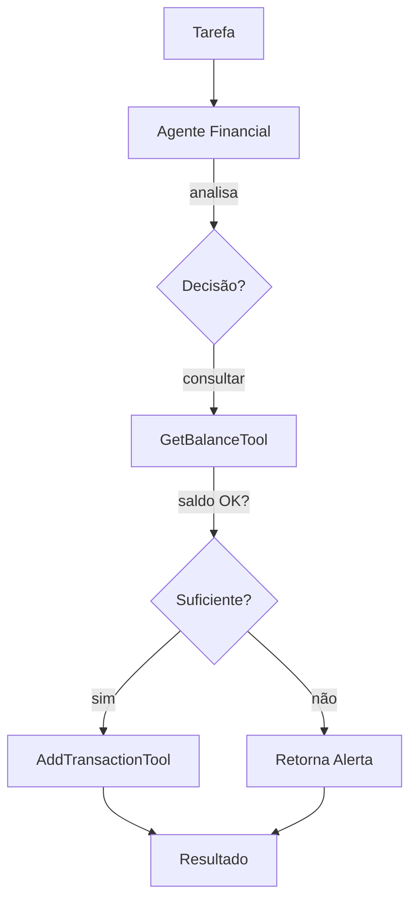
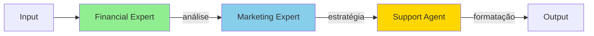
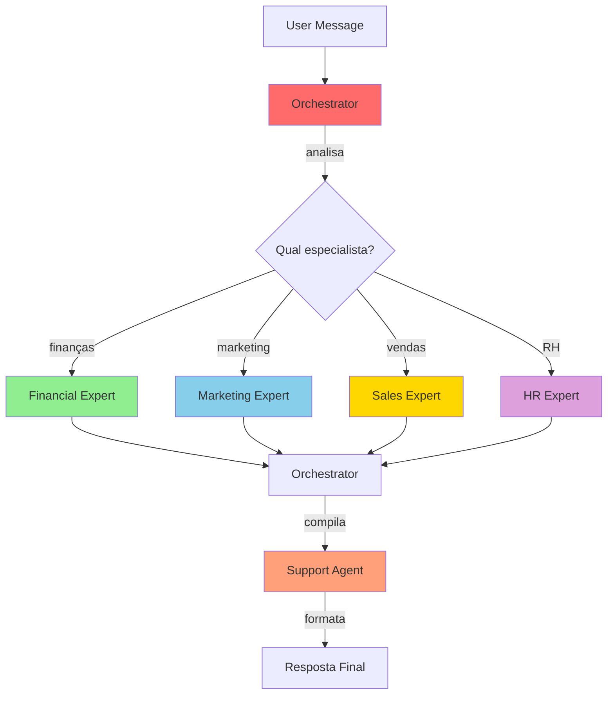

# 🎮 Modos de Uso da Integração CrewAI + Falachefe

## 📋 Índice

1. [Visão Geral dos Modos](#visão-geral-dos-modos)
2. [Modo 1: Tool Direta](#modo-1-tool-direta)
3. [Modo 2: Agente Único](#modo-2-agente-único)
4. [Modo 3: Crew Sequencial](#modo-3-crew-sequencial)
5. [Modo 4: Crew Hierárquica (RECOMENDADO)](#modo-4-crew-hierárquica)
6. [Comparação de Modos](#comparação-de-modos)

---

## 🎯 Visão Geral dos Modos

A integração oferece **4 modos diferentes** de uso, desde o mais simples e direto até o mais sofisticado e inteligente:

```
┌──────────────────────────────────────────────────────────────┐
│  NÍVEIS DE COMPLEXIDADE E INTELIGÊNCIA                       │
├──────────────────────────────────────────────────────────────┤
│                                                              │
│  Modo 1: Tool Direta        [■□□□□] Simples                 │
│  └─ Chamada direta de função                                │
│                                                              │
│  Modo 2: Agente Único       [■■□□□] Básico                  │
│  └─ Um agente especializado                                 │
│                                                              │
│  Modo 3: Crew Sequencial    [■■■□□] Intermediário           │
│  └─ Múltiplos agentes, ordem fixa                           │
│                                                              │
│  Modo 4: Crew Hierárquica   [■■■■■] Avançado (RECOMENDADO) │
│  └─ Orquestração inteligente                                │
│                                                              │
└──────────────────────────────────────────────────────────────┘
```

---

## 🔧 Modo 1: Tool Direta

### Quando Usar

- ✅ Você sabe exatamente qual operação executar
- ✅ Não precisa de análise ou inteligência
- ✅ Quer máxima performance e controle
- ✅ Integração com código existente

### Características

| Aspecto | Descrição |
|---------|-----------|
| **Complexidade** | Mínima |
| **Inteligência** | Nenhuma (determinístico) |
| **Performance** | Máxima |
| **Custo** | Zero tokens LLM |
| **Controle** | Total |

### Exemplo: Registrar Transação

```python
from falachefe_crew.tools.cashflow_tools import AddCashflowTransactionTool

# Criar instância da tool
tool = AddCashflowTransactionTool()

# Chamada direta (sem IA)
result = tool._run(
    user_id="empresa_123",
    transaction_type="saida",
    amount=5000.00,
    category="aluguel",
    description="Aluguel outubro 2025"
)

print(result)
# ✅ Transação registrada diretamente no banco
```

### Fluxo de Execução


### Casos de Uso

1. **Scripts de Automação**
   ```python
   # Importar transações de CSV
   for row in csv_reader:
       tool._run(
           user_id=row['user_id'],
           transaction_type=row['type'],
           amount=float(row['amount']),
           category=row['category'],
           description=row['description']
       )
   ```

2. **Webhooks**
   ```python
   @app.post("/webhook/transaction")
   async def handle_transaction(data: dict):
       tool = AddCashflowTransactionTool()
       return tool._run(**data)
   ```

3. **Testes Unitários**
   ```python
   def test_add_transaction():
       tool = AddCashflowTransactionTool()
       result = tool._run(
           user_id="test_user",
           transaction_type="entrada",
           amount=1000.00,
           category="teste",
           description="Transação de teste"
       )
       assert "sucesso" in result.lower()
   ```

---

## 🤖 Modo 2: Agente Único

### Quando Usar

- ✅ Precisa de alguma análise ou decisão
- ✅ Tarefa bem definida e específica
- ✅ Não requer colaboração entre especialistas
- ✅ Quer equilíbrio entre IA e performance

### Características

| Aspecto | Descrição |
|---------|-----------|
| **Complexidade** | Baixa |
| **Inteligência** | Moderada |
| **Performance** | Alta |
| **Custo** | Baixo (1 agente) |
| **Controle** | Alto |

### Exemplo: Análise Financeira

```python
from crewai import Agent, Task
from falachefe_crew.tools.cashflow_tools import (
    GetCashflowBalanceTool,
    AddCashflowTransactionTool
)

# Criar agente especializado
financial_agent = Agent(
    role="Especialista Financeiro",
    goal="Analisar finanças e tomar decisões sobre transações",
    backstory="""Você é um CFO experiente com 20 anos de experiência
    em gestão financeira de PMEs.""",
    tools=[
        GetCashflowBalanceTool(),
        AddCashflowTransactionTool()
    ],
    verbose=True
)

# Criar tarefa
task = Task(
    description="""
    O usuário quer registrar uma despesa de R$ 5.000 em aluguel.
    
    Antes de registrar:
    1. Consulte o saldo atual
    2. Verifique se há recursos suficientes
    3. Se sim, registre a transação
    4. Se não, alerte o usuário e sugira alternativas
    
    user_id: empresa_123
    """,
    expected_output="Confirmação da transação ou alerta com sugestões",
    agent=financial_agent
)

# Executar
result = task.execute()
print(result)
```

### Fluxo de Execução



### Casos de Uso

1. **Aprovação Inteligente**
   ```python
   # Agente decide se aprova despesa baseado no saldo
   task = Task(
       description="Aprovar ou rejeitar despesa de R$ 10.000",
       agent=financial_agent
   )
   ```

2. **Categorização Automática**
   ```python
   # Agente categoriza transação baseado na descrição
   task = Task(
       description="""
       Categorize e registre: 'Pagamento conta de luz - 350 reais'
       """,
       agent=financial_agent
   )
   ```

3. **Análise com Recomendações**
   ```python
   # Agente analisa situação e dá conselhos
   task = Task(
       description="Analise o fluxo de caixa e dê 3 recomendações",
       agent=financial_agent
   )
   ```

---

## 👥 Modo 3: Crew Sequencial

### Quando Usar

- ✅ Tarefa complexa que requer múltiplos especialistas
- ✅ Ordem de execução bem definida
- ✅ Cada agente depende do resultado do anterior
- ✅ Pipeline de processamento

### Características

| Aspecto | Descrição |
|---------|-----------|
| **Complexidade** | Moderada |
| **Inteligência** | Alta |
| **Performance** | Moderada |
| **Custo** | Moderado (múltiplos agentes) |
| **Controle** | Alto (ordem fixa) |

### Exemplo: Pipeline de Análise

```python
from crewai import Crew, Process
from falachefe_crew.crew import FalachefeCrew

# Criar crew
crew_instance = FalachefeCrew()

# Definir tarefas em sequência
crew = Crew(
    agents=[
        crew_instance.financial_expert(),
        crew_instance.marketing_expert(),
        crew_instance.support_agent()
    ],
    tasks=[
        crew_instance.analyze_cashflow(),      # 1º
        crew_instance.marketing_strategy(),    # 2º (usa resultado do 1º)
        crew_instance.format_and_send_response()  # 3º (usa ambos)
    ],
    process=Process.sequential,  # Ordem fixa
    verbose=True
)

# Executar
result = crew.kickoff(inputs={
    "user_id": "empresa_123",
    "phone_number": "+5511999999999"
})
```

### Fluxo de Execução



### Casos de Uso

1. **Relatório Mensal Completo**
   ```python
   # 1. Analista coleta dados
   # 2. CFO faz análise financeira
   # 3. Designer cria visualizações
   # 4. Gerente compila relatório final
   ```

2. **Onboarding de Cliente**
   ```python
   # 1. Sales valida dados do cliente
   # 2. Finance configura billing
   # 3. Support envia boas-vindas
   # 4. Marketing adiciona à campanha
   ```

3. **Processamento de Pedido**
   ```python
   # 1. Sales valida pedido
   # 2. Finance verifica crédito
   # 3. Operations processa
   # 4. Support notifica cliente
   ```

---

## 🎯 Modo 4: Crew Hierárquica (RECOMENDADO)

### Quando Usar

- ✅ Demandas variadas e imprevisíveis
- ✅ Precisa de roteamento inteligente
- ✅ Múltiplos especialistas disponíveis
- ✅ Atendimento conversacional (WhatsApp, chatbot)

### Características

| Aspecto | Descrição |
|---------|-----------|
| **Complexidade** | Alta |
| **Inteligência** | Máxima |
| **Performance** | Variável |
| **Custo** | Variável (só usa agentes necessários) |
| **Controle** | Moderado (delegação automática) |

### Exemplo: Assistente Inteligente

```python
from falachefe_crew.crew import FalachefeCrew

# Criar crew hierárquica
crew = FalachefeCrew()
orchestrated = crew.orchestrated_crew()

# Input do usuário (natural language)
result = orchestrated.kickoff(inputs={
    "user_message": """
        Olá! Preciso de ajuda:
        1. Quanto tenho de saldo?
        2. Como posso aumentar minhas vendas em 30%?
        3. Preciso contratar um contador
    """,
    "user_id": "empresa_123",
    "phone_number": "+5511999999999"
})

# O orchestrator irá:
# 1. Analisar a mensagem
# 2. Identificar 3 necessidades diferentes
# 3. Delegar para:
#    - Financial Expert (saldo)
#    - Marketing Expert (vendas)
#    - HR Expert (contratação)
# 4. Compilar resposta unificada
```

### Fluxo de Execução



### Arquitetura Hierárquica

```
                    ┌─────────────────┐
                    │  ORCHESTRATOR   │
                    │  (Manager LLM)  │
                    └────────┬────────┘
                             │
              ┌──────────────┼──────────────┐
              │              │              │
              ▼              ▼              ▼
        ┌──────────┐   ┌──────────┐   ┌──────────┐
        │Financial │   │Marketing │   │   HR     │
        │  Expert  │   │  Expert  │   │  Expert  │
        └──────────┘   └──────────┘   └──────────┘
              │              │              │
              └──────────────┼──────────────┘
                             ▼
                    ┌─────────────────┐
                    │ Support Agent   │
                    │ (Formatação)    │
                    └─────────────────┘
```

### Casos de Uso

1. **Atendimento WhatsApp**
   ```python
   # Usuário envia mensagem livre
   # Sistema roteia automaticamente para especialista correto
   
   @webhook.message
   async def handle_message(message: str, user_id: str):
       result = orchestrated.kickoff(inputs={
           "user_message": message,
           "user_id": user_id,
           "phone_number": user_id
       })
       await send_whatsapp(user_id, result)
   ```

2. **Chatbot Empresarial**
   ```python
   # Interface web com chat
   # Múltiplos departamentos atendidos por agentes
   ```

3. **Help Desk Inteligente**
   ```python
   # Ticket roteado automaticamente
   # Especialista mais adequado responde
   ```

---

## 📊 Comparação de Modos

### Tabela Comparativa

| Aspecto | Tool Direta | Agente Único | Crew Sequencial | Crew Hierárquica |
|---------|-------------|--------------|-----------------|------------------|
| **Complexidade** | ⭐ | ⭐⭐ | ⭐⭐⭐ | ⭐⭐⭐⭐ |
| **Inteligência** | - | ⭐⭐ | ⭐⭐⭐ | ⭐⭐⭐⭐⭐ |
| **Performance** | ⭐⭐⭐⭐⭐ | ⭐⭐⭐⭐ | ⭐⭐⭐ | ⭐⭐ |
| **Custo (tokens)** | 0 | Baixo | Médio | Variável |
| **Controle** | ⭐⭐⭐⭐⭐ | ⭐⭐⭐⭐ | ⭐⭐⭐ | ⭐⭐ |
| **Flexibilidade** | ⭐ | ⭐⭐ | ⭐⭐ | ⭐⭐⭐⭐⭐ |

### Matriz de Decisão

```
                     SIMPLES  →  COMPLEXO
                     ┌─────────────────────┐
                     │                     │
        DETERMINÍS-  │  Tool   │  Agente   │
        TICO         │  Direta │  Único    │
                     │         │           │
                     ├─────────┼───────────┤
                     │         │           │
        INTELIGENTE  │  Crew   │   Crew    │
                     │ Sequenc │ Hierárq.  │
                     │         │           │
                     └─────────────────────┘
```

### Quando Usar Cada Modo

#### Use Tool Direta quando:
- ✅ Você tem controle total do fluxo
- ✅ Operação bem definida
- ✅ Performance é crítica
- ✅ Não precisa de IA

#### Use Agente Único quando:
- ✅ Precisa de análise simples
- ✅ Tarefa específica e focada
- ✅ Um especialista é suficiente
- ✅ Quer economia de tokens

#### Use Crew Sequencial quando:
- ✅ Pipeline de processamento
- ✅ Ordem de execução clara
- ✅ Cada passo depende do anterior
- ✅ Quer controle sobre o fluxo

#### Use Crew Hierárquica quando:
- ✅ Atendimento conversacional
- ✅ Demandas variadas
- ✅ Precisa de roteamento inteligente
- ✅ Flexibilidade é prioritária

---

## 🚀 Exemplos de Migração

### Do Modo 1 para Modo 4

```python
# ❌ ANTES: Tool Direta (limitado)
tool = AddCashflowTransactionTool()
result = tool._run(
    user_id="empresa_123",
    transaction_type="saida",
    amount=5000.00,
    category="aluguel",
    description="Aluguel"
)

# ✅ DEPOIS: Crew Hierárquica (inteligente)
orchestrated = FalachefeCrew().orchestrated_crew()
result = orchestrated.kickoff(inputs={
    "user_message": "Registre o pagamento do aluguel de R$ 5.000",
    "user_id": "empresa_123",
    "phone_number": "+5511999999999"
})

# Benefícios:
# - Entende linguagem natural
# - Pode fazer validações
# - Sugere otimizações
# - Resposta formatada
```

---

## 🎓 Recomendações

### Para Desenvolvimento/Testes
```python
# Use Tool Direta ou Agente Único
# - Rápido para testar
# - Fácil de debugar
# - Zero ou baixo custo
```

### Para Produção Interna
```python
# Use Crew Sequencial
# - Processos bem definidos
# - Controle sobre o fluxo
# - Custo previsível
```

### Para Produto SaaS/WhatsApp
```python
# Use Crew Hierárquica
# - Melhor experiência do usuário
# - Flexibilidade máxima
# - Escalável
```

---

## 📚 Próximos Passos

1. **Experimente cada modo** com o script:
   ```bash
   python exemplo_integracao_completa.py
   ```

2. **Escolha o modo adequado** para seu caso de uso

3. **Implemente gradualmente**: comece simples, evolua para complexo

4. **Monitore custos**: use observability (Langfuse/Portkey)

---

**Última atualização**: 08/10/2025  
**Versão**: 1.0.0

