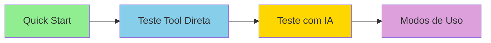
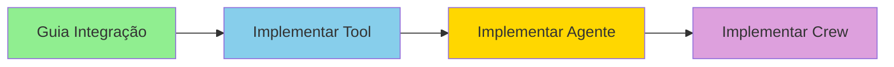
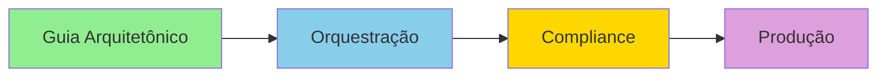

# 🤖 Documentação Integração CrewAI + Falachefe

## 📚 Índice de Documentação

Bem-vindo à documentação completa da integração entre CrewAI e a plataforma Falachefe. Esta documentação está organizada do mais básico ao mais avançado.

---

## 🚀 Início Rápido

### Para Iniciantes (Comece aqui!)

| Documento | Descrição | Tempo | Nível |
|-----------|-----------|-------|-------|
| **[⚡ Quick Start](./QUICK-START-INTEGRACAO.md)** | Comece em 5 minutos | 5 min | 🟢 Iniciante |
| **[🎮 Modos de Uso](./MODOS-DE-USO.md)** | 4 formas de usar a integração | 15 min | 🟢 Iniciante |
| **[🔌 Guia de Integração](./GUIA-INTEGRACAO.md)** | Guia completo com exemplos | 30 min | 🟡 Intermediário |

### Para Desenvolvedores

| Documento | Descrição | Localização |
|-----------|-----------|-------------|
| **[API Integration Guide](../../crewai-projects/falachefe_crew/README-INTEGRACAO-API.md)** | Documentação técnica da API | `/crewai-projects/falachefe_crew/` |
| **[Resumo da Integração](../../crewai-projects/falachefe_crew/RESUMO-INTEGRACAO.md)** | Sumário executivo | `/crewai-projects/falachefe_crew/` |
| **[LGPD Compliance](../../crewai-projects/falachefe_crew/LGPD-COMPLIANCE.md)** | Compliance e segurança | `/crewai-projects/falachefe_crew/` |

### Guias Arquitetônicos

| Documento | Descrição | Localização |
|-----------|-----------|-------------|
| **[Guia Arquitetônico Completo](./crewai_falachefe_integracao.md)** | Arquitetura detalhada (61k palavras) | `/docs/crewai/` |
| **[Sistema de Orquestração](../../crewai-projects/falachefe_crew/SISTEMA-ORQUESTRACAO-README.md)** | Fluxos hierárquicos | `/crewai-projects/falachefe_crew/` |
| **[Orchestrator Guide](../../crewai-projects/falachefe_crew/ORCHESTRATOR-GUIDE.md)** | Guia do orquestrador | `/crewai-projects/falachefe_crew/` |

---

## 📖 Estrutura da Documentação

```
docs/crewai/
├── README.md                          # 📍 Você está aqui
├── QUICK-START-INTEGRACAO.md         # ⚡ Comece em 5 minutos
├── MODOS-DE-USO.md                    # 🎮 4 formas de usar
├── GUIA-INTEGRACAO.md                 # 🔌 Guia completo
└── crewai_falachefe_integracao.md    # 📚 Guia arquitetônico

crewai-projects/falachefe_crew/
├── README-INTEGRACAO-API.md           # 🔧 API técnica
├── RESUMO-INTEGRACAO.md              # 📊 Sumário executivo
├── LGPD-COMPLIANCE.md                # 🔒 Compliance
├── SISTEMA-ORQUESTRACAO-README.md    # 🎯 Orquestração
├── ORCHESTRATOR-GUIDE.md             # 🤖 Orchestrator
├── exemplo_integracao_completa.py    # 💻 Exemplos de código
└── src/falachefe_crew/
    ├── crew.py                        # 👥 Definição dos agentes
    ├── tools/
    │   ├── cashflow_tools.py         # 💰 Tools financeiras
    │   └── uazapi_tools.py           # 📱 Tools WhatsApp
    └── config/
        ├── agents.yaml               # ⚙️ Config agentes
        └── tasks.yaml                # 📋 Config tasks
```

---

## 🎯 Fluxo de Aprendizado Recomendado

### 1️⃣ Fase: Entendimento Básico (30 minutos)



1. Leia: [Quick Start](./QUICK-START-INTEGRACAO.md)
2. Execute: `python teste_rapido.py`
3. Execute: `python teste_com_ia.py`
4. Leia: [Modos de Uso](./MODOS-DE-USO.md)

**Ao final, você saberá:**
- ✅ Como a integração funciona
- ✅ Como executar sua primeira operação
- ✅ Qual modo usar para cada caso

---

### 2️⃣ Fase: Implementação Prática (1-2 horas)



1. Leia: [Guia de Integração Completo](./GUIA-INTEGRACAO.md)
2. Implemente: Tool personalizada
3. Implemente: Agente especializado
4. Implemente: Crew orquestrada

**Ao final, você saberá:**
- ✅ Como criar tools customizadas
- ✅ Como configurar agentes
- ✅ Como orquestrar múltiplos agentes

---

### 3️⃣ Fase: Arquitetura Avançada (2-4 horas)



1. Leia: [Guia Arquitetônico Completo](./crewai_falachefe_integracao.md)
2. Estude: [Sistema de Orquestração](../../crewai-projects/falachefe_crew/SISTEMA-ORQUESTRACAO-README.md)
3. Revise: [LGPD Compliance](../../crewai-projects/falachefe_crew/LGPD-COMPLIANCE.md)
4. Planeje: Arquitetura de produção

**Ao final, você saberá:**
- ✅ Padrões arquitetônicos
- ✅ Escalabilidade e concorrência
- ✅ Segurança e compliance
- ✅ Deploy em produção

---

## 🎓 Recursos de Aprendizado

### Tutoriais em Vídeo

| Tópico | Duração | Link |
|--------|---------|------|
| Introdução ao CrewAI | 10 min | [DeepLearning.AI](https://www.deeplearning.ai/short-courses/multi-ai-agent-systems-with-crewai/) |
| Multi-Agent Systems | 15 min | [YouTube](https://www.youtube.com/@crewAIInc) |

### Documentação Oficial

- [CrewAI Docs](https://docs.crewai.com/)
- [CrewAI GitHub](https://github.com/crewAIInc/crewAI)
- [CrewAI Community](https://community.crewai.com/)

### Scripts de Exemplo

```bash
cd /Users/tiagoyokoyama/Falachefe/crewai-projects/falachefe_crew

# Teste rápido
python teste_rapido.py

# Exemplos completos
python exemplo_integracao_completa.py

# Teste de mensagem real
python test_mensagem_real.py
```

---

## 🛠️ Casos de Uso Implementados

### ✅ Funcionando Agora

1. **Consulta de Saldo**
   - Tool: `GetCashflowBalanceTool`
   - Endpoint: `GET /api/financial/transactions`
   - Status: ✅ Produção

2. **Registro de Transações**
   - Tool: `AddCashflowTransactionTool`
   - Endpoint: `POST /api/financial/transactions`
   - Status: ✅ Produção

3. **WhatsApp Integration**
   - Tools: `SendTextMessageTool`, `SendMenuMessageTool`, etc.
   - API: UazAPI
   - Status: ✅ Produção

4. **Orquestração Hierárquica**
   - Mode: Hierarchical Process
   - Agents: 6 especialistas
   - Status: ✅ Produção

### 🚧 Em Desenvolvimento

1. **Categorias Dinâmicas**
   - Tool: `GetCashflowCategoriesTool`
   - Status: 🚧 Mock (pronto para integração)

2. **Resumo Completo**
   - Tool: `GetCashflowSummaryTool`
   - Status: 🚧 Mock (pronto para integração)

3. **Analytics Avançado**
   - Features: Previsões, alertas, insights
   - Status: 🚧 Planejado

---

## 📊 Arquitetura em Alto Nível

```
┌─────────────────────────────────────────────────────────┐
│                    CAMADA DE USUÁRIO                     │
│            (WhatsApp, Web, API, Mobile)                  │
└────────────────────────┬────────────────────────────────┘
                         │
                         ▼
┌─────────────────────────────────────────────────────────┐
│                  CAMADA DE ORQUESTRAÇÃO                  │
│                  (CrewAI Orchestrator)                   │
│                                                          │
│  ┌──────────┐  ┌──────────┐  ┌──────────┐  ┌─────────┐│
│  │FinExpert │  │ MktExpert│  │ SlsExpert│  │HRExpert ││
│  └──────────┘  └──────────┘  └──────────┘  └─────────┘│
└────────────────────────┬────────────────────────────────┘
                         │
                         ▼
┌─────────────────────────────────────────────────────────┐
│                    CAMADA DE TOOLS                       │
│                                                          │
│  ┌─────────────┐  ┌─────────────┐  ┌─────────────┐    │
│  │   Cashflow  │  │   WhatsApp  │  │   Custom    │    │
│  │    Tools    │  │    Tools    │  │    Tools    │    │
│  └─────────────┘  └─────────────┘  └─────────────┘    │
└────────────────────────┬────────────────────────────────┘
                         │
                         ▼
┌─────────────────────────────────────────────────────────┐
│                     CAMADA DE API                        │
│              (Next.js API Routes + REST)                 │
└────────────────────────┬────────────────────────────────┘
                         │
                         ▼
┌─────────────────────────────────────────────────────────┐
│                  CAMADA DE DADOS                         │
│              (PostgreSQL + Auth + LGPD)                  │
└─────────────────────────────────────────────────────────┘
```

---

## 🔒 Segurança e Compliance

### LGPD

- ✅ **userId obrigatório** em todas operações
- ✅ **Isolamento de dados** por usuário
- ✅ **Audit trail completo** em metadata JSONB
- ✅ **Autenticação** via Better Auth
- ✅ **Rastreabilidade** de todas operações

Ver: [LGPD Compliance Guide](../../crewai-projects/falachefe_crew/LGPD-COMPLIANCE.md)

### Boas Práticas

1. **Credenciais**
   - Sempre use variáveis de ambiente
   - Nunca commite .env
   - Use secrets manager em produção

2. **Validação**
   - userId sempre validado
   - Inputs sanitizados
   - Outputs validados

3. **Logs**
   - Não logue dados sensíveis
   - Mantenha audit trail
   - Use observability tools

---

## 📈 Métricas e Observabilidade

### Ferramentas Recomendadas

| Ferramenta | Uso | Status |
|------------|-----|--------|
| **Langfuse** | Tracing de execuções | 🟡 Recomendado |
| **Portkey** | Gateway + observability | 🟡 Recomendado |
| **W&B Weave** | Analytics de agentes | 🟡 Recomendado |

### Métricas Importantes

- **Latência**: Tempo de resposta
- **Tokens**: Custo por execução
- **Taxa de sucesso**: % de tasks completadas
- **Erros**: Rate e tipos

---

## 🐛 Troubleshooting

### Problemas Comuns

| Problema | Solução | Link |
|----------|---------|------|
| Connection refused | Verificar servidor | [Quick Start](./QUICK-START-INTEGRACAO.md#problemas-comuns) |
| Invalid API Key | Configurar .env | [Quick Start](./QUICK-START-INTEGRACAO.md#erro-invalid-api-key) |
| userId obrigatório | Sempre passar user_id | [API Guide](../../crewai-projects/falachefe_crew/README-INTEGRACAO-API.md#-erros-comuns) |

### Logs e Debug

```bash
# Logs do servidor
cd /Users/tiagoyokoyama/Falachefe
npm run dev

# Logs do CrewAI
cd crewai-projects/falachefe_crew
crewai test -n 1 -m gpt-4o-mini

# Logs do PostgreSQL
psql -U postgres -d falachefe
SELECT * FROM financial_data ORDER BY created_at DESC LIMIT 10;
```

---

## 🆘 Suporte

### Canais de Ajuda

1. **Documentação**: Leia os guias neste diretório
2. **Exemplos**: Execute os scripts de exemplo
3. **Community**: [CrewAI Community](https://community.crewai.com/)
4. **GitHub**: [CrewAI Issues](https://github.com/crewAIInc/crewAI/issues)

### Checklist de Debug

- [ ] Servidor Next.js rodando? (`npm run dev`)
- [ ] PostgreSQL ativo? (`psql -U postgres`)
- [ ] Variáveis de ambiente configuradas? (`cat .env`)
- [ ] OpenAI API Key válida?
- [ ] userId sendo passado?

---

## 🎯 Roadmap

### Q4 2025

- [ ] Adicionar mais tools (categorias, summary)
- [ ] Implementar cache de respostas
- [ ] Dashboard de analytics
- [ ] Otimização de custos

### Q1 2026

- [ ] Webhooks para eventos
- [ ] Notificações proativas
- [ ] Multi-tenancy avançado
- [ ] Integração com mais serviços

---

## 📜 Changelog

### v1.0.0 (08/10/2025)

- ✅ Integração completa funcionando
- ✅ API REST implementada
- ✅ Tools CrewAI integradas
- ✅ LGPD compliance
- ✅ Documentação completa
- ✅ Exemplos de código

---

## 📞 Contato

Para questões sobre a integração:

- **Documentação**: Este diretório
- **Código**: `/crewai-projects/falachefe_crew/`
- **Exemplos**: `exemplo_integracao_completa.py`

---

**Status Geral**: ✅ Produção  
**Última atualização**: 08/10/2025  
**Versão**: 1.0.0  
**Compliance**: ✅ LGPD

---

## 🚀 Comece Agora!

```bash
# 1. Leia o Quick Start
cat docs/crewai/QUICK-START-INTEGRACAO.md

# 2. Execute o teste rápido
cd crewai-projects/falachefe_crew
python teste_rapido.py

# 3. Explore os modos de uso
cat docs/crewai/MODOS-DE-USO.md

# 4. Implemente sua solução!
python exemplo_integracao_completa.py
```

**Boa sorte com sua integração! 🎉**

