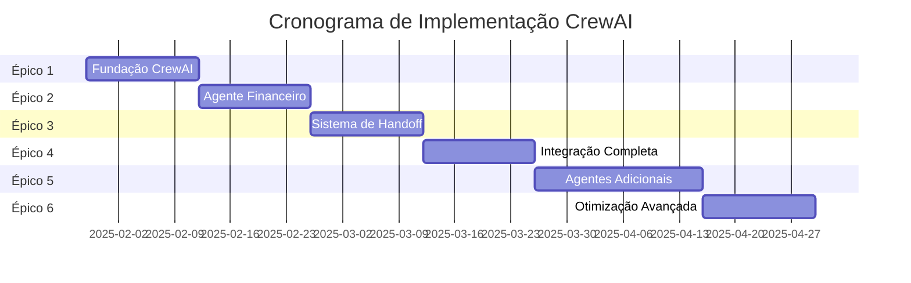
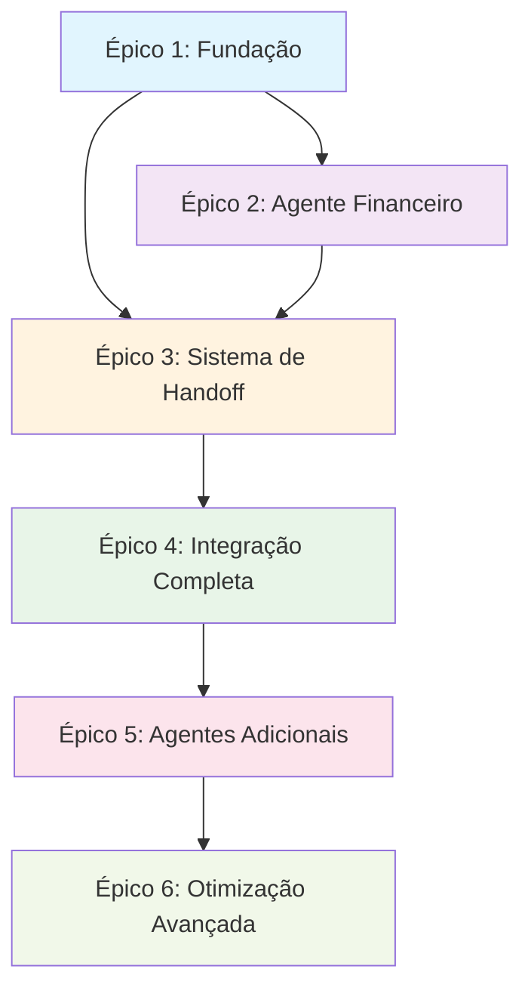

# 📚 ÉPICOS CREWAI - DOCUMENTAÇÃO FÍSICA CONSOLIDADA

## 📋 **Índice de Documentos**

Este documento consolida toda a documentação física dos épicos CrewAI do projeto Falachefe, organizando os 6 épicos principais em uma estrutura clara e acessível.

**Data de Consolidação**: 29 de janeiro de 2025  
**Versão**: v1.0  
**Status**: Documentação Física Completa  

---

## 🎯 **Visão Geral dos Épicos**

### **Cronograma de Implementação**
- **Duração Total**: 11 semanas
- **Início**: Janeiro 2025
- **Conclusão**: Abril 2025
- **Status Atual**: Planejamento

### **Épicos em Sequência**
1. **🏗️ ÉPICO 1**: Fundação CrewAI (2 semanas)
2. **💰 ÉPICO 2**: Agente Financeiro (2 semanas)  
3. **🔄 ÉPICO 3**: Sistema de Handoff (2 semanas)
4. **🌐 ÉPICO 4**: Integração Completa (2 semanas)
5. **🤖 ÉPICO 5**: Agentes Adicionais (3 semanas)
6. **⚡ ÉPICO 6**: Otimização Avançada (2 semanas)

---

## 📊 **Documentos por Épico**

### **🏗️ ÉPICO 1: Fundação CrewAI**
**Arquivo**: `epic-crewai-1-fundacao.md`
**Duração**: 2 semanas | **Prioridade**: Crítica | **Complexidade**: Alta

#### **Objetivo Principal**
Estabelecer a infraestrutura fundamental para integração CrewAI no sistema Falachefe.

#### **Entregas Principais**
- [ ] Instalação e configuração de dependências CrewAI
- [ ] Estrutura de banco de dados para crews, agentes e tarefas
- [ ] Sistema de memória CrewAI
- [ ] Configuração Redis para coordenação
- [ ] Orquestrador básico
- [ ] Sistema de isolamento por tenant

#### **User Stories Críticas**
- **US-1.1**: Instalação CrewAI
- **US-1.2**: Schema de Banco de Dados
- **US-1.3**: Sistema de Memória
- **US-1.4**: Configuração Redis
- **US-1.5**: Orquestrador Base
- **US-1.6**: Isolamento Multi-tenant

#### **Critérios de Aceitação**
- [ ] CrewAI instalado e funcionando
- [ ] Tabelas de banco criadas e testadas
- [ ] Redis configurado para coordenação
- [ ] Orquestrador processando mensagens básicas
- [ ] Isolamento por empresa funcionando
- [ ] Testes unitários > 80% cobertura

---

### **💰 ÉPICO 2: Agente Financeiro**
**Arquivo**: `epic-crewai-2-agente-financeiro.md`
**Duração**: 2 semanas | **Prioridade**: Alta | **Complexidade**: Alta

#### **Objetivo Principal**
Implementar o Agente Financeiro especializado usando CrewAI, substituindo o sistema legado.

#### **Entregas Principais**
- [ ] Financial Agent com role, goal e backstory definidos
- [ ] Ferramentas especializadas para operações financeiras
- [ ] Sistema de memória específico para finanças
- [ ] Migração de funcionalidades existentes
- [ ] Análise inteligente de fluxo de caixa

#### **User Stories Críticas**
- **US-2.1**: Agente Financeiro CrewAI
- **US-2.2**: Ferramentas Financeiras
- **US-2.3**: Sistema de Memória Financeira
- **US-2.4**: Migração de Funcionalidades
- **US-2.5**: Análise de Fluxo de Caixa
- **US-2.6**: Integração com Banco de Dados

#### **Critérios de Aceitação**
- [ ] Agente financeiro funcionando com CrewAI
- [ ] Todas as ferramentas financeiras implementadas
- [ ] Memória específica para contexto financeiro
- [ ] Migração 100% das funcionalidades existentes
- [ ] Análise de fluxo de caixa inteligente
- [ ] Performance equivalente ou superior ao sistema legado

---

### **🔄 ÉPICO 3: Sistema de Handoff**
**Arquivo**: `epic-crewai-3-sistema-handoff.md`
**Duração**: 2 semanas | **Prioridade**: Alta | **Complexidade**: Muito Alta

#### **Objetivo Principal**
Implementar sistema inteligente de transferência entre agentes com preservação de contexto.

#### **Entregas Principais**
- [ ] Sistema de handoff inteligente
- [ ] Transferência de contexto preservada
- [ ] Gerenciamento de estado de conversa
- [ ] Detecção automática de necessidade de transferência
- [ ] Notificação transparente ao usuário
- [ ] Error handling robusto

#### **User Stories Críticas**
- **US-3.1**: Sistema de Handoff Inteligente
- **US-3.2**: Preservação de Contexto
- **US-3.3**: Gerenciamento de Estado
- **US-3.4**: Detecção Automática
- **US-3.5**: Notificação ao Usuário
- **US-3.6**: Error Handling

#### **Critérios de Aceitação**
- [ ] Handoff automático entre agentes funcionando
- [ ] Contexto 100% preservado nas transferências
- [ ] Estado de conversa mantido durante handoffs
- [ ] Detecção inteligente de necessidade de transferência
- [ ] Usuário notificado de forma transparente
- [ ] Error handling robusto para falhas de handoff

---

### **🌐 ÉPICO 4: Integração Completa**
**Arquivo**: `epic-crewai-4-integracao-completa.md`
**Duração**: 2 semanas | **Prioridade**: Crítica | **Complexidade**: Muito Alta

#### **Objetivo Principal**
Finalizar a integração CrewAI com produção completa, incluindo UAZ API e interface de usuário.

#### **Entregas Principais**
- [ ] Integração completa com UAZ API (WhatsApp)
- [ ] Integração com interface de chat existente
- [ ] Dashboard de métricas e monitoramento
- [ ] Sistema de human-in-the-loop
- [ ] Deploy em produção com rollback automático
- [ ] Monitoramento em tempo real

#### **User Stories Críticas**
- **US-4.1**: Integração UAZ API
- **US-4.2**: Interface de Chat Integrada
- **US-4.3**: Dashboard de Métricas
- **US-4.4**: Sistema Human-in-the-Loop
- **US-4.5**: Deploy em Produção
- **US-4.6**: Monitoramento Tempo Real

#### **Critérios de Aceitação**
- [ ] Webhook UAZ API funcionando com CrewAI
- [ ] Chat interface integrada e responsiva
- [ ] Dashboard com métricas em tempo real
- [ ] Sistema de aprovação humana operacional
- [ ] Deploy em produção com rollback automático
- [ ] Monitoramento ativo e alertas funcionando

---

### **🤖 ÉPICO 5: Agentes Adicionais**
**Arquivo**: `epic-crewai-5-agentes-adicionais.md`
**Duração**: 3 semanas | **Prioridade**: Média | **Complexidade**: Alta

#### **Objetivo Principal**
Expandir o ecossistema CrewAI com agentes especializados adicionais.

#### **Entregas Principais**
- [ ] Marketing Agent especializado
- [ ] Support Agent para suporte técnico
- [ ] HR Agent para recursos humanos
- [ ] Sistema de coordenação entre múltiplos agentes
- [ ] Dashboard de gerenciamento de agentes
- [ ] Sistema de treinamento contínuo

#### **User Stories Críticas**
- **US-5.1**: Marketing Agent
- **US-5.2**: Support Agent
- **US-5.3**: HR Agent
- **US-5.4**: Coordenação Multi-agente
- **US-5.5**: Dashboard de Gerenciamento
- **US-5.6**: Sistema de Treinamento

#### **Critérios de Aceitação**
- [ ] Marketing Agent funcionando e especializado
- [ ] Support Agent para suporte técnico
- [ ] HR Agent para recursos humanos
- [ ] Coordenação entre múltiplos agentes
- [ ] Dashboard completo de gerenciamento
- [ ] Sistema de treinamento contínuo ativo

---

### **⚡ ÉPICO 6: Otimização Avançada**
**Arquivo**: `epic-crewai-6-otimizacao-avancada.md`
**Duração**: 2 semanas | **Prioridade**: Baixa | **Complexidade**: Muito Alta

#### **Objetivo Principal**
Otimizar o sistema com recursos avançados de IA e ML.

#### **Entregas Principais**
- [ ] Sistema de aprendizado de máquina
- [ ] Auto-tuning de parâmetros de agentes
- [ ] Predição de necessidades de handoff
- [ ] Otimização automática de custos
- [ ] Sistema de feedback loop inteligente
- [ ] Analytics preditivos

#### **User Stories Críticas**
- **US-6.1**: Sistema de ML
- **US-6.2**: Auto-tuning de Parâmetros
- **US-6.3**: Predição de Handoff
- **US-6.4**: Otimização de Custos
- **US-6.5**: Feedback Loop Inteligente
- **US-6.6**: Analytics Preditivos

#### **Critérios de Aceitação**
- [ ] Sistema de ML funcionando
- [ ] Auto-tuning de parâmetros ativo
- [ ] Predição de handoff > 90% precisão
- [ ] Otimização automática de custos
- [ ] Feedback loop inteligente operacional
- [ ] Analytics preditivos fornecendo insights

---

## 📊 **Métricas de Sucesso Globais**

### **Métricas Técnicas**
- ✅ **Uptime**: > 99.9%
- ✅ **Tempo de Resposta**: < 3 segundos
- ✅ **Taxa de Sucesso**: > 98%
- ✅ **Cobertura de Testes**: > 85%

### **Métricas de Negócio**
- ✅ **Empresas Suportadas**: 20+ simultâneas
- ✅ **Redução de Custos**: > 25%
- ✅ **Melhoria de Performance**: > 30%
- ✅ **Satisfação do Usuário**: > 90%

### **Métricas de Qualidade**
- ✅ **Precisão de Handoff**: > 95%
- ✅ **Preservação de Contexto**: 100%
- ✅ **Taxa de Recovery**: > 95%
- ✅ **Zero Perda de Dados**: 100%

---

## 🚨 **Riscos Principais e Mitigações**

### **Risco 1: Complexidade de Migração**
- **Probabilidade**: Alta
- **Impacto**: Crítico
- **Mitigação**: Migração gradual e testes extensivos

### **Risco 2: Performance em Produção**
- **Probabilidade**: Média
- **Impacto**: Alto
- **Mitigação**: Load testing e otimização contínua

### **Risco 3: Custos Excessivos**
- **Probabilidade**: Baixa
- **Impacto**: Alto
- **Mitigação**: Monitoramento rigoroso e otimização automática

### **Risco 4: Perda de Funcionalidades**
- **Probabilidade**: Baixa
- **Impacto**: Crítico
- **Mitigação**: Migração 100% das funcionalidades existentes

---

## 📅 **Cronograma Detalhado**

---

## 🔗 **Dependências entre Épicos**

---

## 📚 **Documentos de Referência**

### **Arquitetura**
- [Arquitetura Completa](../architecture.md)
- [Data Models](../architecture/data-models.md)
- [Components](../architecture/components.md)
- [Core Workflows](../architecture/core-workflows.md)

### **Implementação Técnica**
- [Plano de Integração](../archive/implementation/PLANO-INTEGRACAO-CREWAI-FALACHEFE.md)
- [Implementação Técnica](../archive/implementation/IMPLEMENTACAO-TECNICA-CREWAI.md)

### **Business**
- [Integração CrewAI](../business/crewai_falachefe_integracao.md)
- [Project Summary](../business/project-summary.md)

---

## 🚀 **Próximos Passos Imediatos**

### **Semana 1-2: Épico 1 - Fundação**
1. **Instalar dependências CrewAI**
2. **Criar migrations para tabelas CrewAI**
3. **Implementar orquestrador básico**
4. **Configurar Redis para coordenação**
5. **Sistema de isolamento por tenant**

### **Semana 3-4: Épico 2 - Agente Financeiro**
1. **Migrar Financial Agent para CrewAI**
2. **Implementar ferramentas especializadas**
3. **Sistema de memória financeira**
4. **Testes de integração**

### **Semana 5-6: Épico 3 - Sistema de Handoff**
1. **Implementar handoff inteligente**
2. **Preservação de contexto**
3. **Gerenciamento de estado**
4. **Testes de transferência**

---

## ✅ **Checklist de Início**

### **Pré-requisitos**
- [ ] Plano aprovado por todos os stakeholders
- [ ] Equipe formada e responsabilidades definidas
- [ ] Ambiente de desenvolvimento configurado
- [ ] Acesso a todas as ferramentas necessárias
- [ ] Cronograma detalhado aprovado

### **Preparação**
- [ ] Documentação técnica revisada
- [ ] Arquitetura validada
- [ ] Dependências externas confirmadas
- [ ] Riscos identificados e mitigados
- [ ] Critérios de sucesso definidos

---

## 📞 **Contatos e Responsabilidades**

### **Equipe Principal**
- **Product Owner**: [Definir] - Aprovação de épicos e prioridades
- **Tech Lead**: [Definir] - Arquitetura e decisões técnicas
- **Dev Team**: [Definir] - Implementação e testes
- **QA Team**: [Definir] - Testes e validação
- **DevOps**: [Definir] - Deploy e infraestrutura

### **Stakeholders**
- **Business**: [Definir] - Requisitos de negócio
- **Usuários**: [Definir] - Feedback e validação
- **Suporte**: [Definir] - Treinamento e documentação

---

**Esta documentação física consolida todos os épicos CrewAI em uma estrutura organizada e acessível para implementação!** 🚀

---

*Última atualização: 29 de janeiro de 2025*

