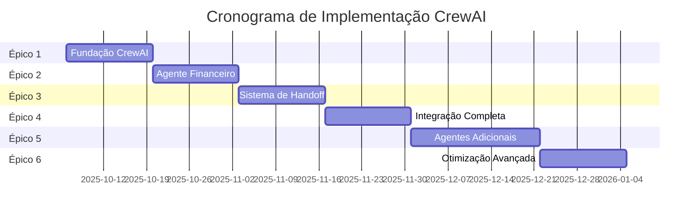
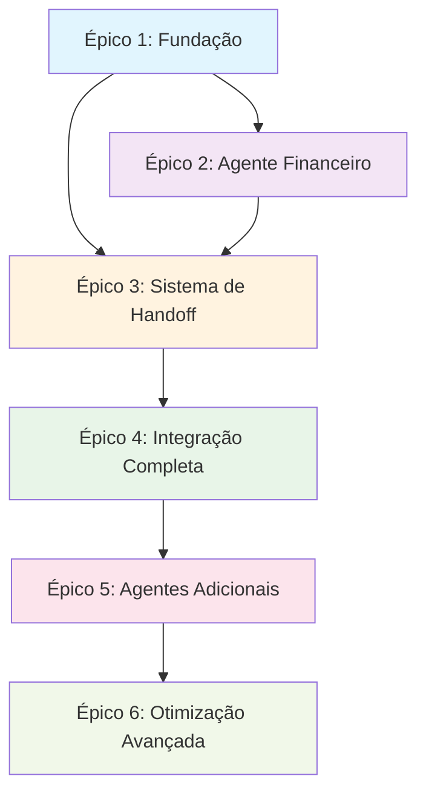

# 🚀 Épicos CrewAI - Plano de Implementação Completo

## 📋 **Visão Geral**

Este documento apresenta o plano completo de implementação da integração CrewAI no sistema Falachefe, organizado em 6 épicos sequenciais que garantem uma migração segura e escalável.

**Data de Criação**: 5 de outubro de 2025  
**Duração Total Estimada**: 11 semanas  
**Status**: Planejamento  

---

## 🎯 **Objetivos Gerais**

### **Objetivo Principal**
Substituir o sistema atual de agentes por CrewAI, mantendo compatibilidade com UAZ API e interface existente, enquanto adiciona capacidades avançadas de coordenação, handoff inteligente e otimização automática.

### **Benefícios Esperados**
- ✅ **Escalabilidade**: Suporte a 20+ empresas simultâneas
- ✅ **Inteligência**: Agentes especializados com coordenação inteligente
- ✅ **Eficiência**: Handoff automático e otimização de recursos
- ✅ **Qualidade**: Sistema de memória e aprendizado contínuo
- ✅ **Custo**: Otimização automática de custos e tokens
- ✅ **Monitoramento**: Dashboard completo e métricas em tempo real

---

## 📊 **Épicos do Plano**

### **🏗️ ÉPICO 1: Fundação CrewAI**
**Duração**: 2 semanas | **Prioridade**: Crítica | **Complexidade**: Alta

**Objetivo**: Estabelecer a infraestrutura fundamental para integração CrewAI.

**Principais Entregas**:
- Instalação e configuração de dependências CrewAI
- Estrutura de banco de dados para crews, agentes e tarefas
- Sistema de memória CrewAI
- Configuração Redis para coordenação
- Orquestrador básico
- Sistema de isolamento por tenant

**Dependências**: Sistema atual funcionando

---

### **💰 ÉPICO 2: Agente Financeiro**
**Duração**: 2 semanas | **Prioridade**: Alta | **Complexidade**: Alta

**Objetivo**: Implementar o Agente Financeiro especializado usando CrewAI.

**Principais Entregas**:
- Financial Agent com role, goal e backstory definidos
- Ferramentas especializadas para operações financeiras
- Sistema de memória específico para finanças
- Migração de funcionalidades existentes
- Análise inteligente de fluxo de caixa

**Dependências**: Épico 1 completo

---

### **🔄 ÉPICO 3: Sistema de Handoff**
**Duração**: 2 semanas | **Prioridade**: Alta | **Complexidade**: Muito Alta

**Objetivo**: Implementar sistema inteligente de transferência entre agentes.

**Principais Entregas**:
- Sistema de handoff inteligente
- Transferência de contexto preservada
- Gerenciamento de estado de conversa
- Detecção automática de necessidade de transferência
- Notificação transparente ao usuário
- Error handling robusto

**Dependências**: Épicos 1 e 2 completos

---

### **🌐 ÉPICO 4: Integração Completa**
**Duração**: 2 semanas | **Prioridade**: Crítica | **Complexidade**: Muito Alta

**Objetivo**: Finalizar a integração CrewAI com produção completa.

**Principais Entregas**:
- Integração completa com UAZ API (WhatsApp)
- Integração com interface de chat existente
- Dashboard de métricas e monitoramento
- Sistema de human-in-the-loop
- Deploy em produção com rollback automático
- Monitoramento em tempo real

**Dependências**: Épicos 1, 2 e 3 completos

---

### **🤖 ÉPICO 5: Agentes Adicionais**
**Duração**: 3 semanas | **Prioridade**: Média | **Complexidade**: Alta

**Objetivo**: Expandir o ecossistema CrewAI com agentes especializados.

**Principais Entregas**:
- Marketing Agent especializado
- Support Agent para suporte técnico
- HR Agent para recursos humanos
- Sistema de coordenação entre múltiplos agentes
- Dashboard de gerenciamento de agentes
- Sistema de treinamento contínuo

**Dependências**: Épicos 1-4 completos

---

### **⚡ ÉPICO 6: Otimização Avançada**
**Duração**: 2 semanas | **Prioridade**: Baixa | **Complexidade**: Muito Alta

**Objetivo**: Otimizar o sistema com recursos avançados de IA e ML.

**Principais Entregas**:
- Sistema de aprendizado de máquina
- Auto-tuning de parâmetros de agentes
- Predição de necessidades de handoff
- Otimização automática de custos
- Sistema de feedback loop inteligente
- Analytics preditivos

**Dependências**: Todos os épicos anteriores completos

---

## 📅 **Cronograma Geral**

---

## 🔗 **Dependências entre Épicos**

---

## 📊 **Métricas de Sucesso Globais**

### **Métricas Técnicas**
- ✅ **Uptime**: > 99.9%
- ✅ **Tempo de Resposta**: < 3 segundos
- ✅ **Taxa de Sucesso**: > 98%
- ✅ **Cobertura de Testes**: > 85%

### **Métricas de Negócio**
- ✅ **Empresas Suportadas**: 20+ simultâneas
- ✅ **Redução de Custos**: > 25%
- ✅ **Melhoria de Performance**: > 30%
- ✅ **Satisfação do Usuário**: > 90%

### **Métricas de Qualidade**
- ✅ **Precisão de Handoff**: > 95%
- ✅ **Preservação de Contexto**: 100%
- ✅ **Taxa de Recovery**: > 95%
- ✅ **Zero Perda de Dados**: 100%

---

## 🚨 **Riscos Principais e Mitigações**

### **Risco 1: Complexidade de Migração**
- **Probabilidade**: Alta
- **Impacto**: Crítico
- **Mitigação**: Migração gradual e testes extensivos

### **Risco 2: Performance em Produção**
- **Probabilidade**: Média
- **Impacto**: Alto
- **Mitigação**: Load testing e otimização contínua

### **Risco 3: Custos Excessivos**
- **Probabilidade**: Baixa
- **Impacto**: Alto
- **Mitigação**: Monitoramento rigoroso e otimização automática

### **Risco 4: Perda de Funcionalidades**
- **Probabilidade**: Baixa
- **Impacto**: Crítico
- **Mitigação**: Migração 100% das funcionalidades existentes

---

## 🎯 **Critérios de Aceitação Globais**

### **Funcionalidade**
- [ ] Todos os agentes funcionando corretamente
- [ ] Handoff inteligente operacional
- [ ] Integração UAZ API 100% funcional
- [ ] Dashboard de métricas completo
- [ ] Sistema de monitoramento ativo

### **Performance**
- [ ] Tempo de resposta < 3 segundos
- [ ] Suporte a 20+ empresas simultâneas
- [ ] Uptime > 99.9%
- [ ] Taxa de sucesso > 98%

### **Qualidade**
- [ ] Zero perda de dados
- [ ] Preservação de contexto 100%
- [ ] Cobertura de testes > 85%
- [ ] Documentação completa

### **Segurança**
- [ ] Isolamento por tenant 100%
- [ ] Controle de acesso rigoroso
- [ ] Logs de auditoria completos
- [ ] Backup e recovery testados

---

## 📚 **Documentação dos Épicos**

### **Documentos Principais**
- [📚 Épicos Consolidados](./EPICOS-CREWAI-CONSOLIDADOS.md) - Documentação física completa
- [📁 Índice Físico](./INDICE-FISICO-EPICOS.md) - Inventário de todos os documentos

### **Épicos CrewAI Detalhados**
1. [Épico 1: Fundação CrewAI](./epic-crewai-1-fundacao.md)
2. [Épico 2: Agente Financeiro](./epic-crewai-2-agente-financeiro.md)
3. [Épico 3: Sistema de Handoff](./epic-crewai-3-sistema-handoff.md)
4. [Épico 4: Integração Completa](./epic-crewai-4-integracao-completa.md)
5. [Épico 5: Agentes Adicionais](./epic-crewai-5-agentes-adicionais.md)
6. [Épico 6: Otimização Avançada](./epic-crewai-6-otimizacao-avancada.md)

### **Documentos de Referência**
- [Plano de Integração CrewAI](../archive/implementation/PLANO-INTEGRACAO-CREWAI-FALACHEFE.md)
- [Implementação Técnica CrewAI](../archive/implementation/IMPLEMENTACAO-TECNICA-CREWAI.md)
- [Arquitetura do Sistema](../architecture.md)

---

## 🚀 **Próximos Passos**

### **Imediatos (Próxima Semana)**
1. **Aprovação do Plano**: Revisar e aprovar todos os épicos
2. **Setup do Ambiente**: Preparar ambiente de desenvolvimento
3. **Formação da Equipe**: Definir responsabilidades e cronograma
4. **Início do Épico 1**: Começar implementação da fundação

### **Curto Prazo (1-2 Meses)**
1. **Completar Épicos 1-3**: Fundação, Agente Financeiro e Handoff
2. **Testes de Integração**: Validar funcionalidades básicas
3. **Preparação para Produção**: Ambiente de staging e testes

### **Médio Prazo (2-3 Meses)**
1. **Completar Épicos 4-5**: Integração completa e agentes adicionais
2. **Deploy em Produção**: Migração gradual das empresas
3. **Monitoramento Ativo**: Acompanhamento de métricas e performance

### **Longo Prazo (3+ Meses)**
1. **Épico 6**: Otimização avançada e ML
2. **Expansão**: Novos agentes e funcionalidades
3. **Evolução Contínua**: Melhorias baseadas em feedback

---

## 📞 **Contatos e Responsabilidades**

### **Equipe Principal**
- **Product Owner**: [Nome] - Aprovação de épicos e prioridades
- **Tech Lead**: [Nome] - Arquitetura e decisões técnicas
- **Dev Team**: [Nomes] - Implementação e testes
- **QA Team**: [Nomes] - Testes e validação
- **DevOps**: [Nome] - Deploy e infraestrutura

### **Stakeholders**
- **Business**: [Nome] - Requisitos de negócio
- **Usuários**: [Representantes] - Feedback e validação
- **Suporte**: [Nome] - Treinamento e documentação

---

## ✅ **Checklist de Início**

### **Pré-requisitos**
- [ ] Plano aprovado por todos os stakeholders
- [ ] Equipe formada e responsabilidades definidas
- [ ] Ambiente de desenvolvimento configurado
- [ ] Acesso a todas as ferramentas necessárias
- [ ] Cronograma detalhado aprovado

### **Preparação**
- [ ] Documentação técnica revisada
- [ ] Arquitetura validada
- [ ] Dependências externas confirmadas
- [ ] Riscos identificados e mitigados
- [ ] Critérios de sucesso definidos

---

**Este plano garante uma implementação CrewAI robusta, escalável e de alta qualidade!** 🚀

---

*Última atualização: 5 de outubro de 2025*