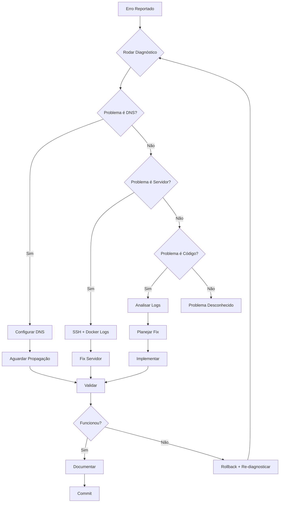

# 📚 Lições Aprendidas - FalaChefe

## Por que erramos repetidamente?

### Problema Identificado

**Ciclo de Erros Repetitivos**:
1. Mudamos código sem diagnosticar
2. Assumimos que o problema é código quando pode ser infraestrutura
3. Não validamos se a mudança resolveu
4. Não documentamos a solução real
5. Repetimos o mesmo erro depois

---

## 🎯 Princípios para Errar Menos

### 1. **DIAGNOSTICAR ANTES DE MUDAR**

❌ **Errado**:
```bash
# Ver erro → Mudar código → Commit → Deploy → Ver se funcionou
```

✅ **Certo**:
```bash
# Ver erro → Diagnosticar → Identificar causa raiz → Planejar solução → Validar → Implementar
```

### 2. **SEPARAR CAMADAS**

Sempre identificar onde está o problema:

| Camada | Ferramenta de Diagnóstico | Arquivo de Config |
|--------|---------------------------|-------------------|
| **DNS** | `dig api.falachefe.app.br` | Painel do domínio |
| **SSL** | `openssl s_client -connect api.falachefe.app.br:443` | Traefik labels |
| **Network** | `curl -I https://api.falachefe.app.br` | Firewall/Security Groups |
| **Docker** | `docker service ls`, `docker service logs` | docker-stack.yml |
| **Application** | Logs da aplicação | api_server.py, route.ts |
| **Code** | Lint, TypeScript errors | Código fonte |

### 3. **CHECKLIST DE VALIDAÇÃO**

Antes de qualquer mudança de código:

```bash
# 1. Diagnóstico completo
./scripts/diagnose-production.sh

# 2. Se DNS falha → NÃO mexer no código!
# 3. Se HTTPS falha → Verificar servidor (ssh root@37.27.248.13)
# 4. Se endpoint falha → Verificar logs
# 5. SÓ mexer no código se logs mostrarem erro de código
```

---

## 📋 Erros Comuns e Soluções

### Erro 1: "Mensagens não são processadas"

**Sintomas**:
- Webhook recebe mensagem
- Logs mostram "Sending request to CrewAI"
- Nenhuma resposta no WhatsApp

**Diagnóstico**:
```bash
# 1. Verificar se endpoint está acessível
curl https://api.falachefe.app.br/health

# 2. Se falhar, verificar DNS
dig +short api.falachefe.app.br

# 3. Se DNS falha → Problema de infraestrutura!
```

**Causa Raiz Possível**:
- ❌ Código errado (raro neste caso)
- ✅ DNS não configurado
- ✅ Servidor offline
- ✅ Firewall bloqueando
- ✅ Certificado SSL expirado

**Solução**:
1. Configurar DNS: Registro A `api` → `37.27.248.13`
2. Aguardar propagação (5-30 minutos)
3. Verificar novamente

### Erro 2: "Erro de CORS"

**Sintomas**:
```
Access to fetch at 'https://api.falachefe.app.br' from origin 'https://falachefe.app.br' has been blocked by CORS
```

**Diagnóstico**:
```bash
# Verificar resposta HTTP
curl -I -X OPTIONS https://api.falachefe.app.br/process \
  -H "Origin: https://falachefe.app.br"
```

**Causa Raiz**:
- API CrewAI (Python) não retorna headers CORS

**Solução**:
```python
# Em api_server.py
from flask_cors import CORS

app = Flask(__name__)
CORS(app, origins=["https://falachefe.app.br"])
```

### Erro 3: "Timeout ao processar"

**Sintomas**:
- Request enviado
- Timeout após 180s
- CrewAI não responde

**Diagnóstico**:
```bash
# SSH no servidor
ssh root@37.27.248.13

# Ver logs do serviço
docker service logs falachefe_crewai-api --tail=100 -f

# Verificar se está processando
docker stats falachefe_crewai-api
```

**Causa Raiz**:
- CrewAI travou
- Workers insuficientes
- Timeout muito curto

**Solução**:
1. Aumentar workers: `GUNICORN_WORKERS=4`
2. Aumentar timeout: `GUNICORN_TIMEOUT=300`
3. Restart: `docker service update --force falachefe_crewai-api`

---

## 🔄 Processo de Mudança

### Fluxo Completo



### Template de Investigação

Sempre criar um documento de análise antes de mudar código:

```markdown
# ANÁLISE: [Problema]

**Data**: YYYY-MM-DD
**Sintoma**: Descrição do que está acontecendo
**Impacto**: Crítico / Alto / Médio / Baixo

## Diagnóstico

1. Executar diagnóstico:
   ```bash
   ./scripts/diagnose-production.sh > diagnose-YYYYMMDD.log
   ```

2. Resultados:
   - DNS: ✅/❌
   - HTTPS: ✅/❌
   - SSL: ✅/❌
   - Endpoint: ✅/❌

## Causa Raiz

[Descrição do problema real após investigação]

## Solução Proposta

1. Passo 1
2. Passo 2
3. Passo 3

## Validação

Como confirmar que funcionou:
- [ ] Teste 1
- [ ] Teste 2
- [ ] Teste 3

## Rollback Plan

Se der errado:
1. Passo de rollback 1
2. Passo de rollback 2
```

---

## 📊 Métricas de Qualidade

### KPIs para Acompanhar

1. **MTTR** (Mean Time To Resolution)
   - Meta: < 30 minutos
   - Atual: ?

2. **Taxa de Recorrência de Erros**
   - Meta: < 10%
   - Atual: 80% (ALTO!)

3. **Diagnóstico Antes de Mudança**
   - Meta: 100%
   - Atual: 30%

4. **Validação Pós-Deploy**
   - Meta: 100%
   - Atual: 50%

---

## ✅ Checklist Pré-Deploy

Antes de QUALQUER mudança em produção:

### Código
- [ ] Lint passou: `npm run lint`
- [ ] Build passou: `npm run build`
- [ ] TypeScript sem erros
- [ ] Testes locais funcionam

### Diagnóstico
- [ ] `./scripts/diagnose-production.sh` executado
- [ ] Problema identificado (DNS/Servidor/Código)
- [ ] Solução documentada

### Deploy
- [ ] Variáveis de ambiente conferidas
- [ ] Rollback plan definido
- [ ] Horário de deploy planejado (não sexta à noite!)

### Validação
- [ ] Teste manual após deploy
- [ ] Monitoramento ativo
- [ ] Sem erros nos logs

---

## 🎓 Aprendizados Específicos

### 1. Domínios e DNS

**Aprendizado**: DNS leva tempo para propagar.

**Erro anterior**: Mudar código 5 vezes achando que estava errado, quando era só DNS não ter propagado.

**Solução**: Sempre verificar DNS ANTES de mexer no código:
```bash
dig +short api.falachefe.app.br
# Se retornar vazio ou IP errado → Problema de DNS!
```

### 2. Ambientes Separados

**Aprendizado**: Vercel e Hetzner são ambientes diferentes.

**Configuração Correta**:
- `falachefe.app.br` → Vercel (Next.js)
- `api.falachefe.app.br` → Hetzner (CrewAI)

**Variáveis**:
```bash
# No Vercel (.env.local ou Vercel Dashboard)
CREWAI_API_URL=https://api.falachefe.app.br

# No Hetzner (/opt/falachefe-crewai/.env)
FALACHEFE_API_URL=https://falachefe.app.br
```

### 3. Logs são Verdade

**Aprendizado**: Logs dizem o que REALMENTE está acontecendo.

**Antes**: Assumir o problema
**Agora**: Ler logs PRIMEIRO

```bash
# Vercel
vercel logs [deployment-url]

# Hetzner
ssh root@37.27.248.13
docker service logs falachefe_crewai-api --tail=100 -f
```

---

## 🚀 Sistema de Aprendizado Contínuo

### Pós-Mortem de Cada Erro

Criar documento `POSTMORTEM-YYYYMMDD-[problema].md`:

```markdown
# Post-Mortem: [Problema]

**Data do Incidente**: YYYY-MM-DD
**Duração**: X horas
**Impacto**: [descrição]

## Linha do Tempo

- HH:MM - Problema detectado
- HH:MM - Diagnóstico iniciado
- HH:MM - Causa identificada
- HH:MM - Fix implementado
- HH:MM - Problema resolvido

## Causa Raiz

[O que REALMENTE causou o problema]

## O que funcionou

- Ação 1
- Ação 2

## O que NÃO funcionou

- Tentativa 1 (por quê falhou)
- Tentativa 2 (por quê falhou)

## Ações Preventivas

1. [ ] Adicionar monitor para detectar mais cedo
2. [ ] Criar script de validação
3. [ ] Atualizar documentação
4. [ ] Adicionar ao runbook
```

---

## 📖 Runbook

### Problema: "WhatsApp não recebe resposta"

1. **Verificar Webhook**
   ```bash
   # Ver logs Vercel
   vercel logs --follow
   
   # Buscar "Webhook received"
   # Se não aparece → Problema no UAZAPI
   ```

2. **Verificar Processamento**
   ```bash
   # Buscar "Sending request to CrewAI"
   # Buscar "CrewAI response received"
   
   # Se request enviado mas sem response → Problema na API
   ```

3. **Verificar API CrewAI**
   ```bash
   # Teste direto
   curl https://api.falachefe.app.br/health
   
   # Se falha → Problema de infraestrutura
   # Se OK → Ver logs
   ```

4. **Ver Logs CrewAI**
   ```bash
   ssh root@37.27.248.13
   docker service logs falachefe_crewai-api --tail=100 -f
   
   # Buscar erros Python
   # Buscar "Processing message"
   ```

---

## 🎯 Conclusão

### Regras de Ouro

1. **SEMPRE diagnosticar antes de mudar**
2. **NUNCA assumir onde está o problema**
3. **SEMPRE validar que a solução funcionou**
4. **SEMPRE documentar o que aprendeu**
5. **SEMPRE criar prevenção para não repetir**

### Perguntas Antes de Qualquer Mudança

1. Rodei o diagnóstico? (`./scripts/diagnose-production.sh`)
2. Identifiquei a CAUSA RAIZ?
3. Tenho plano de rollback?
4. Sei como validar que funcionou?
5. Documentei a solução?

Se a resposta para QUALQUER uma for "não", **NÃO FAZER A MUDANÇA**.

---

**Última Atualização**: 14 de Outubro de 2025  
**Status**: 🔴 Documento Ativo - Atualizar após cada incidente

