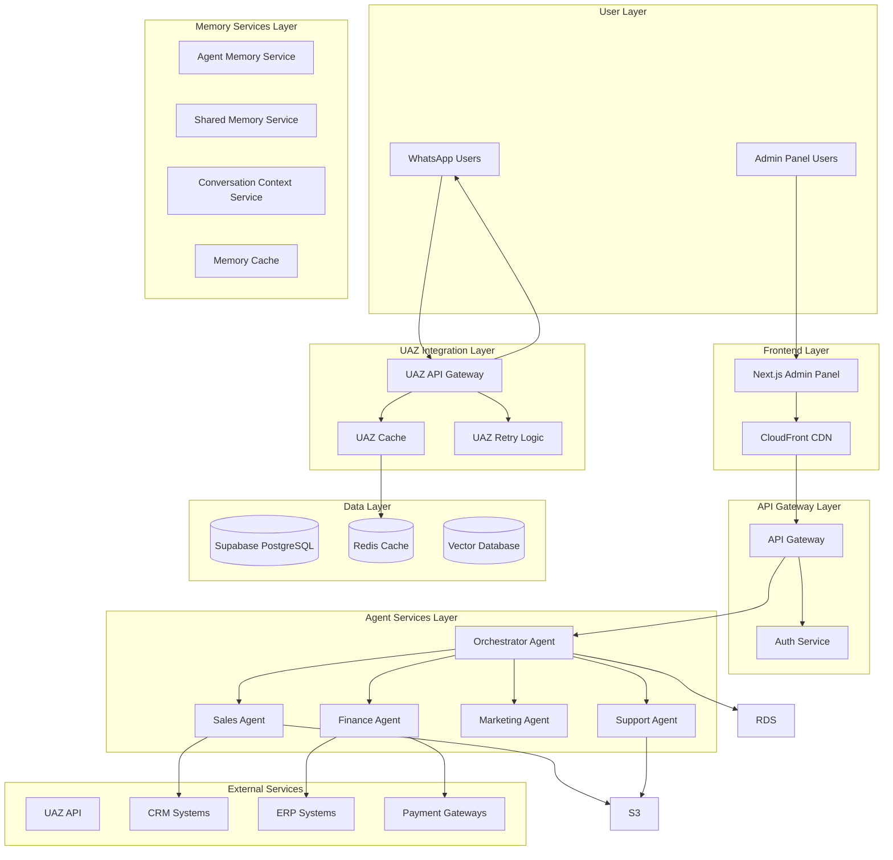
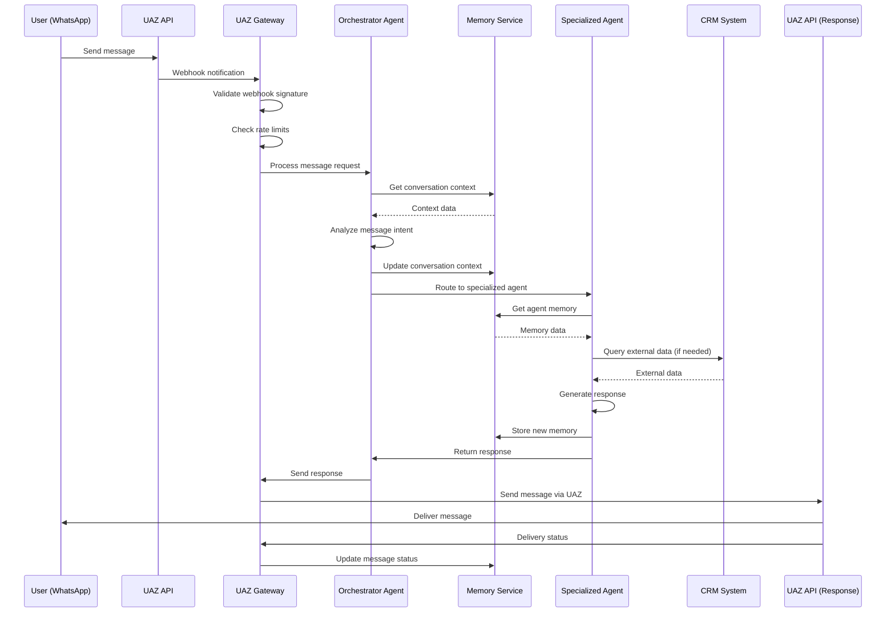

# Plataforma SaaS de Chat Multagente de IA via WhatsApp - Arquitetura

## Visão Geral

Esta arquitetura define uma plataforma SaaS completa para chat multagente de IA via WhatsApp, utilizando UAZ API como gateway principal. A solução combina microserviços serverless, memória persistente distribuída e agentes especializados para oferecer atendimento 24/7 automatizado.

## Stack Tecnológica

### Frontend
- **Framework:** Next.js 14 + TypeScript
- **UI:** shadcn/ui + Tailwind CSS
- **State:** Zustand + React Query
- **Deploy:** Vercel

### Backend
- **Runtime:** Vercel Functions (Node.js/TypeScript)
- **Database:** Supabase PostgreSQL
- **Cache:** Upstash Redis
- **Auth:** Supabase Auth

### Integrações
- **WhatsApp:** UAZ API REST
- **AI/ML:** OpenAI GPT-4
- **Storage:** Supabase Storage
- **Monitoring:** Vercel Analytics + Sentry

## Arquitetura de Componentes

### 1. UAZ API Gateway
- Gateway principal para integração WhatsApp
- Circuit breaker e retry logic
- Rate limiting e cache
- Webhook processing

### 2. Orchestrator Agent
- Analisa mensagens e determina intenção
- Roteia para agentes especializados
- Gerencia contexto da conversa
- Aprendizado contínuo

### 3. Agentes Especializados
- **Sales Agent:** Vendas e propostas
- **Support Agent:** Suporte técnico
- **Marketing Agent:** Campanhas e segmentação
- **Finance Agent:** Relatórios e cobrança

### 4. Sistema de Memória
- **Agent Memory:** Memórias individuais por agente
- **Shared Memory:** Memórias compartilhadas entre agentes
- **Conversation Context:** Contexto persistente das conversas
- **Learning Memory:** Padrões de aprendizado

## Modelo de Dados

### Entidades Principais
- **Companies:** Empresas clientes
- **Users:** Usuários finais via WhatsApp
- **Agents:** Agentes especializados de IA
- **Conversations:** Conversas entre usuários e agentes
- **Messages:** Mensagens individuais
- **Templates:** Templates de mensagem WhatsApp

### Entidades de Memória
- **AgentMemories:** Memórias individuais dos agentes
- **SharedMemories:** Memórias compartilhadas
- **ConversationContexts:** Contexto das conversas
- **AgentLearnings:** Padrões de aprendizado

## APIs Principais

### UAZ API Integration
- `POST /uaz/webhook` - Webhook da UAZ
- `POST /uaz/send-message` - Enviar mensagens
- `GET /uaz/templates` - Listar templates
- `POST /uaz/templates` - Criar templates

### Memory Management
- `GET /agents/{id}/memory` - Memórias do agente
- `POST /agents/{id}/memory` - Criar memória
- `GET /shared-memory` - Memórias compartilhadas
- `POST /shared-memory` - Criar memória compartilhada

### Conversation Management
- `POST /conversations` - Criar conversa
- `GET /conversations/{id}/messages` - Mensagens
- `POST /conversations/{id}/messages` - Enviar mensagem

## Workflows Principais

### 1. Processamento de Mensagem
1. Usuário envia mensagem via WhatsApp
2. UAZ API recebe e envia webhook
3. Orchestrator analisa intenção
4. Roteia para agente especializado
5. Agente processa com memória contextual
6. Resposta enviada via UAZ API

### 2. Gestão de Memória
1. Agente acessa memórias relevantes
2. Processa com contexto atual
3. Armazena nova memória
4. Atualiza memórias compartilhadas
5. Aprende padrões de interação

### 3. Gestão de Templates
1. Admin cria template no painel
2. Sistema valida formato
3. Submete para UAZ API
4. Aguarda aprovação
5. Cache template aprovado
6. Disponibiliza para uso

## Estrutura do Projeto

```
plataforma-chat-saas/
├── apps/
│   ├── web/                 # Next.js Frontend
│   └── api/                 # Vercel Functions
├── packages/
│   ├── shared/              # Tipos compartilhados
│   ├── ui/                  # Componentes UI
│   └── config/              # Configurações
├── infrastructure/          # IaC
├── docs/                    # Documentação
└── scripts/                 # Scripts de build
```

## Segurança e Conformidade

### Segurança
- Criptografia ponta a ponta (WhatsApp nativo)
- Autenticação JWT + RBAC
- Validação de entrada com Zod
- Rate limiting por usuário
- Logs de auditoria completos

### Conformidade
- LGPD/GDPR compliance
- Opt-in/opt-out management
- Data retention policies
- Privacy by design
- SOC2 ready

## Performance e Escalabilidade

### Métricas Alvo
- Response time: <3s para 95% das requisições
- Uptime: 99.9%
- Memory hit rate: >90%
- Concurrent conversations: 1000+

### Estratégias
- Cache Redis para dados frequentes
- Circuit breaker para UAZ API
- Auto-scaling serverless
- Database indexing otimizado
- CDN para assets estáticos

## Monitoramento

### Métricas Frontend
- Core Web Vitals
- JavaScript errors
- API response times
- User interactions

### Métricas Backend
- Request rate e error rate
- Response time
- Database performance
- UAZ API health

### Alertas
- Falhas de UAZ API
- Memory leaks
- Performance degradation
- Security incidents

## Próximos Passos

1. **MVP (0-3 meses)**
   - Integração UAZ API
   - Orchestrator + 2 agentes
   - Painel básico
   - Sistema de memória

2. **Funcionalidades Avançadas (4-6 meses)**
   - Todos os agentes especializados
   - Dashboards em tempo real
   - RBAC completo
   - Ambiente sandbox

3. **Otimização (7-9 meses)**
   - Workflows complexos
   - Integrações nativas CRM/ERP
   - Analytics avançado
   - Performance tuning

4. **Escala e Expansão (10-12 meses)**
   - Multi-idiomas
   - Marketplace de agentes
   - APIs públicas
   - Aprendizado contínuo

## Diagramas de Arquitetura

### Arquitetura de Alto Nível



### Fluxo de Processamento de Mensagem



## Especificação Técnica Detalhada

### Stack Tecnológica Completa

#### Frontend
- **Framework:** Next.js 14.0+ (App Router)
- **Language:** TypeScript 5.3+
- **UI Library:** shadcn/ui + Radix UI
- **Styling:** Tailwind CSS 3.4+
- **State Management:** Zustand 4.4+ + TanStack Query 5.0+
- **Forms:** React Hook Form + Zod
- **Charts:** Recharts + Chart.js
- **Testing:** Vitest + Testing Library + Playwright
- **Deployment:** Vercel

#### Backend
- **Runtime:** Vercel Functions (Node.js 18+)
- **Language:** TypeScript 5.3+
- **API Style:** REST + tRPC
- **Validation:** Zod
- **Database:** Supabase PostgreSQL 15+
- **Cache:** Upstash Redis
- **Auth:** Supabase Auth
- **Storage:** Supabase Storage
- **Queue:** Upstash Redis Streams
- **Monitoring:** Vercel Analytics + Sentry

#### Integrações
- **WhatsApp:** UAZ API REST
- **AI/ML:** OpenAI GPT-4 + Anthropic Claude
- **Vector DB:** Pinecone
- **Email:** Resend
- **SMS:** Twilio
- **Analytics:** Mixpanel + Google Analytics

### Estrutura de Banco de Dados

#### Tabelas Principais

```sql
-- Companies (Empresas clientes)
CREATE TABLE companies (
    id UUID PRIMARY KEY DEFAULT gen_random_uuid(),
    name VARCHAR(255) NOT NULL,
    domain VARCHAR(255) UNIQUE,
    uaz_token TEXT NOT NULL, -- encrypted instance token
    uaz_admin_token TEXT NOT NULL, -- encrypted admin token
    subscription_plan VARCHAR(50) DEFAULT 'starter',
    is_active BOOLEAN DEFAULT true,
    settings JSONB DEFAULT '{}',
    created_at TIMESTAMP WITH TIME ZONE DEFAULT NOW(),
    updated_at TIMESTAMP WITH TIME ZONE DEFAULT NOW()
);

-- Users (Usuários finais via WhatsApp)
CREATE TABLE users (
    id UUID PRIMARY KEY DEFAULT gen_random_uuid(),
    phone_number VARCHAR(20) UNIQUE NOT NULL,
    name VARCHAR(255) NOT NULL,
    company_id UUID REFERENCES companies(id) ON DELETE CASCADE,
    opt_in_status BOOLEAN DEFAULT false,
    last_interaction TIMESTAMP WITH TIME ZONE,
    window_expires_at TIMESTAMP WITH TIME ZONE,
    preferences JSONB DEFAULT '{}',
    created_at TIMESTAMP WITH TIME ZONE DEFAULT NOW(),
    updated_at TIMESTAMP WITH TIME ZONE DEFAULT NOW()
);

-- Agents (Agentes especializados de IA)
CREATE TABLE agents (
    id UUID PRIMARY KEY DEFAULT gen_random_uuid(),
    company_id UUID REFERENCES companies(id) ON DELETE CASCADE,
    name VARCHAR(255) NOT NULL,
    type VARCHAR(50) NOT NULL CHECK (type IN ('sales', 'support', 'marketing', 'finance', 'orchestrator')),
    description TEXT,
    system_prompt TEXT NOT NULL,
    is_active BOOLEAN DEFAULT true,
    capabilities JSONB DEFAULT '{}',
    config JSONB DEFAULT '{}',
    created_at TIMESTAMP WITH TIME ZONE DEFAULT NOW(),
    updated_at TIMESTAMP WITH TIME ZONE DEFAULT NOW()
);

-- Conversations (Conversas entre usuários e agentes)
CREATE TABLE conversations (
    id UUID PRIMARY KEY DEFAULT gen_random_uuid(),
    user_id UUID REFERENCES users(id) ON DELETE CASCADE,
    company_id UUID REFERENCES companies(id) ON DELETE CASCADE,
    current_agent_id UUID REFERENCES agents(id),
    status VARCHAR(50) DEFAULT 'active' CHECK (status IN ('active', 'waiting', 'escalated', 'closed', 'archived')),
    priority VARCHAR(20) DEFAULT 'medium' CHECK (priority IN ('low', 'medium', 'high', 'urgent')),
    context JSONB DEFAULT '{}',
    metadata JSONB DEFAULT '{}',
    started_at TIMESTAMP WITH TIME ZONE DEFAULT NOW(),
    last_message_at TIMESTAMP WITH TIME ZONE DEFAULT NOW(),
    ended_at TIMESTAMP WITH TIME ZONE
);

-- Messages (Mensagens individuais)
CREATE TABLE messages (
    id UUID PRIMARY KEY DEFAULT gen_random_uuid(),
    conversation_id UUID REFERENCES conversations(id) ON DELETE CASCADE,
    sender_type VARCHAR(20) NOT NULL CHECK (sender_type IN ('user', 'agent', 'system')),
    sender_id UUID NOT NULL,
    content TEXT NOT NULL,
    message_type VARCHAR(50) NOT NULL CHECK (message_type IN ('text', 'image', 'document', 'template', 'interactive', 'flow')),
    uaz_message_id VARCHAR(255),
    status VARCHAR(20) DEFAULT 'pending' CHECK (status IN ('pending', 'sent', 'delivered', 'read', 'failed')),
    metadata JSONB DEFAULT '{}',
    sent_at TIMESTAMP WITH TIME ZONE DEFAULT NOW(),
    delivered_at TIMESTAMP WITH TIME ZONE,
    read_at TIMESTAMP WITH TIME ZONE
);

-- Templates (Templates de mensagem WhatsApp)
CREATE TABLE templates (
    id UUID PRIMARY KEY DEFAULT gen_random_uuid(),
    company_id UUID REFERENCES companies(id) ON DELETE CASCADE,
    name VARCHAR(255) NOT NULL,
    category VARCHAR(50) NOT NULL CHECK (category IN ('marketing', 'utility', 'authentication')),
    language VARCHAR(10) NOT NULL,
    status VARCHAR(20) DEFAULT 'draft' CHECK (status IN ('draft', 'pending', 'approved', 'rejected', 'paused')),
    content JSONB NOT NULL,
    uaz_template_id VARCHAR(255),
    usage_count INTEGER DEFAULT 0,
    created_at TIMESTAMP WITH TIME ZONE DEFAULT NOW(),
    updated_at TIMESTAMP WITH TIME ZONE DEFAULT NOW()
);
```

#### Tabelas de Memória

```sql
-- Agent Memories (Memórias individuais dos agentes)
CREATE TABLE agent_memories (
    id UUID PRIMARY KEY DEFAULT gen_random_uuid(),
    agent_id UUID REFERENCES agents(id) ON DELETE CASCADE,
    conversation_id UUID REFERENCES conversations(id) ON DELETE CASCADE,
    memory_type VARCHAR(50) NOT NULL CHECK (memory_type IN ('fact', 'preference', 'context', 'learning', 'pattern')),
    content JSONB NOT NULL,
    importance DECIMAL(3,2) DEFAULT 0.5 CHECK (importance >= 0 AND importance <= 1),
    expires_at TIMESTAMP WITH TIME ZONE,
    access_count INTEGER DEFAULT 0,
    last_accessed_at TIMESTAMP WITH TIME ZONE DEFAULT NOW(),
    created_at TIMESTAMP WITH TIME ZONE DEFAULT NOW(),
    updated_at TIMESTAMP WITH TIME ZONE DEFAULT NOW()
);

-- Shared Memories (Memórias compartilhadas)
CREATE TABLE shared_memories (
    id UUID PRIMARY KEY DEFAULT gen_random_uuid(),
    company_id UUID REFERENCES companies(id) ON DELETE CASCADE,
    memory_type VARCHAR(50) NOT NULL CHECK (memory_type IN ('company_policy', 'user_preference', 'business_rule', 'integration_config', 'common_knowledge')),
    content JSONB NOT NULL,
    access_level VARCHAR(20) DEFAULT 'public' CHECK (access_level IN ('public', 'restricted', 'confidential')),
    tags TEXT[] DEFAULT '{}',
    is_active BOOLEAN DEFAULT true,
    created_by UUID REFERENCES agents(id),
    last_updated_by UUID REFERENCES agents(id),
    created_at TIMESTAMP WITH TIME ZONE DEFAULT NOW(),
    updated_at TIMESTAMP WITH TIME ZONE DEFAULT NOW()
);

-- Conversation Contexts (Contexto das conversas)
CREATE TABLE conversation_contexts (
    id UUID PRIMARY KEY DEFAULT gen_random_uuid(),
    conversation_id UUID REFERENCES conversations(id) ON DELETE CASCADE,
    context_type VARCHAR(50) NOT NULL CHECK (context_type IN ('user_intent', 'business_process', 'integration_state', 'workflow_progress')),
    data JSONB NOT NULL,
    version INTEGER DEFAULT 1,
    is_active BOOLEAN DEFAULT true,
    created_at TIMESTAMP WITH TIME ZONE DEFAULT NOW(),
    updated_at TIMESTAMP WITH TIME ZONE DEFAULT NOW()
);

-- Agent Learnings (Padrões de aprendizado)
CREATE TABLE agent_learnings (
    id UUID PRIMARY KEY DEFAULT gen_random_uuid(),
    agent_id UUID REFERENCES agents(id) ON DELETE CASCADE,
    learning_type VARCHAR(50) NOT NULL CHECK (learning_type IN ('response_pattern', 'user_behavior', 'error_recovery', 'optimization')),
    pattern JSONB NOT NULL,
    confidence DECIMAL(3,2) DEFAULT 0.5 CHECK (confidence >= 0 AND confidence <= 1),
    success_rate DECIMAL(3,2) DEFAULT 0.0 CHECK (success_rate >= 0 AND success_rate <= 1),
    usage_count INTEGER DEFAULT 0,
    is_validated BOOLEAN DEFAULT false,
    created_at TIMESTAMP WITH TIME ZONE DEFAULT NOW(),
    updated_at TIMESTAMP WITH TIME ZONE DEFAULT NOW()
);
```

### APIs Detalhadas

#### UAZ API Integration

```typescript
// UAZ API Client
export class UAZClient {
  private apiKey: string;
  private baseUrl: string;
  private retryConfig: RetryConfig;

  async sendMessage(message: SendMessageRequest): Promise<MessageResponse> {
    // Implementação com retry e circuit breaker
  }

  async createTemplate(template: CreateTemplateRequest): Promise<TemplateResponse> {
    // Criação de templates via UAZ API
  }

  async getTemplateStatus(templateId: string): Promise<TemplateStatus> {
    // Status de aprovação de templates
  }

  async handleWebhook(payload: WebhookPayload): Promise<void> {
    // Processamento de webhooks da UAZ
  }
}
```

#### Memory Management APIs

```typescript
// Agent Memory Service
export class AgentMemoryService {
  async getMemories(agentId: string, filters?: MemoryFilters): Promise<AgentMemory[]> {
    // Busca memórias do agente com filtros
  }

  async createMemory(memory: CreateAgentMemoryInput): Promise<AgentMemory> {
    // Cria nova memória para o agente
  }

  async updateMemory(memoryId: string, updates: UpdateMemoryInput): Promise<AgentMemory> {
    // Atualiza memória existente
  }

  async searchMemories(query: string, agentId: string): Promise<AgentMemory[]> {
    // Busca semântica em memórias
  }

  async cleanupExpiredMemories(): Promise<void> {
    // Limpeza automática de memórias expiradas
  }
}

// Shared Memory Service
export class SharedMemoryService {
  async getSharedMemories(companyId: string, accessLevel?: AccessLevel): Promise<SharedMemory[]> {
    // Busca memórias compartilhadas
  }

  async createSharedMemory(memory: CreateSharedMemoryInput): Promise<SharedMemory> {
    // Cria memória compartilhada
  }

  async updateSharedMemory(memoryId: string, updates: UpdateSharedMemoryInput): Promise<SharedMemory> {
    // Atualiza memória compartilhada
  }

  async syncMemories(agentId: string): Promise<void> {
    // Sincroniza memórias entre agentes
  }
}
```

### Configuração de Desenvolvimento

#### Estrutura de Projeto Detalhada

```
plataforma-chat-saas/
├── .github/
│   └── workflows/
│       ├── ci.yaml
│       ├── deploy.yaml
│       └── security.yaml
├── apps/
│   ├── web/                    # Next.js Frontend
│   │   ├── src/
│   │   │   ├── app/            # App Router pages
│   │   │   ├── components/     # React components
│   │   │   │   ├── ui/         # shadcn/ui components
│   │   │   │   ├── forms/      # Form components
│   │   │   │   ├── charts/     # Chart components
│   │   │   │   └── layout/     # Layout components
│   │   │   ├── hooks/          # Custom React hooks
│   │   │   ├── lib/            # Utility functions
│   │   │   ├── services/       # API client services
│   │   │   ├── stores/         # Zustand stores
│   │   │   ├── types/          # TypeScript types
│   │   │   └── utils/          # Helper functions
│   │   ├── public/             # Static assets
│   │   ├── tests/              # Frontend tests
│   │   ├── next.config.js
│   │   ├── tailwind.config.js
│   │   └── package.json
│   └── api/                    # Vercel Functions
│       ├── functions/
│       │   ├── uaz-webhook/    # UAZ webhook handler
│       │   ├── orchestrator/   # Orchestrator agent
│       │   ├── sales-agent/    # Sales agent
│       │   ├── support-agent/  # Support agent
│       │   ├── marketing-agent/# Marketing agent
│       │   ├── finance-agent/  # Finance agent
│       │   ├── memory-service/ # Memory management
│       │   ├── template-service/# Template management
│       │   └── analytics-service/# Analytics
│       ├── lib/
│       │   ├── uaz-client/     # UAZ API client
│       │   ├── memory/         # Memory utilities
│       │   ├── auth/           # Authentication
│       │   ├── database/       # Database utilities
│       │   └── utils/          # Shared utilities
│       ├── types/              # TypeScript types
│       └── package.json
├── packages/
│   ├── shared/                 # Shared types/utilities
│   │   ├── src/
│   │   │   ├── types/          # Shared TypeScript types
│   │   │   ├── constants/      # Shared constants
│   │   │   ├── utils/          # Shared utilities
│   │   │   └── schemas/        # Zod schemas
│   │   └── package.json
│   ├── ui/                     # Shared UI components
│   │   ├── src/
│   │   │   ├── components/     # Reusable components
│   │   │   ├── hooks/          # Shared hooks
│   │   │   └── styles/         # Shared styles
│   │   └── package.json
│   └── config/                 # Shared configuration
│       ├── eslint/
│       ├── typescript/
│       ├── tailwind/
│       └── jest/
├── infrastructure/             # IaC definitions
│   ├── vercel/                 # Vercel configuration
│   ├── supabase/               # Supabase migrations
│   └── monitoring/             # Monitoring setup
├── scripts/                    # Build/deploy scripts
│   ├── build.sh
│   ├── deploy.sh
│   └── test.sh
├── docs/                       # Documentation
│   ├── architecture.md
│   ├── api/                    # API documentation
│   ├── deployment/             # Deployment guides
│   └── development/            # Development guides
├── .env.example
├── .gitignore
├── package.json                # Root package.json
├── turbo.json                  # Turborepo configuration
├── tsconfig.json               # TypeScript configuration
└── README.md
```

#### Scripts de Desenvolvimento

```json
{
  "scripts": {
    "dev": "turbo run dev",
    "dev:web": "turbo run dev --filter=web",
    "dev:api": "turbo run dev --filter=api",
    "build": "turbo run build",
    "test": "turbo run test",
    "test:e2e": "playwright test",
    "lint": "turbo run lint",
    "type-check": "turbo run type-check",
    "db:generate": "supabase gen types typescript --local > packages/shared/src/types/database.ts",
    "db:reset": "supabase db reset",
    "db:migrate": "supabase db push",
    "deploy": "vercel --prod",
    "deploy:preview": "vercel"
  }
}
```

### Monitoramento e Observabilidade

#### Métricas de Performance

```typescript
// Performance Metrics
interface PerformanceMetrics {
  // Response Time
  averageResponseTime: number; // ms
  p95ResponseTime: number; // ms
  p99ResponseTime: number; // ms
  
  // Throughput
  requestsPerSecond: number;
  messagesPerMinute: number;
  
  // Memory Usage
  memoryHitRate: number; // percentage
  memoryAccessTime: number; // ms
  memoryCleanupEfficiency: number; // percentage
  
  // Error Rates
  errorRate: number; // percentage
  uazApiErrorRate: number; // percentage
  agentErrorRate: number; // percentage
  
  // Business Metrics
  conversationsPerDay: number;
  messagesPerConversation: number;
  agentUtilization: number; // percentage
  userSatisfaction: number; // NPS score
}
```

#### Alertas Configurados

```yaml
# Alerting Configuration
alerts:
  - name: "High Response Time"
    condition: "avg(response_time) > 3000ms"
    severity: "warning"
    channels: ["slack", "email"]
  
  - name: "UAZ API Down"
    condition: "uaz_api_health == 'down'"
    severity: "critical"
    channels: ["slack", "email", "pagerduty"]
  
  - name: "Memory Leak Detected"
    condition: "memory_usage > 80% for 5min"
    severity: "warning"
    channels: ["slack"]
  
  - name: "High Error Rate"
    condition: "error_rate > 5%"
    severity: "critical"
    channels: ["slack", "email", "pagerduty"]
```

### Segurança e Compliance

#### Políticas de Segurança

```typescript
// Security Policies
interface SecurityPolicies {
  // Data Encryption
  encryptionAtRest: boolean;
  encryptionInTransit: boolean;
  fieldLevelEncryption: string[]; // Sensitive fields
  
  // Access Control
  rbacEnabled: boolean;
  mfaRequired: boolean;
  sessionTimeout: number; // minutes
  
  // Data Retention
  dataRetentionDays: number;
  logRetentionDays: number;
  memoryRetentionDays: number;
  
  // Compliance
  lgpdCompliant: boolean;
  gdprCompliant: boolean;
  soc2Ready: boolean;
  auditLogging: boolean;
}
```

#### Validação de Dados

```typescript
// Input Validation Schemas
export const CreateAgentSchema = z.object({
  name: z.string().min(1).max(255),
  type: z.enum(['sales', 'support', 'marketing', 'finance', 'orchestrator']),
  description: z.string().optional(),
  systemPrompt: z.string().min(10).max(4000),
  capabilities: z.object({
    canSendMessages: z.boolean(),
    canReceiveMessages: z.boolean(),
    canAccessCRM: z.boolean(),
    canAccessERP: z.boolean(),
    maxTokensPerRequest: z.number().min(100).max(8000),
    responseTimeLimit: z.number().min(5).max(300)
  }),
  config: z.object({
    model: z.string(),
    temperature: z.number().min(0).max(2),
    maxTokens: z.number().min(100).max(8000),
    retryAttempts: z.number().min(1).max(5),
    escalationThreshold: z.number().min(0).max(1)
  })
});

export const SendMessageSchema = z.object({
  content: z.string().min(1).max(4000),
  messageType: z.enum(['text', 'image', 'document', 'template', 'interactive', 'flow']),
  metadata: z.object({
    templateId: z.string().optional(),
    mediaUrl: z.string().url().optional(),
    interactiveData: z.object({
      type: z.enum(['button', 'list', 'flow']),
      data: z.any()
    }).optional()
  }).optional()
});
```

## Conclusão

Esta arquitetura fornece uma base sólida para uma plataforma SaaS de chat multagente escalável, segura e eficiente. A integração com UAZ API simplifica a comunicação WhatsApp, enquanto o sistema de memória persistente permite agentes inteligentes e contextuais. A arquitetura serverless garante escalabilidade automática e custos otimizados.

### Principais Benefícios

1. **Escalabilidade Automática:** Serverless architecture com auto-scaling
2. **Memória Inteligente:** Sistema de memória persistente distribuída
3. **Integração Simplificada:** UAZ API como gateway único
4. **Segurança Robusta:** Conformidade LGPD/GDPR e SOC2
5. **Monitoramento Completo:** Observabilidade end-to-end
6. **Desenvolvimento Ágil:** Stack moderna e ferramentas atuais

### Próximos Passos

1. **Configurar ambiente de desenvolvimento**
2. **Implementar integração UAZ API**
3. **Desenvolver sistema de memória**
4. **Criar primeiro agente especializado**
5. **Implementar painel administrativo**

---

**Versão:** 1.0  
**Data:** Dezembro 2024  
**Autor:** Winston - Architect  
**Status:** Aprovado para implementação
