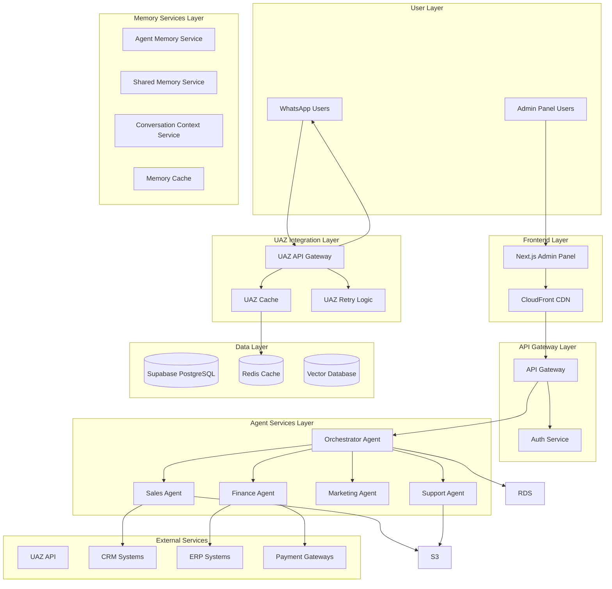
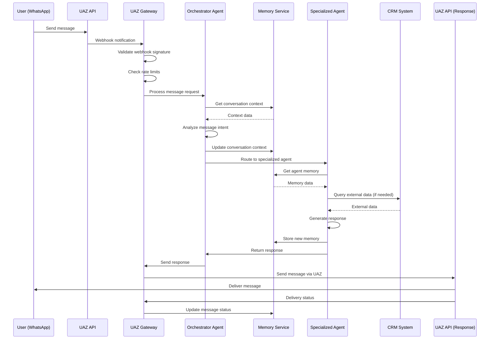

# Diagramas de Arquitetura

## Arquitetura de Alto Nível

```mermaid
graph TB
    subgraph "User Layer"
        WA[WhatsApp Users]
        ADMIN[Admin Panel Users]
    end
    
    subgraph "Frontend Layer"
        WEB[Next.js Admin Panel]
        CDN[CloudFront CDN]
    end
    
    subgraph "API Gateway Layer"
        APIGW[API Gateway]
        AUTH[Auth Service]
    end
    
    subgraph "UAZ Integration Layer"
        UAZ[UAZ API Gateway]
        UAZCACHE[UAZ Cache]
        UAZRETRY[UAZ Retry Logic]
    end
    
    subgraph "Agent Services Layer"
        ORCH[Orchestrator Agent]
        SALES[Sales Agent]
        SUPPORT[Support Agent]
        MARKETING[Marketing Agent]
        FINANCE[Finance Agent]
    end
    
    subgraph "Memory Services Layer"
        AGENTMEM[Agent Memory Service]
        SHAREDMEM[Shared Memory Service]
        CONVMEM[Conversation Context Service]
        MEMCACHE[Memory Cache]
    end
    
    subgraph "Data Layer"
        SUPABASE[(Supabase PostgreSQL)]
        REDIS[(Redis Cache)]
        VECTOR[(Vector Database)]
    end
    
    subgraph "External Services"
        UAZAPI[UAZ API]
        CRM[CRM Systems]
        ERP[ERP Systems]
        PAYMENT[Payment Gateways]
    end
    
    WA --> UAZ
    ADMIN --> WEB
    WEB --> CDN
    CDN --> APIGW
    APIGW --> AUTH
    APIGW --> ORCH
    ORCH --> SALES
    ORCH --> SUPPORT
    ORCH --> MARKETING
    ORCH --> FINANCE
    UAZ --> UAZCACHE
    UAZ --> UAZRETRY
    UAZ --> WA
    SALES --> CRM
    FINANCE --> ERP
    FINANCE --> PAYMENT
    ORCH --> RDS
    UAZCACHE --> REDIS
    SALES --> S3
    SUPPORT --> S3
```

## Fluxo de Processamento de Mensagem

```mermaid
sequenceDiagram
    participant U as User (WhatsApp)
    participant UAZ as UAZ API
    participant UAZGW as UAZ Gateway
    participant ORCH as Orchestrator Agent
    participant MEM as Memory Service
    participant AGENT as Specialized Agent
    participant CRM as CRM System
    participant UAZ2 as UAZ API (Response)

    U->>UAZ: Send message
    UAZ->>UAZGW: Webhook notification
    UAZGW->>UAZGW: Validate webhook signature
    UAZGW->>UAZGW: Check rate limits
    UAZGW->>ORCH: Process message request
    
    ORCH->>MEM: Get conversation context
    MEM-->>ORCH: Context data
    ORCH->>ORCH: Analyze message intent
    ORCH->>MEM: Update conversation context
    ORCH->>AGENT: Route to specialized agent
    
    AGENT->>MEM: Get agent memory
    MEM-->>AGENT: Memory data
    AGENT->>CRM: Query external data (if needed)
    CRM-->>AGENT: External data
    AGENT->>AGENT: Generate response
    AGENT->>MEM: Store new memory
    AGENT->>ORCH: Return response
    
    ORCH->>UAZGW: Send response
    UAZGW->>UAZ2: Send message via UAZ
    UAZ2->>U: Deliver message
    UAZ2->>UAZGW: Delivery status
    UAZGW->>MEM: Update message status
```
